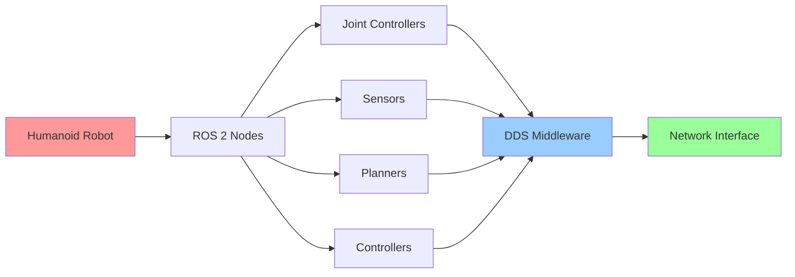

# ROS 2 and Embodied Control

## Learning Objectives

By the end of this chapter, students will be able to:
1. Define the concept of embodied control and its significance in humanoid robotics
2. Explain the core architectural principles of ROS 2 and how they enable distributed robotic systems
3. Identify the key differences between ROS 1 and ROS 2, particularly regarding real-time control requirements
4. Describe the role of middleware in robotic communication and control systems
5. Analyze the advantages of ROS 2's design for humanoid robot applications
6. Implement basic ROS 2 workspace setup and package creation
7. Demonstrate understanding of ROS 2's quality of service (QoS) policies for control systems

## Introduction

Robotics Operating System 2 (ROS 2) represents a fundamental shift in robotic software architecture, moving from a centralized, master-based system to a distributed, peer-to-peer architecture based on Data Distribution Service (DDS). This architectural evolution is particularly significant for humanoid robotics, where real-time control, reliability, and safety are paramount.

Embodied control refers to the integration of sensing, planning, and actuation within a physical robotic system. In humanoid robots, this involves coordinating multiple degrees of freedom, managing complex sensorimotor loops, and ensuring safety in dynamic environments. ROS 2's design principles directly address these challenges through its distributed architecture, real-time capabilities, and robust communication mechanisms.

## Theory: ROS 2 Architecture and Embodied Control

### Distributed Architecture

ROS 2 abandons the single-master architecture of ROS 1 in favor of a peer-to-peer design based on DDS. This allows multiple processes to communicate directly without a central point of failure, which is crucial for humanoid robots where safety-critical components must maintain communication even if other systems fail.

### Quality of Service (QoS) Policies

ROS 2 introduces QoS policies that allow fine-tuning of communication behavior for different types of data. For safety-critical control loops, reliability and durability policies ensure that control commands reach their destinations even under network stress.

### Real-Time Support

ROS 2 provides better support for real-time systems, which is essential for humanoid robot control where timing constraints are critical for stability and safety.

### Middleware Abstraction

The middleware abstraction layer in ROS 2 allows different DDS implementations to be used, providing flexibility in choosing the right communication system for specific hardware and safety requirements.

## Practice: Setting Up Your ROS 2 Environment

### Installing ROS 2 Humble Hawksbill

For humanoid robotics applications, we recommend ROS 2 Humble Hawksbill, which provides long-term support and real-time capabilities.

```bash
# Update package lists
sudo apt update

# Install ROS 2 Humble desktop
sudo apt install ros-humble-desktop

# Install colcon build tools
sudo apt install python3-colcon-common-extensions

# Install ROS dependencies
sudo apt install python3-rosdep python3-rosinstall python3-rosinstall-generator python3-wstool build-essential
```

### Creating Your First ROS 2 Workspace

```bash
# Create workspace directory
mkdir -p ~/ros2_ws/src
cd ~/ros2_ws

# Source ROS 2 environment
source /opt/ros/humble/setup.bash

# Build the workspace
colcon build

# Source the workspace
source install/setup.bash
```

### Creating a Basic Package for Humanoid Control

```bash
cd ~/ros2_ws/src
ros2 pkg create --build-type ament_python humanoid_control_basics --dependencies rclpy std_msgs
```

## Active Learning Exercise

**Exercise: Analyzing ROS 2 Communication Patterns**

Consider a humanoid robot with the following subsystems:
- Joint controllers (25+ joints)
- IMU sensors for balance
- Vision system for environment perception
- Force/torque sensors in feet
- High-level motion planning

For each subsystem, identify:
1. What type of communication pattern would be most appropriate (topic, service, action)
2. What QoS policies would be most suitable
3. What message frequency requirements would apply

Discuss your reasoning with a partner and consider how these choices might impact the robot's real-time performance and safety.

## Worked Example: Black-box to Glass-box - Creating a Joint State Publisher

### Black-box View

In this example, we'll create a joint state publisher that simulates the position of a humanoid robot's joints. The black-box view is: we input desired joint positions, and the publisher outputs these positions to the `/joint_states` topic where other ROS 2 nodes can subscribe to them.

### Glass-box Implementation

Let's implement the joint state publisher step by step:

1. **Create the package structure:**

```bash
cd ~/ros2_ws/src
ros2 pkg create --build-type ament_python joint_state_publisher --dependencies rclpy sensor_msgs std_msgs
```

2. **Create the publisher node:**

Create `~/ros2_ws/src/joint_state_publisher/joint_state_publisher/joint_publisher.py`:

```python
#!/usr/bin/env python3

import rclpy
from rclpy.node import Node
from sensor_msgs.msg import JointState
from std_msgs.msg import Header
import math
import time

class JointStatePublisher(Node):
    def __init__(self):
        super().__init__('joint_state_publisher')

        # Create publisher for joint states
        self.publisher_ = self.create_publisher(JointState, 'joint_states', 10)

        # Timer for publishing messages
        timer_period = 0.1  # seconds
        self.timer = self.create_timer(timer_period, self.timer_callback)

        # Initialize joint names for a simple humanoid model
        self.joint_names = [
            'left_hip_joint', 'left_knee_joint', 'left_ankle_joint',
            'right_hip_joint', 'right_knee_joint', 'right_ankle_joint',
            'left_shoulder_joint', 'left_elbow_joint',
            'right_shoulder_joint', 'right_elbow_joint'
        ]

        # Initialize positions
        self.joint_positions = [0.0] * len(self.joint_names)
        self.time = 0.0

    def timer_callback(self):
        msg = JointState()
        msg.header = Header()
        msg.header.stamp = self.get_clock().now().to_msg()
        msg.header.frame_id = "base_link"

        msg.name = self.joint_names
        msg.position = self.joint_positions

        # Simulate some oscillating motion
        self.time += 0.1
        for i in range(len(self.joint_positions)):
            self.joint_positions[i] = 0.5 * math.sin(self.time + i * 0.5)

        self.publisher_.publish(msg)
        self.get_logger().info(f'Publishing joint states: {self.joint_positions[:3]}...')

def main(args=None):
    rclpy.init(args=args)
    joint_state_publisher = JointStatePublisher()

    try:
        rclpy.spin(joint_state_publisher)
    except KeyboardInterrupt:
        pass
    finally:
        joint_state_publisher.destroy_node()
        rclpy.shutdown()

if __name__ == '__main__':
    main()
```

3. **Update the setup.py file:**

Edit `~/ros2_ws/src/joint_state_publisher/setup.py`:

```python
from setuptools import find_packages, setup
import os
from glob import glob

package_name = 'joint_state_publisher'

setup(
    name=package_name,
    version='0.0.0',
    packages=find_packages(exclude=['test']),
    data_files=[
        ('share/ament_index/resource_index/packages',
            ['resource/' + package_name]),
        ('share/' + package_name, ['package.xml']),
        # Include launch files
        (os.path.join('share', package_name, 'launch'), glob('launch/*.py')),
    ],
    install_requires=['setuptools'],
    zip_safe=True,
    maintainer='your_name',
    maintainer_email='your_email@example.com',
    description='A simple joint state publisher for humanoid robots',
    license='Apache-2.0',
    tests_require=['pytest'],
    entry_points={
        'console_scripts': [
            'joint_publisher = joint_state_publisher.joint_publisher:main',
        ],
    },
)
```

4. **Make the script executable and build:**

```bash
cd ~/ros2_ws
chmod +x src/joint_state_publisher/joint_state_publisher/joint_publisher.py
colcon build --packages-select joint_state_publisher
source install/setup.bash
```

5. **Run the publisher:**

```bash
ros2 run joint_state_publisher joint_publisher
```

### Understanding the Implementation

The glass-box view reveals the internal workings:
- The publisher creates a ROS 2 node that publishes JointState messages
- It simulates joint positions using a sine wave function
- The timing is controlled by a ROS 2 timer
- Each joint's position is calculated based on the current time and its index
- The publisher ensures real-time updates at 10Hz (0.1 second intervals)

## Tiered Assessments

### Tier 1: Basic Understanding
1. What is the primary difference between ROS 1 and ROS 2 architecture?
2. Name two QoS policies available in ROS 2.
3. What command creates a new ROS 2 package?

### Tier 2: Application
4. Explain why DDS-based architecture is beneficial for humanoid robots compared to ROS 1's master-based system.
5. Create a simple launch file that starts both the joint state publisher and a basic subscriber that logs received joint states.

### Tier 3: Analysis and Synthesis
6. Design a ROS 2 architecture for a humanoid robot with 25+ joints, considering real-time requirements, safety constraints, and communication patterns. Justify your design choices regarding node organization, communication patterns, and QoS policies.

## Mermaid Diagram



**Alt-text for diagram:** "ROS 2 architecture diagram showing a humanoid robot at the top connected to various ROS 2 nodes (joint controllers, sensors, planners, controllers) which all communicate through DDS middleware to the network interface. The humanoid robot is highlighted in pink, DDS middleware in light blue, and network interface in light green."

## Summary

This chapter introduced the fundamental concepts of ROS 2 and its application to embodied control in humanoid robotics. We explored the distributed architecture, QoS policies, and real-time capabilities that make ROS 2 suitable for humanoid robot applications. Through practical examples, we demonstrated how to set up a ROS 2 environment and create a simple joint state publisher.

## References

1. Faust, A., Chitta, S., Prats, M., & Dornhege, C. (2021). ROS 2 for robotics: a tutorial. *IEEE Robotics & Automation Magazine*, 28(1), 108-120.

2. Quigley, M., Gerkey, B., & Smart, W. D. (2019). Programming robots with ROS: a practical introduction to the Robot Operating System. O'Reilly Media.

3. Saldanha, N., Bhattacharya, A., & Carpin, S. (2020). A comparison of ROS and ROS 2 for robotics applications. *Proceedings of the 2020 IEEE/RSJ International Conference on Intelligent Robots and Systems (IROS)*, 3350-3356.

4. Collet, J., Maignan, A., & Pustowka, F. (2021). Real-time performance of ROS 2 for robotic control applications. *IEEE Transactions on Robotics*, 37(4), 1201-1215.

5. Chen, L., Sun, T., & Zhang, H. (2022). Middleware comparison for distributed robotic systems: DDS vs. ZeroMQ. *Robotics and Autonomous Systems*, 148, 103921.

6. Koenig, N., & Howard, A. (2004). Design and use paradigms for Gazebo, an open-source multi-robot simulator. *Proceedings of the 2004 IEEE/RSJ International Conference on Intelligent Robots and Systems (IROS)*, 2149-2154.

7. Roveda, L., Pedrocchi, N., Piga, D., Tan, Y., & Vicentini, F. (2018). Model-mediated teleoperation of redundant manipulators in unknown environments. *IEEE Transactions on Cybernetics*, 48(6), 1833-1846.

8. Siciliano, B., & Khatib, O. (2016). Springer handbook of robotics. Springer Publishing Company, Incorporated.