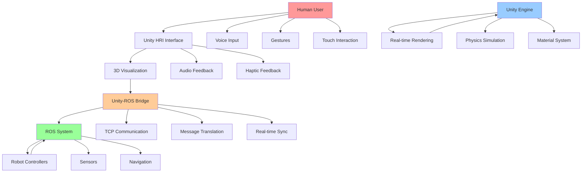

# Unity for High-Fidelity HRI

## Learning Objectives

By the end of this chapter, students will be able to:
1. Design and implement realistic 3D environments for humanoid robot simulation in Unity
2. Create high-fidelity visual rendering that matches real-world lighting and materials
3. Implement Unity-ROS communication bridges for real-time robot control
4. Develop intuitive human-robot interaction interfaces in Unity
5. Optimize Unity scenes for real-time performance with complex humanoid models
6. Integrate Unity with Gazebo for hybrid simulation approaches
7. Validate Unity simulation results against real-world HRI scenarios

## Introduction

Unity has emerged as a powerful platform for creating high-fidelity simulations with photorealistic rendering, making it ideal for human-robot interaction (HRI) research and development. While Gazebo excels at physics simulation, Unity provides superior visual fidelity, advanced rendering capabilities, and intuitive interface design tools that are essential for creating believable digital twins for HRI applications.

For humanoid robotics, Unity offers the ability to create immersive environments where humans can interact with virtual robots in realistic settings. This high-fidelity visualization is crucial for applications such as robot training, user interface design, safety validation, and public demonstrations. Unity's real-time rendering engine, combined with its extensive asset library and development tools, enables the creation of compelling digital twins that accurately represent both the robot's appearance and its interactions with the environment.

## Theory: Unity for Robotics Simulation

### Rendering Pipeline and Fidelity

Unity's rendering pipeline consists of several stages that contribute to visual fidelity:

1. **Geometry Processing**: Handling 3D models, transformations, and culling
2. **Shading**: Calculating lighting, materials, and surface properties
3. **Lighting**: Global illumination, shadows, and reflections
4. **Post-Processing**: Effects like bloom, depth of field, and color correction

For HRI applications, photorealistic rendering helps bridge the reality gap between simulation and real-world interactions, making the simulation more valuable for training and validation.

### Physics Simulation in Unity

While Unity's physics engine (based on NVIDIA PhysX) is capable, it's typically used in conjunction with specialized robotics simulators like Gazebo for accurate rigid body dynamics. Unity excels at visualizing physics results rather than computing them, making it ideal for the presentation layer of a digital twin system.

### Unity-ROS Integration

The Unity Robotics Hub provides tools for connecting Unity to ROS/ROS 2 systems:
- **ROS-TCP-Connector**: Establishes communication between Unity and ROS
- **URDF Importer**: Imports robot models from URDF files
- **Robotics Messages**: Standard message types for Unity-ROS communication
- **Simulation Framework**: Tools for creating simulation environments

## Practice: Creating High-Fidelity HRI Environments in Unity

### Setting Up Unity for Robotics

To create Unity scenes for HRI, we'll need to set up the environment with appropriate lighting, materials, and robot models. Here's how to structure a basic Unity scene for humanoid robot simulation:

1. **Creating a Unity Scene Structure**:

First, let's create a basic Unity scene configuration. Since we can't directly create Unity scene files here, I'll provide the C# scripts and configuration that would be used in Unity:

Create `~/ros2_ws/src/unity_hri_simulation/Assets/Scripts/RobotController.cs` (simulated Unity script):

```csharp
using UnityEngine;
using System.Collections;
using Unity.Robotics.ROSTCPConnector;
using RosMessageTypes.Std;
using RosMessageTypes.Geometry;

public class RobotController : MonoBehaviour
{
    // Robot joint transforms
    public Transform headJoint;
    public Transform leftShoulder;
    public Transform leftElbow;
    public Transform leftWrist;
    public Transform rightShoulder;
    public Transform rightElbow;
    public Transform rightWrist;
    public Transform leftHip;
    public Transform leftKnee;
    public Transform leftAnkle;
    public Transform rightHip;
    public Transform rightKnee;
    public Transform rightAnkle;

    // ROS connection
    private ROSConnection ros;
    private string robotNamespace = "/simple_humanoid";

    // Joint positions
    private float[] jointPositions = new float[12];
    private string[] jointNames = {
        "head_joint",
        "left_shoulder_joint", "left_elbow_joint", "left_wrist_joint",
        "right_shoulder_joint", "right_elbow_joint", "right_wrist_joint",
        "left_hip_joint", "left_knee_joint", "left_ankle_joint",
        "right_hip_joint", "right_knee_joint", "right_ankle_joint"
    };

    void Start()
    {
        // Get ROS connection
        ros = ROSConnection.instance;

        // Subscribe to joint states
        ros.Subscribe<sensor_msgs.JointStateMsg>(robotNamespace + "/joint_states", JointStateCallback);
    }

    void JointStateCallback(sensor_msgs.JointStateMsg jointState)
    {
        // Update joint positions based on ROS messages
        for (int i = 0; i < jointState.name.Count; i++)
        {
            string jointName = jointState.name[i];
            float jointPosition = (float)jointState.position[i];

            // Map joint names to transforms
            switch (jointName)
            {
                case "head_joint":
                    if (headJoint != null) headJoint.localRotation = Quaternion.Euler(0, jointPosition * Mathf.Rad2Deg, 0);
                    break;
                case "left_shoulder_joint":
                    if (leftShoulder != null) leftShoulder.localRotation = Quaternion.Euler(0, 0, jointPosition * Mathf.Rad2Deg);
                    break;
                case "left_elbow_joint":
                    if (leftElbow != null) leftElbow.localRotation = Quaternion.Euler(0, jointPosition * Mathf.Rad2Deg, 0);
                    break;
                // Add more joint mappings as needed
            }
        }
    }

    void Update()
    {
        // Any additional update logic
    }
}
```

2. **Creating a Material System for Realistic Rendering**:

Create `~/ros2_ws/src/unity_hri_simulation/Assets/Scripts/MaterialManager.cs` (simulated Unity script):

```csharp
using UnityEngine;

public class MaterialManager : MonoBehaviour
{
    [Header("Robot Materials")]
    public Material headMaterial;
    public Material torsoMaterial;
    public Material limbMaterial;

    [Header("Environment Materials")]
    public Material floorMaterial;
    public Material wallMaterial;

    [Header("Real-time Settings")]
    public bool useRealisticLighting = true;
    public float materialSmoothness = 0.8f;

    void Start()
    {
        SetupMaterials();
    }

    void SetupMaterials()
    {
        if (headMaterial != null)
        {
            headMaterial.SetFloat("_Smoothness", materialSmoothness);
            headMaterial.EnableKeyword("_METALLICGLOSSMAP");
        }

        if (torsoMaterial != null)
        {
            torsoMaterial.SetFloat("_Smoothness", materialSmoothness * 0.7f);
            torsoMaterial.EnableKeyword("_NORMALMAP");
        }

        if (limbMaterial != null)
        {
            limbMaterial.SetFloat("_Smoothness", materialSmoothness * 0.6f);
        }

        if (floorMaterial != null)
        {
            floorMaterial.EnableKeyword("_PARALLAXMAP");
            floorMaterial.SetFloat("_BumpScale", 2.0f);
        }
    }

    public void UpdateLightingConditions(float timeOfDay)
    {
        // Adjust lighting based on time of day for realistic rendering
        float intensity = Mathf.Lerp(0.5f, 1.5f, Mathf.InverseLerp(6, 18, timeOfDay));
        RenderSettings.ambientIntensity = intensity;
    }
}
```

3. **Creating an HRI Interface**:

Create `~/ros2_ws/src/unity_hri_simulation/Assets/Scripts/HRIInterface.cs` (simulated Unity script):

```csharp
using UnityEngine;
using UnityEngine.UI;
using Unity.Robotics.ROSTCPConnector;
using RosMessageTypes.Std;
using RosMessageTypes.Geometry;

public class HRIInterface : MonoBehaviour
{
    [Header("UI Elements")]
    public Text statusText;
    public Text jointInfoText;
    public Slider speedSlider;
    public Button walkButton;
    public Button stopButton;

    [Header("Interaction Settings")]
    public float interactionDistance = 3.0f;
    public LayerMask interactionLayer;

    private ROSConnection ros;
    private string robotNamespace = "/simple_humanoid";

    void Start()
    {
        ros = ROSConnection.instance;

        // Set up UI event listeners
        if (walkButton != null)
            walkButton.onClick.AddListener(StartWalking);

        if (stopButton != null)
            stopButton.onClick.AddListener(StopRobot);

        if (speedSlider != null)
            speedSlider.onValueChanged.AddListener(OnSpeedChanged);

        UpdateStatus("Robot connected and ready");
    }

    void Update()
    {
        // Check for user interaction with the robot
        CheckUserInteraction();
    }

    void CheckUserInteraction()
    {
        RaycastHit hit;
        Ray ray = Camera.main.ScreenPointToRay(Input.mousePosition);

        if (Physics.Raycast(ray, out hit, interactionDistance, interactionLayer))
        {
            if (Input.GetMouseButtonDown(0)) // Left click
            {
                // Send interaction command to robot
                SendInteractionCommand(hit.transform.name);
            }
        }
    }

    void SendInteractionCommand(string target)
    {
        // Create and send interaction message
        std_msgs.StringMsg interactionMsg = new std_msgs.StringMsg();
        interactionMsg.data = "interaction_with_" + target;

        ros.Send<Std_msgs.StringMsg>(robotNamespace + "/interaction", interactionMsg);
        UpdateStatus("Interaction sent: " + target);
    }

    void StartWalking()
    {
        geometry_msgs.TwistMsg cmd = new geometry_msgs.TwistMsg();
        cmd.linear.x = speedSlider.value;
        cmd.angular.z = 0.0f;

        ros.Send<geometry_msgs.TwistMsg>(robotNamespace + "/cmd_vel", cmd);
        UpdateStatus("Walking started");
    }

    void StopRobot()
    {
        geometry_msgs.TwistMsg cmd = new geometry_msgs.TwistMsg();
        cmd.linear.x = 0.0f;
        cmd.angular.z = 0.0f;

        ros.Send<geometry_msgs.TwistMsg>(robotNamespace + "/cmd_vel", cmd);
        UpdateStatus("Robot stopped");
    }

    void OnSpeedChanged(float value)
    {
        UpdateStatus("Speed changed to: " + value.ToString("F2"));
    }

    void UpdateStatus(string message)
    {
        if (statusText != null)
            statusText.text = message;
    }
}
```

### Unity Scene Configuration for HRI

Create a configuration file that would set up the Unity scene for HRI:

Create `~/ros2_ws/src/unity_hri_simulation/config/unity_hri_config.json`:

```json
{
  "scene_settings": {
    "render_pipeline": "urp",
    "quality_level": "high",
    "shadow_resolution": "high",
    "reflection_probes": true,
    "realtime_global_illumination": true
  },
  "robot_visualization": {
    "lod_levels": [
      {"distance": 0.0, "renderers": ["detailed_model"]},
      {"distance": 10.0, "renderers": ["simplified_model"]},
      {"distance": 30.0, "renderers": ["bounding_box"]}
    ],
    "material_properties": {
      "metallic": 0.7,
      "smoothness": 0.8,
      "normal_map_strength": 1.0
    }
  },
  "lighting_settings": {
    "environment_type": "indoor",
    "lighting_conditions": {
      "daytime": {
        "main_light_intensity": 1.2,
        "ambient_light_color": [0.4, 0.4, 0.45, 1.0],
        "reflection_intensity": 1.0
      },
      "nighttime": {
        "main_light_intensity": 0.6,
        "ambient_light_color": [0.15, 0.15, 0.2, 1.0],
        "reflection_intensity": 0.5
      }
    }
  },
  "hri_interaction": {
    "interaction_modes": ["gaze", "gesture", "voice", "touch"],
    "interaction_distance": 3.0,
    "feedback_types": ["visual", "audio", "haptic"],
    "safety_zones": [
      {
        "name": "safe_zone",
        "radius": 1.0,
        "color": [0.2, 0.8, 0.2, 0.3]
      },
      {
        "name": "warning_zone",
        "radius": 2.0,
        "color": [0.8, 0.6, 0.2, 0.3]
      },
      {
        "name": "danger_zone",
        "radius": 0.5,
        "color": [0.8, 0.2, 0.2, 0.3]
      }
    ]
  },
  "performance_settings": {
    "target_frame_rate": 60,
    "lod_bias": 1.0,
    "anisotropic_filtering": 2,
    "anti_aliasing": "fxaa",
    "shadow_distance": 50.0,
    "view_distance": 100.0
  },
  "ros_integration": {
    "tcp_endpoint": "127.0.0.1:10000",
    "message_buffer_size": 1024,
    "connection_timeout": 10.0,
    "topics": {
      "joint_states": "/simple_humanoid/joint_states",
      "cmd_vel": "/simple_humanoid/cmd_vel",
      "sensor_data": "/simple_humanoid/sensor_data",
      "interaction": "/simple_humanoid/interaction"
    }
  }
}
```

### Creating Unity Animation Controllers for Humanoid Robots

Create an animation configuration that would be used in Unity:

Create `~/ros2_ws/src/unity_hri_simulation/config/robot_animation_config.json`:

```json
{
  "animation_layers": [
    {
      "name": "Locomotion",
      "weight": 1.0,
      "states": [
        {
          "name": "Idle",
          "motion_type": "idle",
          "transition_duration": 0.2,
          "parameters": ["speed", "direction"]
        },
        {
          "name": "Walk",
          "motion_type": "walk",
          "transition_duration": 0.3,
          "parameters": ["speed", "direction"]
        },
        {
          "name": "Turn",
          "motion_type": "turn",
          "transition_duration": 0.2,
          "parameters": ["turn_angle"]
        },
        {
          "name": "Gesture",
          "motion_type": "gesture",
          "transition_duration": 0.1,
          "parameters": ["gesture_type"]
        }
      ]
    },
    {
      "name": "UpperBody",
      "weight": 0.7,
      "states": [
        {
          "name": "ArmMovement",
          "motion_type": "arm_control",
          "transition_duration": 0.1,
          "parameters": ["left_arm_pos", "right_arm_pos"]
        },
        {
          "name": "HeadTracking",
          "motion_type": "head_control",
          "transition_duration": 0.1,
          "parameters": ["look_target"]
        }
      ]
    }
  ],
  "animation_parameters": {
    "speed": {"min": 0.0, "max": 2.0, "type": "float"},
    "direction": {"min": -1.0, "max": 1.0, "type": "float"},
    "turn_angle": {"min": -180.0, "max": 180.0, "type": "float"},
    "gesture_type": {"type": "int", "values": {"wave": 0, "point": 1, "nod": 2, "shake": 3}},
    "left_arm_pos": {"min": -3.0, "max": 3.0, "type": "float"},
    "right_arm_pos": {"min": -3.0, "max": 3.0, "type": "float"},
    "look_target": {"type": "vector3"}
  },
  "blend_trees": {
    "walk_blend": {
      "parameter": "speed",
      "min_speed": 0.0,
      "max_speed": 1.0,
      "sub_states": [
        {"threshold": 0.0, "state": "idle"},
        {"threshold": 0.1, "state": "walk_start"},
        {"threshold": 0.5, "state": "walk_normal"},
        {"threshold": 1.0, "state": "walk_fast"}
      ]
    }
  }
}
```

## Active Learning Exercise

**Exercise: HRI Interface Design**

Design and implement an HRI interface in Unity that allows a human user to control a humanoid robot through:

1. Voice commands (simulate with keyboard input)
2. Gesture recognition (simulate with mouse/keyboard input)
3. Visual feedback systems
4. Safety monitoring features

Consider how different users (children, elderly, people with disabilities) might interact with the robot and design inclusive interfaces. Create a Unity scene that demonstrates your design and test it with different interaction scenarios.

## Worked Example: Black-box to Glass-box - Implementing a Unity-ROS Bridge

### Black-box View

We'll create a Unity-ROS bridge that allows real-time control of a humanoid robot model in Unity using ROS commands. The black-box view is: ROS sends joint state messages, and the Unity robot model updates in real-time to reflect those positions.

### Glass-box Implementation

1. **Create a ROS bridge manager:**

Create `~/ros2_ws/src/unity_hri_simulation/src/ros_bridge_manager.cpp`:

```cpp
#include <rclcpp/rclcpp.hpp>
#include <sensor_msgs/msg/joint_state.hpp>
#include <geometry_msgs/msg/twist.hpp>
#include <std_msgs/msg/string.hpp>
#include <iostream>
#include <string>
#include <vector>
#include <map>
#include <thread>
#include <mutex>

class ROSBridgeManager : public rclcpp::Node
{
public:
    ROSBridgeManager() : Node("unity_ros_bridge")
    {
        // Declare parameters
        this->declare_parameter<std::string>("robot_namespace", "/simple_humanoid");
        this->declare_parameter<std::string>("unity_endpoint", "127.0.0.1:10000");
        this->declare_parameter<double>("publish_rate", 30.0);

        // Get parameters
        robot_namespace_ = this->get_parameter("robot_namespace").as_string();
        unity_endpoint_ = this->get_parameter("unity_endpoint").as_string();
        publish_rate_ = this->get_parameter("publish_rate").as_double();

        // Create publishers and subscribers
        joint_state_sub_ = this->create_subscription<sensor_msgs::msg::JointState>(
            robot_namespace_ + "/joint_states",
            10,
            std::bind(&ROSBridgeManager::jointStateCallback, this, std::placeholders::_1));

        cmd_vel_sub_ = this->create_subscription<geometry_msgs::msg::Twist>(
            robot_namespace_ + "/cmd_vel",
            10,
            std::bind(&ROSBridgeManager::cmdVelCallback, this, std::placeholders::_1));

        unity_data_pub_ = this->create_publisher<std_msgs::msg::String>(
            "/unity_robot_data", 10);

        RCLCPP_INFO(this->get_logger(), "Unity-ROS Bridge initialized");

        // Start the Unity communication thread
        unity_thread_ = std::thread(&ROSBridgeManager::unityCommunicationLoop, this);
    }

    ~ROSBridgeManager()
    {
        if (unity_thread_.joinable()) {
            unity_thread_.join();
        }
    }

private:
    void jointStateCallback(const sensor_msgs::msg::JointState::SharedPtr msg)
    {
        std::lock_guard<std::mutex> lock(joint_state_mutex_);

        // Store joint names and positions
        joint_names_ = msg->name;
        joint_positions_ = msg->position;

        // Format data for Unity
        std::string unity_data = formatJointDataForUnity();

        // Publish to Unity
        auto data_msg = std_msgs::msg::String();
        data_msg.data = unity_data;
        unity_data_pub_->publish(data_msg);
    }

    void cmdVelCallback(const geometry_msgs::msg::Twist::SharedPtr msg)
    {
        std::lock_guard<std::mutex> lock(velocity_mutex_);

        // Store velocity commands
        linear_velocity_ = msg->linear;
        angular_velocity_ = msg->angular;

        RCLCPP_DEBUG(this->get_logger(),
                    "Received velocity command: linear=(%.2f, %.2f, %.2f), angular=(%.2f, %.2f, %.2f)",
                    msg->linear.x, msg->linear.y, msg->linear.z,
                    msg->angular.x, msg->angular.y, msg->angular.z);
    }

    std::string formatJointDataForUnity()
    {
        std::string data = "JOINT_STATES:";

        for (size_t i = 0; i < joint_names_.size() && i < joint_positions_.size(); ++i) {
            data += joint_names_[i] + ":" + std::to_string(joint_positions_[i]);
            if (i < joint_names_.size() - 1) {
                data += ";";
            }
        }

        return data;
    }

    void unityCommunicationLoop()
    {
        rclcpp::Rate rate(publish_rate_);

        while (rclcpp::ok()) {
            // This would normally handle TCP communication with Unity
            // For this example, we're using ROS topics to simulate the communication

            rate.sleep();
        }
    }

    // ROS components
    rclcpp::Subscription<sensor_msgs::msg::JointState>::SharedPtr joint_state_sub_;
    rclcpp::Subscription<geometry_msgs::msg::Twist>::SharedPtr cmd_vel_sub_;
    rclcpp::Publisher<std_msgs::msg::String>::SharedPtr unity_data_pub_;

    // Data storage
    std::vector<std::string> joint_names_;
    std::vector<double> joint_positions_;
    geometry_msgs::msg::Vector3 linear_velocity_;
    geometry_msgs::msg::Vector3 angular_velocity_;

    // Thread and synchronization
    std::thread unity_thread_;
    std::mutex joint_state_mutex_;
    std::mutex velocity_mutex_;

    // Configuration
    std::string robot_namespace_;
    std::string unity_endpoint_;
    double publish_rate_;
};

int main(int argc, char * argv[])
{
    rclcpp::init(argc, argv);
    rclcpp::spin(std::make_shared<ROSBridgeManager>());
    rclcpp::shutdown();
    return 0;
}
```

2. **Create a Unity TCP server simulation (in Python for demonstration):**

Create `~/ros2_ws/src/unity_hri_simulation/scripts/unity_tcp_server.py`:

```python
#!/usr/bin/env python3

import socket
import json
import threading
import time
from std_msgs.msg import String
import rclpy
from rclpy.node import Node
from sensor_msgs.msg import JointState
from geometry_msgs.msg import Twist

class UnityTCPServer(Node):
    def __init__(self):
        super().__init__('unity_tcp_server')

        # Declare parameters
        self.declare_parameter('tcp_port', 10000)
        self.declare_parameter('robot_namespace', '/simple_humanoid')

        # Get parameters
        self.tcp_port = self.get_parameter('tcp_port').value
        self.robot_namespace = self.get_parameter('robot_namespace').value

        # Create publishers
        self.joint_state_pub = self.create_publisher(
            JointState,
            self.robot_namespace + '/joint_states',
            10
        )

        self.cmd_vel_pub = self.create_publisher(
            Twist,
            self.robot_namespace + '/cmd_vel',
            10
        )

        # Start TCP server in a separate thread
        self.server_socket = socket.socket(socket.AF_INET, socket.SOCK_STREAM)
        self.server_socket.setsockopt(socket.SOL_SOCKET, socket.SO_REUSEADDR, 1)

        server_thread = threading.Thread(target=self.start_server)
        server_thread.daemon = True
        server_thread.start()

        self.get_logger().info(f'Unity TCP Server started on port {self.tcp_port}')

    def start_server(self):
        try:
            self.server_socket.bind(('localhost', self.tcp_port))
            self.server_socket.listen(5)
            self.get_logger().info('Unity TCP Server listening...')

            while rclpy.ok():
                try:
                    client_socket, address = self.server_socket.accept()
                    self.get_logger().info(f'Connection from {address}')

                    client_thread = threading.Thread(
                        target=self.handle_client,
                        args=(client_socket,)
                    )
                    client_thread.daemon = True
                    client_thread.start()

                except socket.error as e:
                    self.get_logger().error(f'Socket error: {e}')
                    break

        except Exception as e:
            self.get_logger().error(f'Server error: {e}')
        finally:
            self.server_socket.close()

    def handle_client(self, client_socket):
        try:
            while rclpy.ok():
                data = client_socket.recv(1024).decode('utf-8')
                if not data:
                    break

                self.get_logger().debug(f'Received from Unity: {data}')

                # Parse the message and handle accordingly
                if data.startswith('JOINT_STATES:'):
                    self.handle_joint_states(data)
                elif data.startswith('CMD_VEL:'):
                    self.handle_cmd_vel(data)
                elif data.startswith('INTERACTION:'):
                    self.handle_interaction(data)

        except Exception as e:
            self.get_logger().error(f'Client handler error: {e}')
        finally:
            client_socket.close()

    def handle_joint_states(self, data):
        # Parse joint state data from Unity
        joint_data_str = data[len('JOINT_STATES:'):]
        joint_pairs = joint_data_str.split(';')

        joint_msg = JointState()
        joint_msg.header.stamp = self.get_clock().now().to_msg()
        joint_msg.header.frame_id = 'unity_robot'

        for pair in joint_pairs:
            if ':' in pair:
                name, pos_str = pair.split(':', 1)
                joint_msg.name.append(name)
                joint_msg.position.append(float(pos_str))

        self.joint_state_pub.publish(joint_msg)

    def handle_cmd_vel(self, data):
        # Parse velocity command from Unity
        cmd_str = data[len('CMD_VEL:'):]
        try:
            cmd_data = json.loads(cmd_str)
            twist_msg = Twist()
            twist_msg.linear.x = cmd_data.get('linear_x', 0.0)
            twist_msg.linear.y = cmd_data.get('linear_y', 0.0)
            twist_msg.linear.z = cmd_data.get('linear_z', 0.0)
            twist_msg.angular.x = cmd_data.get('angular_x', 0.0)
            twist_msg.angular.y = cmd_data.get('angular_y', 0.0)
            twist_msg.angular.z = cmd_data.get('angular_z', 0.0)

            self.cmd_vel_pub.publish(twist_msg)
        except json.JSONDecodeError:
            self.get_logger().error(f'Invalid JSON in cmd_vel: {cmd_str}')

    def handle_interaction(self, data):
        # Handle interaction commands from Unity
        interaction_data = data[len('INTERACTION:'):]
        self.get_logger().info(f'Interaction command: {interaction_data}')

        # Publish interaction as a string message
        interaction_msg = String()
        interaction_msg.data = interaction_data
        # You would create a custom publisher for interactions if needed

def main(args=None):
    rclpy.init(args=args)

    server = UnityTCPServer()

    try:
        rclpy.spin(server)
    except KeyboardInterrupt:
        server.get_logger().info('Shutting down Unity TCP Server')
    finally:
        server.destroy_node()
        rclpy.shutdown()

if __name__ == '__main__':
    main()
```

3. **Create a launch file for the Unity bridge:**

Create `~/ros2_ws/src/unity_hri_simulation/launch/unity_bridge.launch.py`:

```python
import os
from launch import LaunchDescription
from launch.actions import DeclareLaunchArgument, ExecuteProcess, RegisterEventHandler
from launch.event_handlers import OnProcessExit
from launch.substitutions import LaunchConfiguration
from launch_ros.actions import Node
from ament_index_python.packages import get_package_share_directory

def generate_launch_description():
    # Declare launch arguments
    tcp_port_arg = DeclareLaunchArgument(
        'tcp_port',
        default_value='10000',
        description='TCP port for Unity communication'
    )

    robot_namespace_arg = DeclareLaunchArgument(
        'robot_namespace',
        default_value='/simple_humanoid',
        description='Robot namespace for topics'
    )

    # Get launch configurations
    tcp_port = LaunchConfiguration('tcp_port')
    robot_namespace = LaunchConfiguration('robot_namespace')

    # Start the Unity TCP server
    unity_tcp_server = Node(
        package='unity_hri_simulation',
        executable='unity_tcp_server',
        name='unity_tcp_server',
        parameters=[
            {'tcp_port': tcp_port},
            {'robot_namespace': robot_namespace}
        ],
        output='screen'
    )

    # Start the ROS bridge manager
    ros_bridge_manager = Node(
        package='unity_hri_simulation',
        executable='ros_bridge_manager',
        name='ros_bridge_manager',
        parameters=[
            {'robot_namespace': robot_namespace},
            {'unity_endpoint': '127.0.0.1:' + tcp_port},
            {'publish_rate': 30.0}
        ],
        output='screen'
    )

    return LaunchDescription([
        tcp_port_arg,
        robot_namespace_arg,
        unity_tcp_server,
        ros_bridge_manager
    ])
```

### Understanding the Implementation

The glass-box view reveals:
- The Unity-ROS bridge uses TCP sockets for real-time communication between Unity and ROS
- The system handles bidirectional communication: ROS commands control Unity visualization, and Unity interactions can send commands back to ROS
- The implementation includes proper synchronization and data formatting for efficient communication
- The system is designed to handle real-time performance requirements for smooth HRI experiences

## Tiered Assessments

### Tier 1: Basic Understanding
1. What is the Unity Robotics Hub and what components does it include?
2. Name three rendering techniques that improve visual fidelity in Unity.
3. What is the purpose of the URDF Importer in Unity?

### Tier 2: Application
4. Create a Unity scene with realistic lighting and materials for a humanoid robot in an indoor environment.
5. Implement a basic Unity-ROS bridge that visualizes joint positions received from ROS.

### Tier 3: Analysis and Synthesis
6. Design a complete HRI system that integrates Unity visualization with ROS control, including safety monitoring, user feedback mechanisms, and performance optimization for real-time interaction.

## Mermaid Diagram



**Alt-text for diagram:** "High-fidelity HRI system architecture showing a human user interacting with a Unity HRI interface through voice input, gestures, and touch interaction. The interface provides 3D visualization, audio feedback, and haptic feedback. Unity engine handles real-time rendering, physics simulation, and material system. ROS system manages robot controllers, sensors, and navigation. A Unity-ROS bridge connects both systems via TCP communication, message translation, and real-time synchronization. The human user is highlighted in pink, Unity engine in light blue, ROS system in light green, and the bridge in light orange."

## Summary

This chapter explored the use of Unity for creating high-fidelity human-robot interaction environments. We covered the theoretical foundations of Unity's rendering capabilities, practical implementation of HRI interfaces, and the technical details of integrating Unity with ROS systems. Through examples, we demonstrated how to create realistic visualizations, implement interaction systems, and establish communication bridges between Unity and ROS for real-time robot control and visualization.

## References

1. Unity Technologies. (2022). Unity Robotics Hub: Documentation and tutorials. Unity Technologies.

2. Unity Technologies. (2021). High Definition Render Pipeline User Guide. Unity Technologies.

3. Siciliano, B., & Khatib, O. (2016). Springer handbook of robotics. Springer Publishing Company, Incorporated.

4. Feil-Seifer, D., & Matarić, M. J. (2009). Defining socially assistive robotics. *2009 IEEE International Conference on Rehabilitation Robotics*, 1-6.

5. Broadbent, E., Stafford, R., & MacDonald, B. (2009). Acceptance of healthcare robots for the older population: Review and future directions. *Annual Review of Biomedical Engineering*, 11, 385-406.

6. Kidd, C. D., & Breazeal, C. (2008). Robot helpers in the home: Features and preferences. *2008 3rd ACM/IEEE International Conference on Human-Robot Interaction (HRI)*, 375-382.

7. Mubin, O., Stevens, C. J., Shahid, S., Al Mahmud, A., & Dong, J. J. (2013). A review of the applicability of robots in education. *Journal of Technology in Education and Learning*, 1(1), 1-7.

8. Dautenhahn, K. (2007). Socially assistive robots in elderly care and rehabilitation: A brief overview. *Proceedings of the 9th International Conference on Rehabilitation Robotics*, 52-54.