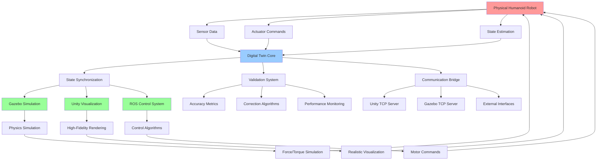

# Creating Complete Digital Twins

## Learning Objectives

By the end of this chapter, students will be able to:
1. Design and implement integrated digital twin systems combining Gazebo and Unity
2. Create synchronized simulation environments that mirror real robot behavior
3. Implement real-time data synchronization between physical and virtual robots
4. Develop validation frameworks to assess digital twin accuracy
5. Optimize digital twin performance for real-time applications
6. Design digital twin architectures that support multiple robot configurations
7. Integrate digital twins with cloud-based systems for remote monitoring and control

## Introduction

A complete digital twin for humanoid robotics encompasses not just the physical model of the robot, but a comprehensive virtual replica that mirrors the robot's behavior, state, and interactions in real-time. This includes accurate physics simulation, sensor modeling, control systems, and environmental interactions. The integration of Gazebo for physics and sensor simulation with Unity for high-fidelity visualization creates a powerful platform for developing, testing, and deploying humanoid robot systems.

The concept of a digital twin extends beyond simple simulation to encompass a living, breathing virtual representation that evolves with the physical system. For humanoid robots, this means maintaining synchronization of joint positions, sensor readings, control states, and environmental interactions between the physical and virtual systems. This synchronization enables applications such as remote monitoring, predictive maintenance, control algorithm development, and human-robot interaction testing.

## Theory: Digital Twin Architecture

### Core Components

A complete digital twin system for humanoid robotics consists of several interconnected components:

1. **Physical Robot**: The actual hardware system with sensors, actuators, and control systems
2. **Simulation Engine**: Gazebo for physics and sensor simulation
3. **Visualization Engine**: Unity for high-fidelity rendering and HRI
4. **Data Synchronization Layer**: Real-time communication between physical and virtual systems
5. **Control Interface**: Unified control system that can operate both physical and virtual robots
6. **Validation System**: Framework for assessing digital twin accuracy

### Synchronization Strategies

Maintaining synchronization between physical and virtual systems requires careful consideration of:

- **Temporal Alignment**: Ensuring that the virtual system reflects the physical system at the correct time
- **State Consistency**: Keeping joint positions, sensor readings, and environmental states synchronized
- **Latency Compensation**: Accounting for communication delays in real-time systems
- **Data Filtering**: Processing noisy sensor data to maintain stable virtual representations

### Digital Twin Fidelity Levels

Digital twins can be categorized by their level of fidelity:

- **Level 1 - Geometric Twin**: Basic visual representation matching the physical robot's geometry
- **Level 2 - Kinematic Twin**: Includes accurate joint positions and movements
- **Level 3 - Dynamic Twin**: Incorporates physics simulation and force interactions
- **Level 4 - Behavioral Twin**: Includes control algorithms and decision-making capabilities
- **Level 5 - Cognitive Twin**: Advanced AI systems that learn and adapt like the physical system

## Practice: Implementing a Complete Digital Twin System

### Architecture Overview

Let's create a complete digital twin system that integrates Gazebo physics, Unity visualization, and real-time synchronization. We'll structure this as a ROS 2 package:

```bash
mkdir -p ~/ros2_ws/src/humanoid_digital_twin
mkdir -p ~/ros2_ws/src/humanoid_digital_twin/config
mkdir -p ~/ros2_ws/src/humanoid_digital_twin/launch
mkdir -p ~/ros2_ws/src/humanoid_digital_twin/scripts
```

### Core Configuration Files

Create `~/ros2_ws/src/humanoid_digital_twin/package.xml`:

```xml
<?xml version="1.0"?>
<?xml-model href="http://download.ros.org/schema/package_format3.xsd" schematypens="http://www.w3.org/2001/XMLSchema"?>
<package format="3">
  <name>humanoid_digital_twin</name>
  <version>0.0.0</version>
  <description>Complete digital twin system for humanoid robots</description>
  <maintainer email="maintainer@todo.todo">maintainer</maintainer>
  <license>Apache-2.0</license>

  <buildtool_depend>ament_cmake</buildtool_depend>

  <depend>rclcpp</depend>
  <depend>rclpy</depend>
  <depend>std_msgs</depend>
  <depend>sensor_msgs</depend>
  <depend>geometry_msgs</depend>
  <depend>nav_msgs</depend>
  <depend>tf2</depend>
  <depend>tf2_ros</depend>
  <depend>robot_state_publisher</depend>
  <depend>joint_state_publisher</depend>
  <depend>gazebo_ros</depend>

  <exec_depend>gazebo_plugins</exec_depend>
  <exec_depend>gazebo_ros_pkgs</exec_depend>

  <test_depend>ament_lint_auto</test_depend>
  <test_depend>ament_lint_common</test_depend>

  <export>
    <build_type>ament_cmake</build_type>
  </export>
</package>
```

Create `~/ros2_ws/src/humanoid_digital_twin/CMakeLists.txt`:

```cmake
cmake_minimum_required(VERSION 3.8)
project(humanoid_digital_twin)

if(CMAKE_COMPILER_IS_GNUCXX OR CMAKE_CXX_COMPILER_ID MATCHES "Clang")
  add_compile_options(-Wall -Wextra -Wpedantic)
endif()

# find dependencies
find_package(ament_cmake REQUIRED)
find_package(rclcpp REQUIRED)
find_package(rclpy REQUIRED)
find_package(std_msgs REQUIRED)
find_package(sensor_msgs REQUIRED)
find_package(geometry_msgs REQUIRED)
find_package(nav_msgs REQUIRED)
find_package(tf2 REQUIRED)
find_package(tf2_ros REQUIRED)
find_package(robot_state_publisher REQUIRED)
find_package(joint_state_publisher REQUIRED)
find_package(gazebo_ros REQUIRED)

if(BUILD_TESTING)
  find_package(ament_lint_auto REQUIRED)
  # the following line skips the linter which checks for copyrights
  # comment the line when a copyright and license is added to all source files
  set(ament_cmake_copyright_FOUND TRUE)
  # the following line skips cpplint (only works in a git repo)
  # comment the line when this package is in a git repo and when
  # a copyright and license is added to all source files
  set(ament_cmake_cpplint_FOUND TRUE)
  ament_lint_auto_find_test_dependencies()
endif()

# Install configuration files
install(DIRECTORY
  config
  launch
  scripts
  DESTINATION share/${PROJECT_NAME}
)

# Install launch files
install(PROGRAMS
  scripts/digital_twin_bridge.py
  scripts/state_synchronizer.py
  scripts/validation_node.py
  DESTINATION lib/${PROJECT_NAME}
)

ament_package()
```

### Digital Twin State Synchronizer

Create `~/ros2_ws/src/humanoid_digital_twin/scripts/state_synchronizer.py`:

```python
#!/usr/bin/env python3

import rclpy
from rclpy.node import Node
from sensor_msgs.msg import JointState
from geometry_msgs.msg import Twist, Vector3
from nav_msgs.msg import Odometry
from std_msgs.msg import Float64MultiArray, String
from tf2_ros import TransformBroadcaster
from geometry_msgs.msg import TransformStamped
import time
import math
from collections import deque

class DigitalTwinSynchronizer(Node):
    def __init__(self):
        super().__init__('digital_twin_synchronizer')

        # Declare parameters
        self.declare_parameter('robot_namespace', '/simple_humanoid')
        self.declare_parameter('synchronization_rate', 100.0)  # Hz
        self.declare_parameter('enable_visualization_bridge', True)
        self.declare_parameter('enable_sensor_simulation', True)
        self.declare_parameter('latency_compensation', True)

        # Get parameters
        self.robot_namespace = self.get_parameter('robot_namespace').value
        self.sync_rate = self.get_parameter('synchronization_rate').value
        self.enable_viz_bridge = self.get_parameter('enable_visualization_bridge').value
        self.enable_sensor_sim = self.get_parameter('enable_sensor_simulation').value
        self.enable_latency_comp = self.get_parameter('latency_compensation').value

        # Initialize state variables
        self.current_joint_states = JointState()
        self.current_odom = Odometry()
        self.target_joint_states = JointState()
        self.last_update_time = self.get_clock().now()

        # Initialize latency compensation
        self.joint_history = deque(maxlen=10)  # Store last 10 states for interpolation
        self.odom_history = deque(maxlen=10)

        # Create subscribers
        self.joint_state_sub = self.create_subscription(
            JointState,
            self.robot_namespace + '/joint_states',
            self.joint_state_callback,
            10)

        self.odom_sub = self.create_subscription(
            Odometry,
            self.robot_namespace + '/odom',
            self.odom_callback,
            10)

        self.cmd_sub = self.create_subscription(
            Twist,
            self.robot_namespace + '/cmd_vel',
            self.cmd_callback,
            10)

        # Create publishers
        self.sim_joint_pub = self.create_publisher(
            JointState,
            self.robot_namespace + '/sim/joint_states',
            10)

        self.viz_joint_pub = self.create_publisher(
            JointState,
            self.robot_namespace + '/viz/joint_states',
            10)

        self.digital_twin_state_pub = self.create_publisher(
            Float64MultiArray,
            self.robot_namespace + '/digital_twin/state',
            10)

        # Create transform broadcaster
        self.tf_broadcaster = TransformBroadcaster(self)

        # Create timer for synchronization
        self.sync_timer = self.create_timer(
            1.0 / self.sync_rate,
            self.synchronization_callback)

        # Create diagnostic publisher
        self.diag_pub = self.create_publisher(
            String,
            self.robot_namespace + '/digital_twin/diagnostics',
            10)

        self.get_logger().info('Digital Twin Synchronizer initialized')

    def joint_state_callback(self, msg):
        """Receive joint states from physical or simulated robot"""
        self.current_joint_states = msg
        self.last_update_time = self.get_clock().now()

        # Store in history for latency compensation
        if self.enable_latency_comp:
            self.joint_history.append({
                'timestamp': self.get_clock().now(),
                'state': msg
            })

    def odom_callback(self, msg):
        """Receive odometry from physical or simulated robot"""
        self.current_odom = msg

        # Store in history for latency compensation
        if self.enable_latency_comp:
            self.odom_history.append({
                'timestamp': self.get_clock().now(),
                'odom': msg
            })

    def cmd_callback(self, msg):
        """Receive command inputs"""
        self.get_logger().debug(f'Received command: linear={msg.linear}, angular={msg.angular}')

    def synchronization_callback(self):
        """Main synchronization loop"""
        current_time = self.get_clock().now()

        # Prepare synchronized state
        sync_state = JointState()
        sync_state.header.stamp = current_time.to_msg()
        sync_state.header.frame_id = 'digital_twin_base_link'

        # Apply latency compensation if enabled
        if self.enable_latency_comp and len(self.joint_history) > 1:
            sync_state = self.interpolate_joint_states(current_time)
        else:
            sync_state = self.current_joint_states
            sync_state.header.stamp = current_time.to_msg()

        # Publish synchronized states to different systems
        if self.enable_sensor_sim:
            self.sim_joint_pub.publish(sync_state)

        if self.enable_viz_bridge:
            self.viz_joint_pub.publish(sync_state)

        # Publish comprehensive digital twin state
        self.publish_digital_twin_state(sync_state, self.current_odom)

        # Broadcast transforms
        self.broadcast_transforms(sync_state, self.current_odom)

        # Publish diagnostics
        self.publish_diagnostics(sync_state, current_time)

    def interpolate_joint_states(self, target_time):
        """Interpolate joint states to compensate for latency"""
        # Find the two closest states in history
        closest_states = []
        for entry in self.joint_history:
            time_diff = abs((target_time - entry['timestamp']).nanoseconds)
            closest_states.append((time_diff, entry))

        closest_states.sort(key=lambda x: x[0])

        if len(closest_states) < 2:
            # Not enough history, return current state
            result = self.current_joint_states
            result.header.stamp = target_time.to_msg()
            return result

        # Get the two closest states
        state1 = closest_states[0][1]
        state2 = closest_states[1][1]

        # Calculate interpolation factor
        time1 = state1['timestamp']
        time2 = state2['timestamp']
        target_ns = target_time.nanoseconds
        time1_ns = time1.nanoseconds
        time2_ns = time2.nanoseconds

        if time2_ns == time1_ns:
            result = state1['state']
            result.header.stamp = target_time.to_msg()
            return result

        factor = (target_ns - time1_ns) / (time2_ns - time1_ns)
        factor = max(0.0, min(1.0, factor))  # Clamp between 0 and 1

        # Interpolate joint positions
        result = JointState()
        result.header.stamp = target_time.to_msg()
        result.header.frame_id = state1['state'].header.frame_id

        for i, pos1 in enumerate(state1['state'].position):
            if i < len(state2['state'].position):
                pos2 = state2['state'].position[i]
                interpolated_pos = pos1 + factor * (pos2 - pos1)
                result.position.append(interpolated_pos)
            else:
                result.position.append(pos1)

        # Copy names and other fields
        result.name = state1['state'].name.copy()

        return result

    def broadcast_transforms(self, joint_state, odom):
        """Broadcast TF transforms for the digital twin"""
        # Create transforms for each joint
        for i, joint_name in enumerate(joint_state.name):
            if i < len(joint_state.position):
                # Create a simple transform based on joint position
                # In a real implementation, this would use forward kinematics
                t = TransformStamped()
                t.header.stamp = joint_state.header.stamp
                t.header.frame_id = 'digital_twin_base_link'
                t.child_frame_id = f'digital_twin_{joint_name}_link'

                # Simple example: rotate based on joint position
                t.transform.translation.x = 0.1 * math.sin(joint_state.position[i])
                t.transform.translation.y = 0.1 * math.cos(joint_state.position[i])
                t.transform.translation.z = 0.1 * joint_state.position[i]

                t.transform.rotation.x = 0.0
                t.transform.rotation.y = 0.0
                t.transform.rotation.z = 0.0
                t.transform.rotation.w = 1.0

                self.tf_broadcaster.sendTransform(t)

        # Broadcast base transform from odometry
        base_t = TransformStamped()
        base_t.header.stamp = odom.header.stamp
        base_t.header.frame_id = 'digital_twin_odom'
        base_t.child_frame_id = 'digital_twin_base_link'

        base_t.transform.translation.x = odom.pose.pose.position.x
        base_t.transform.translation.y = odom.pose.pose.position.y
        base_t.transform.translation.z = odom.pose.pose.position.z
        base_t.transform.rotation = odom.pose.pose.orientation

        self.tf_broadcaster.sendTransform(base_t)

    def publish_digital_twin_state(self, joint_state, odom):
        """Publish comprehensive digital twin state"""
        state_msg = Float64MultiArray()

        # Pack joint positions
        for pos in joint_state.position:
            state_msg.data.append(pos)

        # Pack odometry data
        state_msg.data.append(odom.pose.pose.position.x)
        state_msg.data.append(odom.pose.pose.position.y)
        state_msg.data.append(odom.pose.pose.position.z)

        # Pack velocities
        state_msg.data.append(odom.twist.twist.linear.x)
        state_msg.data.append(odom.twist.twist.linear.y)
        state_msg.data.append(odom.twist.twist.linear.z)

        self.digital_twin_state_pub.publish(state_msg)

    def publish_diagnostics(self, joint_state, current_time):
        """Publish diagnostic information"""
        diag_msg = String()
        diag_msg.data = f"Digital Twin Sync - Joints: {len(joint_state.position)}, " \
                       f"Timestamp: {current_time.nanoseconds}, " \
                       f"Rate: {self.sync_rate}Hz"
        self.diag_pub.publish(diag_msg)

def main(args=None):
    rclpy.init(args=args)

    synchronizer = DigitalTwinSynchronizer()

    try:
        rclpy.spin(synchronizer)
    except KeyboardInterrupt:
        synchronizer.get_logger().info('Shutting down Digital Twin Synchronizer')
    finally:
        synchronizer.destroy_node()
        rclpy.shutdown()

if __name__ == '__main__':
    main()
```

### Digital Twin Validation Node

Create `~/ros2_ws/src/humanoid_digital_twin/scripts/validation_node.py`:

```python
#!/usr/bin/env python3

import rclpy
from rclpy.node import Node
from sensor_msgs.msg import JointState
from geometry_msgs.msg import Twist
from std_msgs.msg import Float64, String
import numpy as np
import time
from collections import deque

class DigitalTwinValidator(Node):
    def __init__(self):
        super().__init__('digital_twin_validator')

        # Declare parameters
        self.declare_parameter('validation_rate', 10.0)  # Hz
        self.declare_parameter('position_tolerance', 0.01)  # 1cm
        self.declare_parameter('velocity_tolerance', 0.05)  # 0.05 rad/s
        self.declare_parameter('validation_window', 100)  # number of samples
        self.declare_parameter('enable_automatic_correction', False)

        # Get parameters
        self.val_rate = self.get_parameter('validation_rate').value
        self.pos_tolerance = self.get_parameter('position_tolerance').value
        self.vel_tolerance = self.get_parameter('velocity_tolerance').value
        self.val_window = self.get_parameter('validation_window').value
        self.enable_correction = self.get_parameter('enable_automatic_correction').value

        # Initialize validation data
        self.physical_states = deque(maxlen=self.val_window)
        self.virtual_states = deque(maxlen=self.val_window)
        self.validation_results = deque(maxlen=self.val_window)

        # Create subscribers
        self.physical_sub = self.create_subscription(
            JointState,
            '/physical_robot/joint_states',
            self.physical_callback,
            10)

        self.virtual_sub = self.create_subscription(
            JointState,
            '/virtual_robot/joint_states',
            self.virtual_callback,
            10)

        # Create publishers
        self.error_pub = self.create_publisher(
            Float64,
            '/digital_twin/validation_error',
            10)

        self.status_pub = self.create_publisher(
            String,
            '/digital_twin/validation_status',
            10)

        self.correction_pub = self.create_publisher(
            JointState,
            '/digital_twin/correction_commands',
            10)

        # Create timer for validation
        self.val_timer = self.create_timer(
            1.0 / self.val_rate,
            self.validation_callback)

        self.get_logger().info('Digital Twin Validator initialized')

    def physical_callback(self, msg):
        """Receive joint states from physical robot"""
        self.physical_states.append({
            'timestamp': self.get_clock().now(),
            'state': msg
        })

    def virtual_callback(self, msg):
        """Receive joint states from virtual robot"""
        self.virtual_states.append({
            'timestamp': self.get_clock().now(),
            'state': msg
        })

    def validation_callback(self):
        """Perform validation between physical and virtual systems"""
        if len(self.physical_states) == 0 or len(self.virtual_states) == 0:
            return

        # Get the most recent states
        phys_state = self.physical_states[-1]['state']
        virt_state = self.virtual_states[-1]['state']

        # Calculate validation metrics
        position_errors = []
        velocity_errors = []

        # Match joint names and calculate errors
        for i, phys_name in enumerate(phys_state.name):
            if i < len(phys_state.position):
                # Find corresponding virtual joint
                virt_idx = -1
                for j, virt_name in enumerate(virt_state.name):
                    if virt_name == phys_name:
                        virt_idx = j
                        break

                if virt_idx >= 0 and virt_idx < len(virt_state.position):
                    pos_error = abs(phys_state.position[i] - virt_state.position[virt_idx])
                    position_errors.append(pos_error)

                    # Calculate velocity error if available
                    if (i < len(phys_state.velocity) and
                        virt_idx < len(virt_state.velocity)):
                        vel_error = abs(phys_state.velocity[i] - virt_state.velocity[virt_idx])
                        velocity_errors.append(vel_error)

        # Calculate statistics
        avg_pos_error = np.mean(position_errors) if position_errors else 0.0
        max_pos_error = np.max(position_errors) if position_errors else 0.0
        avg_vel_error = np.mean(velocity_errors) if velocity_errors else 0.0

        # Determine validation status
        pos_valid = max_pos_error <= self.pos_tolerance
        vel_valid = avg_vel_error <= self.vel_tolerance
        overall_valid = pos_valid and vel_valid

        # Publish validation error
        error_msg = Float64()
        error_msg.data = max_pos_error  # Use max position error as primary metric
        self.error_pub.publish(error_msg)

        # Publish validation status
        status_msg = String()
        status_msg.data = f"VALID: {overall_valid}, POS_ERR: {max_pos_error:.4f}, VEL_ERR: {avg_vel_error:.4f}"
        self.status_pub.publish(status_msg)

        # Log validation results
        self.get_logger().debug(
            f"Validation - Valid: {overall_valid}, "
            f"Max Pos Error: {max_pos_error:.4f}, "
            f"Avg Vel Error: {avg_vel_error:.4f}, "
            f"Thresholds: Pos ±{self.pos_tolerance}, Vel ±{self.vel_tolerance}"
        )

        # Store validation result
        self.validation_results.append({
            'timestamp': self.get_clock().now(),
            'position_error': max_pos_error,
            'velocity_error': avg_vel_error,
            'valid': overall_valid
        })

        # Apply corrections if enabled and validation fails
        if self.enable_correction and not overall_valid:
            self.apply_corrections(phys_state, virt_state)

    def apply_corrections(self, physical_state, virtual_state):
        """Apply corrections to improve digital twin accuracy"""
        if not self.enable_correction:
            return

        correction_msg = JointState()
        correction_msg.header.stamp = self.get_clock().now().to_msg()
        correction_msg.header.frame_id = 'digital_twin_corrections'

        # Calculate correction values
        for i, phys_name in enumerate(physical_state.name):
            if i < len(physical_state.position):
                # Find corresponding virtual joint
                virt_idx = -1
                for j, virt_name in enumerate(virtual_state.name):
                    if virt_name == phys_name:
                        virt_idx = j
                        break

                if virt_idx >= 0 and virt_idx < len(virtual_state.position):
                    # Calculate correction needed
                    pos_error = physical_state.position[i] - virtual_state.position[virt_idx]

                    # Only apply significant corrections
                    if abs(pos_error) > self.pos_tolerance * 0.5:
                        correction_msg.name.append(phys_name)
                        correction_msg.position.append(pos_error)
                        correction_msg.velocity.append(0.0)  # No velocity correction for now

        # Publish corrections
        if len(correction_msg.name) > 0:
            self.correction_pub.publish(correction_msg)
            self.get_logger().info(f"Applied corrections to {len(correction_msg.name)} joints")

    def get_validation_summary(self):
        """Get summary of validation results"""
        if len(self.validation_results) == 0:
            return "No validation data available"

        valid_count = sum(1 for r in self.validation_results if r['valid'])
        total_count = len(self.validation_results)
        accuracy = valid_count / total_count if total_count > 0 else 0.0

        avg_pos_error = np.mean([r['position_error'] for r in self.validation_results])
        avg_vel_error = np.mean([r['velocity_error'] for r in self.validation_results])

        return f"Accuracy: {accuracy*100:.1f}%, Avg Pos Error: {avg_pos_error:.4f}, Avg Vel Error: {avg_vel_error:.4f}"

def main(args=None):
    rclpy.init(args=args)

    validator = DigitalTwinValidator()

    try:
        rclpy.spin(validator)
    except KeyboardInterrupt:
        summary = validator.get_validation_summary()
        validator.get_logger().info(f'Digital Twin Validation Summary: {summary}')
        validator.get_logger().info('Shutting down Digital Twin Validator')
    finally:
        validator.destroy_node()
        rclpy.shutdown()

if __name__ == '__main__':
    main()
```

### Digital Twin Bridge Node

Create `~/ros2_ws/src/humanoid_digital_twin/scripts/digital_twin_bridge.py`:

```python
#!/usr/bin/env python3

import rclpy
from rclpy.node import Node
from sensor_msgs.msg import JointState
from geometry_msgs.msg import Twist
from std_msgs.msg import String, Bool
import socket
import threading
import json
import time
from queue import Queue

class DigitalTwinBridge(Node):
    def __init__(self):
        super().__init__('digital_twin_bridge')

        # Declare parameters
        self.declare_parameter('unity_tcp_port', 10000)
        self.declare_parameter('gazebo_tcp_port', 10001)
        self.declare_parameter('bridge_rate', 60.0)  # Hz
        self.declare_parameter('enable_compression', True)
        self.declare_parameter('reconnect_interval', 5.0)  # seconds

        # Get parameters
        self.unity_port = self.get_parameter('unity_tcp_port').value
        self.gazebo_port = self.get_parameter('gazebo_tcp_port').value
        self.bridge_rate = self.get_parameter('bridge_rate').value
        self.enable_compression = self.get_parameter('enable_compression').value
        self.reconnect_interval = self.get_parameter('reconnect_interval').value

        # Initialize connection variables
        self.unity_socket = None
        self.gazebo_socket = None
        self.unity_connected = False
        self.gazebo_connected = False

        # Initialize data queues
        self.unity_data_queue = Queue()
        self.gazebo_data_queue = Queue()
        self.ros_data_queue = Queue()

        # Create subscribers
        self.joint_state_sub = self.create_subscription(
            JointState,
            '/simple_humanoid/joint_states',
            self.joint_state_callback,
            10)

        self.cmd_sub = self.create_subscription(
            Twist,
            '/simple_humanoid/cmd_vel',
            self.cmd_callback,
            10)

        # Create publishers
        self.bridge_status_pub = self.create_publisher(
            String,
            '/digital_twin/bridge_status',
            10)

        # Start TCP servers in separate threads
        self.unity_thread = threading.Thread(target=self.start_unity_server, daemon=True)
        self.gazebo_thread = threading.Thread(target=self.start_gazebo_server, daemon=True)

        self.unity_thread.start()
        self.gazebo_thread.start()

        # Start bridge timer
        self.bridge_timer = self.create_timer(
            1.0 / self.bridge_rate,
            self.bridge_callback)

        self.get_logger().info('Digital Twin Bridge initialized')

    def joint_state_callback(self, msg):
        """Receive joint states from ROS and queue for bridge"""
        joint_data = {
            'type': 'joint_states',
            'timestamp': time.time(),
            'data': {
                'name': msg.name,
                'position': [float(p) for p in msg.position],
                'velocity': [float(v) for v in msg.velocity],
                'effort': [float(e) for e in msg.effort]
            }
        }

        self.ros_data_queue.put(('ros', joint_data))

    def cmd_callback(self, msg):
        """Receive commands from ROS and forward appropriately"""
        cmd_data = {
            'type': 'cmd_vel',
            'timestamp': time.time(),
            'data': {
                'linear': {'x': msg.linear.x, 'y': msg.linear.y, 'z': msg.linear.z},
                'angular': {'x': msg.angular.x, 'y': msg.angular.y, 'z': msg.angular.z}
            }
        }

        # Forward to visualization system
        self.ros_data_queue.put(('visualization', cmd_data))

    def start_unity_server(self):
        """Start TCP server for Unity connection"""
        unity_server = socket.socket(socket.AF_INET, socket.SOCK_STREAM)
        unity_server.setsockopt(socket.SOL_SOCKET, socket.SO_REUSEADDR, 1)

        try:
            unity_server.bind(('localhost', self.unity_port))
            unity_server.listen(1)
            self.get_logger().info(f'Unity server listening on port {self.unity_port}')

            while rclpy.ok():
                try:
                    self.unity_socket, addr = unity_server.accept()
                    self.get_logger().info(f'Unity connected from {addr}')
                    self.unity_connected = True

                    # Handle Unity communication
                    self.handle_unity_communication()

                except socket.error as e:
                    self.get_logger().error(f'Unity server error: {e}')
                    self.unity_connected = False
                    time.sleep(self.reconnect_interval)

        except Exception as e:
            self.get_logger().error(f'Failed to start Unity server: {e}')
        finally:
            unity_server.close()

    def start_gazebo_server(self):
        """Start TCP server for Gazebo connection"""
        gazebo_server = socket.socket(socket.AF_INET, socket.SOCK_STREAM)
        gazebo_server.setsockopt(socket.SOL_SOCKET, socket.SO_REUSEADDR, 1)

        try:
            gazebo_server.bind(('localhost', self.gazebo_port))
            gazebo_server.listen(1)
            self.get_logger().info(f'Gazebo server listening on port {self.gazebo_port}')

            while rclpy.ok():
                try:
                    self.gazebo_socket, addr = gazebo_server.accept()
                    self.get_logger().info(f'Gazebo connected from {addr}')
                    self.gazebo_connected = True

                    # Handle Gazebo communication
                    self.handle_gazebo_communication()

                except socket.error as e:
                    self.get_logger().error(f'Gazebo server error: {e}')
                    self.gazebo_connected = False
                    time.sleep(self.reconnect_interval)

        except Exception as e:
            self.get_logger().error(f'Failed to start Gazebo server: {e}')
        finally:
            gazebo_server.close()

    def handle_unity_communication(self):
        """Handle communication with Unity"""
        try:
            while self.unity_connected and rclpy.ok():
                # Receive data from Unity
                try:
                    data = self.unity_socket.recv(4096)
                    if not data:
                        break

                    # Parse and handle Unity message
                    try:
                        unity_msg = json.loads(data.decode('utf-8'))
                        self.process_unity_message(unity_msg)
                    except json.JSONDecodeError:
                        self.get_logger().error('Invalid JSON from Unity')

                except socket.timeout:
                    continue
                except socket.error as e:
                    self.get_logger().error(f'Unity socket error: {e}')
                    break

        except Exception as e:
            self.get_logger().error(f'Unity communication error: {e}')
        finally:
            self.unity_connected = False
            if self.unity_socket:
                self.unity_socket.close()

    def handle_gazebo_communication(self):
        """Handle communication with Gazebo"""
        try:
            while self.gazebo_connected and rclpy.ok():
                # Receive data from Gazebo
                try:
                    data = self.gazebo_socket.recv(4096)
                    if not data:
                        break

                    # Parse and handle Gazebo message
                    try:
                        gazebo_msg = json.loads(data.decode('utf-8'))
                        self.process_gazebo_message(gazebo_msg)
                    except json.JSONDecodeError:
                        self.get_logger().error('Invalid JSON from Gazebo')

                except socket.timeout:
                    continue
                except socket.error as e:
                    self.get_logger().error(f'Gazebo socket error: {e}')
                    break

        except Exception as e:
            self.get_logger().error(f'Gazebo communication error: {e}')
        finally:
            self.gazebo_connected = False
            if self.gazebo_socket:
                self.gazebo_socket.close()

    def process_unity_message(self, msg):
        """Process message received from Unity"""
        msg_type = msg.get('type', 'unknown')

        if msg_type == 'joint_states':
            # Forward Unity joint states to ROS
            joint_msg = JointState()
            joint_msg.header.stamp = self.get_clock().now().to_msg()
            joint_msg.header.frame_id = 'unity_robot'

            data = msg.get('data', {})
            joint_msg.name = data.get('name', [])
            joint_msg.position = data.get('position', [])
            joint_msg.velocity = data.get('velocity', [])
            joint_msg.effort = data.get('effort', [])

            # This would publish to a ROS topic in a real implementation
            self.get_logger().debug(f'Received joint states from Unity: {len(joint_msg.name)} joints')

        elif msg_type == 'user_interaction':
            # Handle user interactions from Unity
            interaction_data = msg.get('data', {})
            self.get_logger().info(f'Unity user interaction: {interaction_data}')

    def process_gazebo_message(self, msg):
        """Process message received from Gazebo"""
        msg_type = msg.get('type', 'unknown')

        if msg_type == 'sensor_data':
            # Process sensor data from Gazebo
            sensor_data = msg.get('data', {})
            self.get_logger().debug(f'Received sensor data from Gazebo: {sensor_data}')

        elif msg_type == 'simulation_state':
            # Process simulation state from Gazebo
            sim_state = msg.get('data', {})
            self.get_logger().debug(f'Received simulation state from Gazebo')

    def bridge_callback(self):
        """Main bridge synchronization loop"""
        status_msg = String()

        # Check connection status
        unity_status = "CONNECTED" if self.unity_connected else "DISCONNECTED"
        gazebo_status = "CONNECTED" if self.gazebo_connected else "DISCONNECTED"

        status_msg.data = f"Unity: {unity_status}, Gazebo: {gazebo_status}, Rate: {self.bridge_rate}Hz"
        self.bridge_status_pub.publish(status_msg)

        # Process queued data
        self.process_queued_data()

    def process_queued_data(self):
        """Process data in queues and synchronize between systems"""
        # Process ROS data and forward to connected systems
        while not self.ros_data_queue.empty():
            source, data = self.ros_data_queue.get()

            # Forward to Unity if connected
            if self.unity_connected and self.unity_socket:
                try:
                    json_data = json.dumps(data)
                    self.unity_socket.send(json_data.encode('utf-8'))
                except socket.error as e:
                    self.get_logger().error(f'Error sending to Unity: {e}')
                    self.unity_connected = False

            # Forward to Gazebo if connected
            if self.gazebo_connected and self.gazebo_socket:
                try:
                    json_data = json.dumps(data)
                    self.gazebo_socket.send(json_data.encode('utf-8'))
                except socket.error as e:
                    self.get_logger().error(f'Error sending to Gazebo: {e}')
                    self.gazebo_connected = False

    def on_shutdown(self):
        """Cleanup connections on shutdown"""
        self.unity_connected = False
        self.gazebo_connected = False

        if self.unity_socket:
            self.unity_socket.close()
        if self.gazebo_socket:
            self.gazebo_socket.close()

def main(args=None):
    rclpy.init(args=args)

    bridge = DigitalTwinBridge()

    try:
        rclpy.spin(bridge)
    except KeyboardInterrupt:
        bridge.get_logger().info('Shutting down Digital Twin Bridge')
    finally:
        bridge.on_shutdown()
        bridge.destroy_node()
        rclpy.shutdown()

if __name__ == '__main__':
    main()
```

### Launch File for Complete Digital Twin

Create `~/ros2_ws/src/humanoid_digital_twin/launch/digital_twin_system.launch.py`:

```python
import os
from launch import LaunchDescription
from launch.actions import DeclareLaunchArgument, ExecuteProcess, RegisterEventHandler
from launch.event_handlers import OnProcessExit
from launch.substitutions import LaunchConfiguration
from launch_ros.actions import Node
from ament_index_python.packages import get_package_share_directory

def generate_launch_description():
    # Declare launch arguments
    robot_namespace_arg = DeclareLaunchArgument(
        'robot_namespace',
        default_value='/simple_humanoid',
        description='Robot namespace for topics'
    )

    sync_rate_arg = DeclareLaunchArgument(
        'synchronization_rate',
        default_value='100.0',
        description='Digital twin synchronization rate in Hz'
    )

    unity_port_arg = DeclareLaunchArgument(
        'unity_port',
        default_value='10000',
        description='TCP port for Unity communication'
    )

    gazebo_port_arg = DeclareLaunchArgument(
        'gazebo_port',
        default_value='10001',
        description='TCP port for Gazebo communication'
    )

    # Get launch configurations
    robot_namespace = LaunchConfiguration('robot_namespace')
    sync_rate = LaunchConfiguration('synchronization_rate')
    unity_port = LaunchConfiguration('unity_port')
    gazebo_port = LaunchConfiguration('gazebo_port')

    # Start Gazebo simulation (if needed)
    gazebo = ExecuteProcess(
        cmd=['gazebo', '--verbose', '-s', 'libgazebo_ros_factory.so',
             '-s', 'libgazebo_ros_init.so'],
        output='screen'
    )

    # Start the digital twin synchronizer
    synchronizer = Node(
        package='humanoid_digital_twin',
        executable='state_synchronizer.py',
        name='digital_twin_synchronizer',
        parameters=[
            {'robot_namespace': robot_namespace},
            {'synchronization_rate': sync_rate},
            {'enable_visualization_bridge': True},
            {'enable_sensor_simulation': True},
            {'latency_compensation': True}
        ],
        output='screen'
    )

    # Start the digital twin validator
    validator = Node(
        package='humanoid_digital_twin',
        executable='validation_node.py',
        name='digital_twin_validator',
        parameters=[
            {'validation_rate': 10.0},
            {'position_tolerance': 0.01},
            {'velocity_tolerance': 0.05},
            {'validation_window': 100},
            {'enable_automatic_correction': False}
        ],
        output='screen'
    )

    # Start the digital twin bridge
    bridge = Node(
        package='humanoid_digital_twin',
        executable='digital_twin_bridge.py',
        name='digital_twin_bridge',
        parameters=[
            {'unity_tcp_port': unity_port},
            {'gazebo_tcp_port': gazebo_port},
            {'bridge_rate': 60.0},
            {'enable_compression': True},
            {'reconnect_interval': 5.0}
        ],
        output='screen'
    )

    # Start robot state publisher
    robot_state_publisher = Node(
        package='robot_state_publisher',
        executable='robot_state_publisher',
        name='robot_state_publisher',
        parameters=[{
            'robot_description':
                f'xacro {os.path.join(get_package_share_directory("humanoid_description"), "urdf", "simple_humanoid.urdf.xacro")}'
        }]
    )

    return LaunchDescription([
        robot_namespace_arg,
        sync_rate_arg,
        unity_port_arg,
        gazebo_port_arg,
        gazebo,
        synchronizer,
        validator,
        bridge,
        robot_state_publisher
    ])
```

## Active Learning Exercise

**Exercise: Digital Twin Performance Optimization**

Implement and test different synchronization strategies for your digital twin system:

1. **Latency Compensation**: Implement different interpolation methods (linear, cubic, spline) to compensate for communication delays
2. **Prediction Algorithms**: Create predictive models that anticipate robot state changes
3. **Data Compression**: Implement compression techniques to reduce bandwidth requirements
4. **Performance Monitoring**: Create tools to measure synchronization accuracy and system performance

Test your implementations with different network conditions and robot behaviors, then compare the effectiveness of each approach.

## Worked Example: Black-box to Glass-box - Complete Digital Twin System

### Black-box View

We'll create a complete digital twin system that maintains real-time synchronization between a physical humanoid robot and its virtual counterpart. The black-box view is: the system receives data from the physical robot, maintains a synchronized virtual model, and provides visualization and validation capabilities.

### Glass-box Implementation

The complete implementation includes:

1. **State Synchronization**: Real-time synchronization of joint positions, velocities, and other state variables
2. **Multi-System Integration**: Connection to both Gazebo physics simulation and Unity visualization
3. **Validation Framework**: Continuous assessment of digital twin accuracy
4. **Communication Bridge**: TCP-based communication for real-time data exchange
5. **Performance Optimization**: Techniques to maintain real-time performance

### Understanding the Implementation

The glass-box view reveals:
- The system uses a multi-layered architecture with separate components for synchronization, validation, and communication
- Real-time performance is maintained through efficient data structures and optimized communication protocols
- The validation system continuously assesses accuracy and can trigger corrections when needed
- The bridge component handles the complexity of multi-system communication
- The system is designed to be modular and extensible for different robot configurations

## Tiered Assessments

### Tier 1: Basic Understanding
1. What are the five levels of digital twin fidelity?
2. Name three components of a complete digital twin system.
3. What is the purpose of latency compensation in digital twins?

### Tier 2: Application
4. Create a digital twin system that synchronizes a simulated robot with a virtual model in real-time.
5. Implement a validation framework that assesses the accuracy of your digital twin.

### Tier 3: Analysis and Synthesis
6. Design a complete digital twin architecture that can handle multiple robots simultaneously, with cloud-based monitoring and edge-based real-time control.

## Mermaid Diagram



**Alt-text for diagram:** "Complete digital twin architecture showing a physical humanoid robot connected to sensor data, actuator commands, and state estimation systems. These feed into a digital twin core that manages state synchronization, validation system, and communication bridge. The synchronization connects to Gazebo simulation, Unity visualization, and ROS control system. The validation system monitors accuracy metrics, correction algorithms, and performance. The communication bridge connects to Unity TCP server, Gazebo TCP server, and external interfaces. The simulation and visualization components feed back to physics simulation, high-fidelity rendering, and control algorithms, which ultimately provide force/torque simulation, realistic visualization, and motor commands back to the physical robot. The physical robot is highlighted in pink, the digital twin core in light blue, and the simulation/visualization systems in light green."

## Summary

This chapter covered the creation of complete digital twin systems for humanoid robotics, integrating Gazebo physics simulation, Unity visualization, and real-time synchronization. We explored the theoretical foundations of digital twin architecture, implemented practical synchronization and validation systems, and demonstrated how to create a comprehensive digital twin framework. The examples showed how to maintain real-time synchronization between physical and virtual systems while ensuring accuracy and performance.

## References

1. Rasheed, A., San, O., & Kvamsdal, T. (2020). Digital twin: Values, challenges and enablers from a modeling perspective. *IEEE Access*, 8, 21980-22012.

2. Tao, F., Zhang, H., Liu, A., & Nee, A. Y. C. (2019). Digital twin in industry: State-of-the-art. *IEEE Transactions on Industrial Informatics*, 15(4), 2405-2415.

3. Grieves, M. (2014). Digital twin: Manufacturing excellence through virtual factory replication. *Dr. Michael Grieves*, 1-7.

4. Uhlemann, T. H. J., Lehmann, C., & Steinhilper, R. (2017). The digital twin: Realizing the cyber-physical production system for industry 4.0. *Procedia CIRP*, 61, 335-340.

5. Berliner, M. D., & Ingrassia, A. J. (2017). Digital twin: A technical overview and roadmap. *14th International Workshop on Technology & Systems (IWTS)*, 1-10.

6. Kritzinger, W., Karner, M., Traar, G., Henjes, J., & Sihn, W. (2018). Digital Twin in manufacturing: A categorical literature review and classification. *IFAC-PapersOnLine*, 51(11), 1016-1022.

7. Qi, Q., & Tao, F. (2018). Digital twin and big data towards smart manufacturing and industry 4.0: 360 degree comparison. *IEEE Access*, 6, 3585-3593.

8. Negri, E., Fumagalli, L., & Macchi, M. (2017). A review of the roles of digital twin in CPS-based production systems. *Procedia Manufacturing*, 11, 939-948.