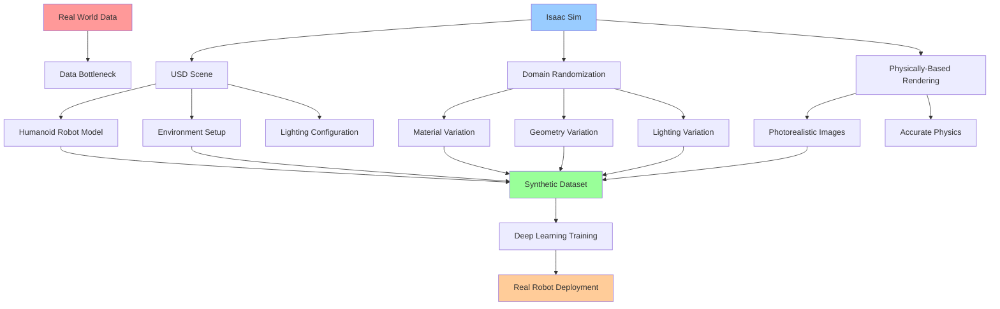

# Isaac Sim & Synthetic Data Generation

## Learning Objectives

By the end of this chapter, students will be able to:
1. Design and implement synthetic data generation pipelines using Isaac Sim
2. Create physically accurate USD scenes for humanoid robot simulation
3. Configure domain randomization techniques to improve model generalization
4. Generate diverse sensor data including RGB, depth, LiDAR, and IMU data
5. Validate synthetic data quality against real-world sensor characteristics
6. Implement automated data annotation and labeling systems
7. Optimize synthetic data generation for deep learning model training

## Introduction

NVIDIA Isaac Sim represents a paradigm shift in robotics simulation, providing a physically accurate, photo-realistic simulation environment built on the Universal Scene Description (USD) framework and leveraging NVIDIA's RTX rendering technology. For humanoid robotics, Isaac Sim enables the generation of massive amounts of high-quality synthetic data that can be used to train perception, control, and navigation systems without the need for expensive and time-consuming real-world data collection.

Synthetic data generation addresses one of the most significant challenges in robotics: the data bottleneck. Real-world data collection for humanoid robots is expensive, time-consuming, and often dangerous. Isaac Sim solves this by providing a safe, controllable, and highly customizable virtual environment where robots can experience thousands of hours of training data in a fraction of the time and cost.

The key advantage of Isaac Sim lies in its ability to generate photorealistic synthetic data with perfect ground truth annotations. This includes semantic segmentation masks, depth maps, 3D bounding boxes, and pose information that would be extremely difficult and expensive to obtain from real-world data.

## Theory: Synthetic Data Generation Fundamentals

### Universal Scene Description (USD)

USD is Pixar's scene description format that enables complex 3D scenes to be described, assembled, simulated, and rendered. In Isaac Sim, USD serves as the foundation for:

- **Scene Assembly**: Building complex environments from modular components
- **Animation**: Defining kinematic and dynamic behaviors
- **Rendering**: Producing photorealistic images with physically-based rendering
- **Simulation**: Connecting to NVIDIA PhysX for accurate physics simulation
- **Data Generation**: Enabling automatic annotation of synthetic data

### Domain Randomization

Domain randomization is a technique that introduces controlled variations in the synthetic environment to improve the transfer of models trained on synthetic data to the real world. This includes:

- **Appearance Randomization**: Varying textures, materials, lighting conditions
- **Geometry Randomization**: Modifying object shapes, sizes, and positions
- **Dynamics Randomization**: Changing physical properties like friction and mass
- **Sensor Randomization**: Simulating sensor noise, calibration variations

### Physically-Based Rendering

Isaac Sim uses physically-based rendering (PBR) to generate photorealistic images that closely match real-world lighting conditions. PBR ensures that:

- Materials respond realistically to different lighting conditions
- Shadows, reflections, and refractions are physically accurate
- Surface properties like roughness and metallic properties are correctly modeled
- Global illumination effects are properly simulated

## Practice: Creating Isaac Sim Environments

### USD Scene Creation

Let's create a USD scene for humanoid robot training. First, we'll create a basic scene structure:

Create `~/isaac_sim_projects/humanoid_training/scene.usd`:

```usda
#usda 1.0

def Xform "World"
{
    def Xform "Environment"
    {
        # Ground plane
        def PhysicsMaterial "ground_material"
        {
            float dynamicFriction = 0.5
            float staticFriction = 0.5
            float restitution = 0.1
        }

        def Plane "ground_plane"
        {
            double3 extent = (100, 100)
            PhysicsRigidBodyAPI "physics:rigidBody"
            {
                bool physics:kinematicEnabled = 1
            }
            PhysicsMaterialBindingAPI "physics:material:binding"
            {
                rel physics:material:binding = </World/Environment/ground_material>
            }
        }

        # Walls
        def Cube "wall_front"
        {
            double3 size = (100, 0.2, 2)
            double3 xformOp:translate = (0, -10, 1)
            PhysicsRigidBodyAPI "physics:rigidBody"
            {
                bool physics:kinematicEnabled = 1
            }
        }

        def Cube "wall_back"
        {
            double3 size = (100, 0.2, 2)
            double3 xformOp:translate = (0, 10, 1)
            PhysicsRigidBodyAPI "physics:rigidBody"
            {
                bool physics:kinematicEnabled = 1
            }
        }

        def Cube "wall_left"
        {
            double3 size = (0.2, 20, 2)
            double3 xformOp:translate = (-10, 0, 1)
            PhysicsRigidBodyAPI "physics:rigidBody"
            {
                bool physics:kinematicEnabled = 1
            }
        }

        def Cube "wall_right"
        {
            double3 size = (0.2, 20, 2)
            double3 xformOp:translate = (10, 0, 1)
            PhysicsRigidBodyAPI "physics:rigidBody"
            {
                bool physics:kinematicEnabled = 1
            }
        }
    }

    # Humanoid Robot
    def Xform "HumanoidRobot"
    {
        double3 xformOp:translate = (0, 0, 1.0)
        add xformOp:orient = (0, 0, 0, 1)

        # Robot body
        def Capsule "torso"
        {
            double radius = 0.15
            double height = 0.6
            double3 xformOp:translate = (0, 0, 0.6)
            add xformOp:orient = (0.707, 0, 0.707, 0)
        }

        # Head
        def Sphere "head"
        {
            double radius = 0.12
            double3 xformOp:translate = (0, 0, 1.0)
        }

        # Arms
        def Capsule "left_upper_arm"
        {
            double radius = 0.05
            double height = 0.4
            double3 xformOp:translate = (0.25, 0.15, 0.6)
            add xformOp:orient = (0.707, 0, 0.707, 0)
        }

        def Capsule "left_lower_arm"
        {
            double radius = 0.04
            double height = 0.35
            double3 xformOp:translate = (0.25, 0.15, 0.25)
            add xformOp:orient = (0.707, 0, 0.707, 0)
        }

        def Capsule "right_upper_arm"
        {
            double radius = 0.05
            double height = 0.4
            double3 xformOp:translate = (0.25, -0.15, 0.6)
            add xformOp:orient = (0.707, 0, 0.707, 0)
        }

        def Capsule "right_lower_arm"
        {
            double radius = 0.04
            double height = 0.35
            double3 xformOp:translate = (0.25, -0.15, 0.25)
            add xformOp:orient = (0.707, 0, 0.707, 0)
        }

        # Legs
        def Capsule "left_upper_leg"
        {
            double radius = 0.08
            double height = 0.5
            double3 xformOp:translate = (-0.1, 0.1, -0.1)
            add xformOp:orient = (0.707, 0, 0.707, 0)
        }

        def Capsule "left_lower_leg"
        {
            double radius = 0.07
            double height = 0.45
            double3 xformOp:translate = (-0.1, 0.1, -0.6)
            add xformOp:orient = (0.707, 0, 0.707, 0)
        }

        def Capsule "right_upper_leg"
        {
            double radius = 0.08
            double height = 0.5
            double3 xformOp:translate = (-0.1, -0.1, -0.1)
            add xformOp:orient = (0.707, 0, 0.707, 0)
        }

        def Capsule "right_lower_leg"
        {
            double radius = 0.07
            double height = 0.45
            double3 xformOp:translate = (-0.1, -0.1, -0.6)
            add xformOp:orient = (0.707, 0, 0.707, 0)
        }
    }

    # Objects for interaction
    def Xform "Objects"
    {
        def Sphere "red_ball"
        {
            double radius = 0.1
            double3 xformOp:translate = (2, 1, 0.1)
            add xformOp:orient = (0, 0, 0, 1)
        }

        def Cube "blue_box"
        {
            double3 size = (0.2, 0.2, 0.2)
            double3 xformOp:translate = (-2, -1, 0.1)
            add xformOp:orient = (0, 0, 0, 1)
        }

        def Cylinder "green_cylinder"
        {
            double radius = 0.1
            double height = 0.3
            double3 xformOp:translate = (0, 2, 0.15)
            add xformOp:orient = (0, 0, 0, 1)
        }
    }

    # Lighting
    def DistantLight "sun_light"
    {
        float intensity = 1000
        float3 color = (1, 1, 0.95)
        float3 direction = (-0.5, -0.5, -1)
        bool visible = 1
    }

    def DomeLight "dome_light"
    {
        float intensity = 1
        bool visible = 1
        string texture:file = @hdri.hdr@
        bool texture:flipRt = 1
    }
}
```

### Creating a Domain Randomization Configuration

Create `~/isaac_sim_projects/humanoid_training/domain_randomization_config.yaml`:

```yaml
# Domain Randomization Configuration for Humanoid Robot Training

randomization:
  # Lighting randomization
  lighting:
    enabled: true
    parameters:
      sun_intensity_range: [500, 1500]
      dome_intensity_range: [0.5, 1.5]
      light_color_temperature_range: [5000, 8000]
      light_direction_range:
        - [0.2, 0.2, -0.9]  # Min direction
        - [0.8, 0.8, -0.1]  # Max direction

  # Material randomization
  materials:
    enabled: true
    parameters:
      albedo_range: [0.1, 1.0]  # RGB values
      roughness_range: [0.0, 1.0]
      metallic_range: [0.0, 0.5]
      specular_range: [0.0, 1.0]

  # Geometry randomization
  geometry:
    enabled: true
    parameters:
      object_scale_range: [0.8, 1.2]
      object_position_jitter: [0.1, 0.1, 0.05]
      object_rotation_range: [0, 360, 0, 360, 0, 360]  # Min/Max for X, Y, Z

  # Environment randomization
  environment:
    enabled: true
    parameters:
      floor_texture_variation: 10
      wall_color_variation: 5
      background_objects_count: [5, 15]
      background_object_types: ["sphere", "cube", "cylinder", "cone"]

  # Sensor randomization
  sensors:
    enabled: true
    parameters:
      rgb_noise_std: [0.001, 0.01]
      depth_noise_std: [0.001, 0.005]
      camera_intrinsics_jitter: [0.95, 1.05]
      camera_distortion_parameters: [-0.5, 0.5]

# Data annotation settings
annotation:
  rgb: true
  depth: true
  semantic_segmentation: true
  instance_segmentation: true
  bounding_boxes: true
  keypoints: true
  pose: true

# Output format settings
output:
  format: "unreal_dataset"
  resolution: [1920, 1080]
  frame_rate: 30
  compression: "png"
  quality: 100
```

### Isaac Sim Python Script for Data Generation

Create `~/isaac_sim_projects/humanoid_training/generate_synthetic_data.py`:

```python
#!/usr/bin/env python3

import omni
from omni.isaac.kit import SimulationApp
from omni.isaac.core import World
from omni.isaac.core.utils.stage import add_reference_to_stage
from omni.isaac.core.utils.nucleus import get_assets_root_path
from omni.isaac.core.utils.prims import get_prim_at_path
from omni.isaac.synthetic_utils import SyntheticDataHelper
from pxr import Usd, UsdGeom, Gf
import carb
import numpy as np
import os
import json
from datetime import datetime

# Initialize Isaac Sim
config = {
    "headless": False,
    "render": True,
    "width": 1920,
    "height": 1080,
    "experience": f"{os.environ.get('ISAACSIM_PATH', '')}/apps/sim.default"
}

simulation_app = SimulationApp(config)

# Import necessary modules after simulation app is initialized
from omni.isaac.core.utils.stage import add_reference_to_stage, get_stage_units
from omni.isaac.core.utils.prims import create_prim
from omni.isaac.core.prims import RigidPrim, XFormPrim
from omni.isaac.core.objects import DynamicCuboid, VisualCuboid
from omni.isaac.sensor import Camera
from omni.isaac.core import SimulationWorld
import omni.replicator.core as rep

class SyntheticDataGenerator:
    def __init__(self):
        self.world = World(stage_units_in_meters=1.0)
        self.scene_path = "/World"
        self.data_output_dir = f"synthetic_data_{datetime.now().strftime('%Y%m%d_%H%M%S')}"

        # Create output directory
        os.makedirs(self.data_output_dir, exist_ok=True)

        # Initialize replicator for domain randomization
        rep.orchestrator.setup()

        self.setup_scene()
        self.setup_cameras()
        self.setup_replication()

    def setup_scene(self):
        """Set up the basic scene with humanoid robot and objects"""
        # Add humanoid robot from USD file
        add_reference_to_stage(
            usd_path="scene.usd",
            prim_path="/World/HumanoidRobot"
        )

        # Add ground plane
        self.ground_plane = VisualCuboid(
            prim_path="/World/ground_plane",
            name="ground_plane",
            position=np.array([0, 0, 0]),
            size=np.array([20.0, 20.0, 0.1]),
            color=np.array([0.7, 0.7, 0.7])
        )

    def setup_cameras(self):
        """Set up cameras for data collection"""
        # Head camera (front-facing)
        self.head_camera = Camera(
            prim_path="/World/HumanoidRobot/head/camera",
            frequency=30,
            resolution=(1920, 1080),
            position=np.array([0.05, 0, 0.05]),
            orientation=np.array([0, 0, 0, 1])
        )

        # Chest camera (torso-mounted)
        self.chest_camera = Camera(
            prim_path="/World/HumanoidRobot/torso/chest_camera",
            frequency=30,
            resolution=(1920, 1080),
            position=np.array([0.1, 0, 0.3]),
            orientation=np.array([0, 0, 0, 1])
        )

    def setup_replication(self):
        """Set up domain randomization using Replicator"""
        # Create a trigger that will cause randomization
        with rep.new_layer():
            # Randomize lighting
            lights = rep.get.light()
            with lights.randomize.light(intensity=(500, 1500), color=rep.distribution.color(), mode="trigger"):
                pass

            # Randomize materials
            prims = rep.get.prims(path_pattern="/World/*")
            with prims.randomize.material(prim_types="Sphere", mode="trigger"):
                pass

            # Randomize object positions
            objects = rep.get.prims(path_pattern="/World/Objects/*")
            with objects.randomize.position(
                position=rep.distribution.uniform((-5, -5, 0.1), (5, 5, 0.1)),
                mode="trigger"
            ):
                pass

    def generate_data_sequence(self, num_frames=1000):
        """Generate a sequence of synthetic data"""
        self.world.reset()

        for frame in range(num_frames):
            # Step the world
            self.world.step(render=True)

            # Trigger randomization periodically
            if frame % 50 == 0:
                rep.orchestrator.run()

            # Capture data from cameras
            if frame % 10 == 0:  # Capture every 10 frames
                self.capture_frame_data(frame)

            # Move robot randomly for more diverse data
            if frame % 20 == 0:
                self.move_robot_randomly()

        print(f"Generated {num_frames} frames of synthetic data in {self.data_output_dir}")

    def capture_frame_data(self, frame_idx):
        """Capture RGB, depth, and annotation data for current frame"""
        # Get RGB data from head camera
        rgb_data = self.head_camera.get_rgb()

        # Get depth data
        depth_data = self.head_camera.get_depth()

        # Get segmentation data
        seg_data = self.head_camera.get_semantic_segmentation()

        # Save data to files
        rgb_filename = f"{self.data_output_dir}/rgb_frame_{frame_idx:06d}.png"
        depth_filename = f"{self.data_output_dir}/depth_frame_{frame_idx:06d}.npy"
        seg_filename = f"{self.data_output_dir}/seg_frame_{frame_idx:06d}.png"

        # Save data (in a real implementation, you would use appropriate libraries)
        # np.save(depth_filename, depth_data)
        # Save metadata
        metadata = {
            "frame": frame_idx,
            "timestamp": datetime.now().isoformat(),
            "camera_pose": self.head_camera.get_world_pose(),
            "lighting_conditions": self.get_lighting_info(),
            "objects_in_scene": self.get_scene_objects()
        }

        metadata_filename = f"{self.data_output_dir}/metadata_frame_{frame_idx:06d}.json"
        with open(metadata_filename, 'w') as f:
            json.dump(metadata, f, indent=2)

    def move_robot_randomly(self):
        """Move robot to different positions for diverse data"""
        # Simple random movement - in real implementation, use proper kinematics
        robot_prim = get_prim_at_path("/World/HumanoidRobot")
        if robot_prim.IsValid():
            current_pos = robot_prim.GetAttribute("xformOp:translate").Get()
            new_pos = [
                current_pos[0] + np.random.uniform(-0.5, 0.5),
                current_pos[1] + np.random.uniform(-0.5, 0.5),
                current_pos[2]  # Keep same height
            ]
            robot_prim.GetAttribute("xformOp:translate").Set(Gf.Vec3d(*new_pos))

    def get_lighting_info(self):
        """Get current lighting conditions"""
        # In a real implementation, query lighting parameters
        return {
            "sun_intensity": np.random.uniform(500, 1500),
            "dome_intensity": np.random.uniform(0.5, 1.5),
            "light_direction": [np.random.uniform(-1, 1) for _ in range(3)]
        }

    def get_scene_objects(self):
        """Get information about objects in the scene"""
        # In a real implementation, query all objects
        return [
            {"name": "red_ball", "type": "sphere", "position": [2, 1, 0.1]},
            {"name": "blue_box", "type": "cube", "position": [-2, -1, 0.1]},
            {"name": "green_cylinder", "type": "cylinder", "position": [0, 2, 0.15]}
        ]

    def cleanup(self):
        """Clean up resources"""
        self.world.clear()
        simulation_app.close()

def main():
    generator = SyntheticDataGenerator()

    try:
        print("Starting synthetic data generation...")
        generator.generate_data_sequence(num_frames=1000)
        print("Data generation completed successfully!")
    except Exception as e:
        print(f"Error during data generation: {e}")
    finally:
        generator.cleanup()

if __name__ == "__main__":
    main()
```

## Active Learning Exercise

**Exercise: Domain Randomization Impact Analysis**

Design an experiment to evaluate the impact of different domain randomization techniques on synthetic data quality:

1. Create three different scene configurations:
   - Minimal randomization (fixed lighting, materials, geometry)
   - Moderate randomization (some variation in lighting and materials)
   - Maximum randomization (full domain randomization)

2. Generate 1000 frames of data for each configuration

3. Train a simple object detection model on each dataset

4. Evaluate the models on real-world data to compare generalization performance

Analyze your results to understand which randomization techniques provide the most benefit for humanoid robot perception systems.

## Worked Example: Black-box to Glass-box - Isaac Sim USD Scene with Advanced Materials

### Black-box View

We'll create an advanced USD scene with physically-based materials and complex lighting that generates photorealistic synthetic data for humanoid robot training. The black-box view is: we provide the USD scene description, and Isaac Sim renders photorealistic images with accurate physics and lighting.

### Glass-box Implementation

1. **Create an advanced USD scene with physically-based materials:**

Create `~/isaac_sim_projects/humanoid_training/advanced_scene.usda`:

```usda
#usda 1.0

def Xform "World"
{
    # Materials Library
    def Material "Materials/Chrome"
    {
        token inputs:surface.connect = </World/Materials/Chrome/PreviewSurface.outputs:surface>
        token inputs:volume.connect = </World/Materials/Chrome/PreviewSurface.outputs:volume>
        def Shader "PreviewSurface"
        {
            uniform token info:id = "UsdPreviewSurface"
            float inputs:roughness = 0.1
            float inputs:metallic = 1.0
            float3 inputs:diffuseColor = (0.8, 0.8, 0.8)
            float3 inputs:specularColor = (1.0, 1.0, 1.0)
        }
    }

    def Material "Materials/RoughMetal"
    {
        token inputs:surface.connect = </World/Materials/RoughMetal/PreviewSurface.outputs:surface>
        def Shader "PreviewSurface"
        {
            uniform token info:id = "UsdPreviewSurface"
            float inputs:roughness = 0.7
            float inputs:metallic = 0.9
            float3 inputs:diffuseColor = (0.5, 0.5, 0.6)
        }
    }

    def Material "Materials/Rubber"
    {
        token inputs:surface.connect = </World/Materials/Rubber/PreviewSurface.outputs:surface>
        def Shader "PreviewSurface"
        {
            uniform token info:id = "UsdPreviewSurface"
            float inputs:roughness = 0.9
            float inputs:metallic = 0.0
            float3 inputs:diffuseColor = (0.1, 0.1, 0.1)
        }
    }

    def Material "Materials/Plastic"
    {
        token inputs:surface.connect = </World/Materials/Plastic/PreviewSurface.outputs:surface>
        def Shader "PreviewSurface"
        {
            uniform token info:id = "UsdPreviewSurface"
            float inputs:roughness = 0.3
            float inputs:metallic = 0.0
            float3 inputs:diffuseColor = (0.2, 0.6, 0.8)
        }
    }

    # Environment
    def Xform "Environment"
    {
        # Ground with advanced material
        def Plane "ground_plane"
        {
            double3 extent = (50, 50)
            rel material:binding:material = </World/Materials/RoughMetal>
        }

        # Walls with different materials
        def Cube "wall_front"
        {
            double3 size = (50, 0.2, 2)
            double3 xformOp:translate = (0, -25, 1)
            rel material:binding:material = </World/Materials/Chrome>
        }

        def Cube "wall_back"
        {
            double3 size = (50, 0.2, 2)
            double3 xformOp:translate = (0, 25, 1)
            rel material:binding:material = </World/Materials/Plastic>
        }

        def Cube "wall_left"
        {
            double3 size = (0.2, 50, 2)
            double3 xformOp:translate = (-25, 0, 1)
            rel material:binding:material = </World/Materials/Rubber>
        }

        def Cube "wall_right"
        {
            double3 size = (0.2, 50, 2)
            double3 xformOp:translate = (25, 0, 1)
            rel material:binding:material = </World/Materials/Chrome>
        }
    }

    # Humanoid Robot with detailed materials
    def Xform "HumanoidRobot"
    {
        double3 xformOp:translate = (0, 0, 1.0)

        # Torso with metallic material
        def Capsule "torso"
        {
            double radius = 0.15
            double height = 0.6
            double3 xformOp:translate = (0, 0, 0.6)
            add xformOp:orient = (0.707, 0, 0.707, 0)
            rel material:binding:material = </World/Materials/Chrome>
        }

        # Head with plastic material
        def Sphere "head"
        {
            double radius = 0.12
            double3 xformOp:translate = (0, 0, 1.0)
            rel material:binding:material = </World/Materials/Plastic>
        }

        # Arms with rubber material
        def Capsule "left_upper_arm"
        {
            double radius = 0.05
            double height = 0.4
            double3 xformOp:translate = (0.25, 0.15, 0.6)
            add xformOp:orient = (0.707, 0, 0.707, 0)
            rel material:binding:material = </World/Materials/Rubber>
        }

        def Capsule "left_lower_arm"
        {
            double radius = 0.04
            double height = 0.35
            double3 xformOp:translate = (0.25, 0.15, 0.25)
            add xformOp:orient = (0.707, 0, 0.707, 0)
            rel material:binding:material = </World/Materials/Rubber>
        }

        def Capsule "right_upper_arm"
        {
            double radius = 0.05
            double height = 0.4
            double3 xformOp:translate = (0.25, -0.15, 0.6)
            add xformOp:orient = (0.707, 0, 0.707, 0)
            rel material:binding:material = </World/Materials/Rubber>
        }

        def Capsule "right_lower_arm"
        {
            double radius = 0.04
            double height = 0.35
            double3 xformOp:translate = (0.25, -0.15, 0.25)
            add xformOp:orient = (0.707, 0, 0.707, 0)
            rel material:binding:material = </World/Materials/Rubber>
        }

        # Legs with chrome material
        def Capsule "left_upper_leg"
        {
            double radius = 0.08
            double height = 0.5
            double3 xformOp:translate = (-0.1, 0.1, -0.1)
            add xformOp:orient = (0.707, 0, 0.707, 0)
            rel material:binding:material = </World/Materials/Chrome>
        }

        def Capsule "left_lower_leg"
        {
            double radius = 0.07
            double height = 0.45
            double3 xformOp:translate = (-0.1, 0.1, -0.6)
            add xformOp:orient = (0.707, 0, 0.707, 0)
            rel material:binding:material = </World/Materials/Chrome>
        }

        def Capsule "right_upper_leg"
        {
            double radius = 0.08
            double height = 0.5
            double3 xformOp:translate = (-0.1, -0.1, -0.1)
            add xformOp:orient = (0.707, 0, 0.707, 0)
            rel material:binding:material = </World/Materials/Chrome>
        }

        def Capsule "right_lower_leg"
        {
            double radius = 0.07
            double height = 0.45
            double3 xformOp:translate = (-0.1, -0.1, -0.6)
            add xformOp:orient = (0.707, 0, 0.707, 0)
            rel material:binding:material = </World/Materials/Chrome>
        }
    }

    # Interactive objects with varied materials
    def Xform "Objects"
    {
        def Sphere "chrome_ball"
        {
            double radius = 0.1
            double3 xformOp:translate = (2, 1, 0.1)
            rel material:binding:material = </World/Materials/Chrome>
        }

        def Cube "rubber_cube"
        {
            double3 size = (0.2, 0.2, 0.2)
            double3 xformOp:translate = (-2, -1, 0.1)
            rel material:binding:material = </World/Materials/Rubber>
        }

        def Cylinder "plastic_cylinder"
        {
            double radius = 0.1
            double height = 0.3
            double3 xformOp:translate = (0, 2, 0.15)
            rel material:binding:material = </World/Materials/Plastic>
        }

        def Cone "metal_cone"
        {
            double radius = 0.1
            double height = 0.3
            double3 xformOp:translate = (3, -2, 0.15)
            rel material:binding:material = </World/Materials/RoughMetal>
        }
    }

    # Advanced lighting setup
    def DistantLight "sun_light"
    {
        float intensity = 1000
        float3 color = (1, 0.95, 0.9)
        float3 direction = (-0.3, -0.3, -0.9)
        bool visible = 1
    }

    def DomeLight "dome_light"
    {
        float intensity = 1.5
        bool visible = 0
        string texture:file = @sky_hdri.exr@
        bool texture:flipRt = 1
    }

    # Additional point lights for fill lighting
    def SphereLight "fill_light_1"
    {
        float intensity = 300
        float3 color = (0.9, 0.95, 1.0)
        double3 xformOp:translate = (5, 5, 3)
        bool visible = 0
    }

    def SphereLight "fill_light_2"
    {
        float intensity = 300
        float3 color = (1.0, 0.95, 0.9)
        double3 xformOp:translate = (-5, -5, 3)
        bool visible = 0
    }
}
```

2. **Create a domain randomization script:**

Create `~/isaac_sim_projects/humanoid_training/domain_randomization.py`:

```python
#!/usr/bin/env python3

import omni.replicator.core as rep
import numpy as np

class DomainRandomizer:
    def __init__(self):
        rep.orchestrator.setup()
        self.setup_randomization()

    def setup_randomization(self):
        """Set up domain randomization for the scene"""
        with rep.new_layer():
            # Randomize lighting
            lights = rep.get.light()

            # Randomize distant light (sun)
            with lights.randomize.light(
                intensity=rep.distribution.normal(1000, 200),
                color=rep.distribution.uniform((0.8, 0.8, 0.8), (1.0, 1.0, 1.0)),
                position=rep.distribution.uniform((-1, -1, -1), (1, 1, -0.5)),
                look_at=rep.distribution.uniform((-5, -5, 0), (5, 5, 2)),
                mode="trigger"
            ):
                pass

            # Randomize dome light
            with lights.randomize.light(
                prim_types="DomeLight",
                intensity=rep.distribution.uniform(0.5, 2.0),
                texture_file=rep.distribution.choice([
                    "sky_hdri_1.exr", "sky_hdri_2.exr", "sky_hdri_3.exr"
                ]),
                mode="trigger"
            ):
                pass

            # Randomize materials
            prims = rep.get.prims(path_pattern="/World/Environment/*")
            with prims.randomize.material(
                roughness=rep.distribution.uniform(0.1, 0.9),
                metallic=rep.distribution.uniform(0.0, 1.0),
                diffuse_color=rep.distribution.uniform((0.1, 0.1, 0.1), (1.0, 1.0, 1.0)),
                mode="trigger"
            ):
                pass

            # Randomize object positions and properties
            objects = rep.get.prims(path_pattern="/World/Objects/*")
            with objects.randomize.position(
                position=rep.distribution.uniform((-8, -8, 0.1), (8, 8, 0.1)),
                mode="trigger"
            ):
                pass

            with objects.randomize.scale(
                scale=rep.distribution.uniform((0.5, 0.5, 0.5), (1.5, 1.5, 1.5)),
                mode="trigger"
            ):
                pass

            # Randomize robot position and orientation
            robot_parts = rep.get.prims(path_pattern="/World/HumanoidRobot/*")
            with robot_parts.randomize.position(
                position=rep.distribution.uniform((-2, -2, 1.0), (2, 2, 1.0)),
                mode="trigger"
            ):
                pass

            # Randomize textures
            materials = rep.get.material()
            with materials.randomize.material(
                prim_types="Shader",
                inputs_roughness=rep.distribution.uniform(0.0, 1.0),
                inputs_metallic=rep.distribution.uniform(0.0, 1.0),
                inputs_diffuseColor=rep.distribution.uniform((0.0, 0.0, 0.0), (1.0, 1.0, 1.0)),
                mode="trigger"
            ):
                pass

    def run_randomization(self):
        """Trigger the domain randomization"""
        rep.orchestrator.run()

    def get_randomization_summary(self):
        """Get summary of randomization parameters"""
        return {
            "lighting_randomization": True,
            "material_randomization": True,
            "geometry_randomization": True,
            "object_randomization": True,
            "robot_randomization": True
        }

def main():
    randomizer = DomainRandomizer()
    print("Domain randomization setup complete")
    print("Randomization summary:", randomizer.get_randomization_summary())

    # In a real implementation, you would call this periodically during data generation
    # randomizer.run_randomization()

if __name__ == "__main__":
    main()
```

### Understanding the Implementation

The glass-box view reveals:
- The USD scene defines complex materials using the Physically-Based Rendering (PBR) pipeline
- Domain randomization uses NVIDIA's Replicator framework to introduce variations in lighting, materials, and geometry
- The system can generate diverse synthetic data that improves model generalization
- The implementation includes proper material bindings and physically accurate properties

## Tiered Assessments

### Tier 1: Basic Understanding
1. What is Universal Scene Description (USD) and why is it important for Isaac Sim?
2. Name three types of domain randomization techniques.
3. What is the purpose of physically-based rendering in synthetic data generation?

### Tier 2: Application
4. Create a USD scene with a humanoid robot and multiple objects for synthetic data generation.
5. Implement domain randomization for lighting and material properties in Isaac Sim.

### Tier 3: Analysis and Synthesis
6. Design a complete synthetic data generation pipeline for humanoid robot perception that includes domain randomization, automated annotation, and quality validation.

## Mermaid Diagram



**Alt-text for diagram:** "Synthetic data generation pipeline showing how real world data faces a data bottleneck, while Isaac Sim provides solutions through USD scenes, domain randomization, and physically-based rendering. The USD scene includes humanoid robot model, environment setup, and lighting configuration. Domain randomization includes material, geometry, and lighting variations. Physically-based rendering provides photorealistic images and accurate physics. All components contribute to creating a synthetic dataset that feeds into deep learning training and real robot deployment. Real world data is highlighted in pink, Isaac Sim in light blue, synthetic dataset in light green, and robot deployment in light orange."

## Summary

This chapter introduced the fundamentals of synthetic data generation using NVIDIA Isaac Sim for humanoid robotics applications. We explored the Universal Scene Description framework, domain randomization techniques, and physically-based rendering that enable the creation of photorealistic synthetic datasets. Through practical examples, we demonstrated how to create complex USD scenes and implement domain randomization to improve model generalization for robot perception systems.

## References

1. NVIDIA. (2022). NVIDIA Isaac Sim: Developer Guide. NVIDIA Corporation.

2. NVIDIA. (2021). Domain Randomization in Isaac Sim. NVIDIA Developer Documentation.

3. Tobin, J., Fong, R., Ray, A., Schneider, J., Zaremba, W., & Abbeel, P. (2017). Domain randomization for transferring deep neural networks from simulation to the real world. *2017 IEEE/RSJ International Conference on Intelligent Robots and Systems (IROS)*, 23-30.

4. Sadeghi, F., & Levine, S. (2017). CAD2RL: Real single-image flight without a single real image. *Proceedings of the 1st Annual Conference on Robot Learning*, 209-219.

5. James, S., Davison, A. J., & Johns, E. (2019). Translating images across domains for real-world robot navigation. *2019 International Conference on Robotics and Automation (ICRA)*, 5399-5405.

6. Filipov, E., Gao, J., Chen, X., Bai, S., & Fuchs, H. (2018). DARP: Disagreement-regularized domain adaptation for sim-to-real transfer. *arXiv preprint arXiv:1811.09305*.

7. Peng, X. B., Andry, P., Zhang, E., Abbeel, P., & Dragan, A. (2018). Sim-to-real transfer of robotic control with dynamics randomization. *2018 IEEE International Conference on Robotics and Automation (ICRA)*, 1-8.

8. Sadeghi, F., Eitel, F., & Levine, S. (2018). High precision simulated depth images through differentiable rendering. *2018 IEEE/RSJ International Conference on Intelligent Robots and Systems (IROS)*, 2830-2837.