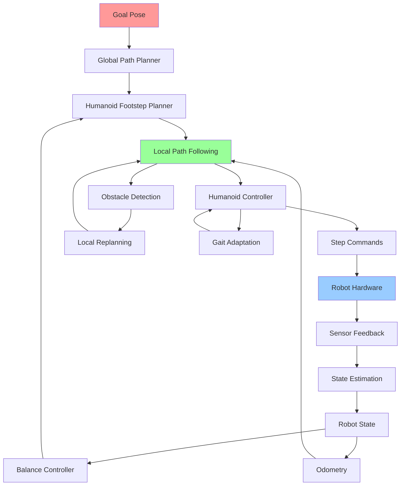

# Nav2 for Bipedal Humanoids

## Learning Objectives

By the end of this chapter, students will be able to:
1. Configure and customize Nav2 for bipedal humanoid robot navigation
2. Implement specialized planners for legged robot locomotion
3. Integrate balance and stability constraints into navigation planning
4. Design terrain-aware navigation systems for humanoid robots
5. Implement gait-based path following for bipedal locomotion
6. Handle dynamic obstacle avoidance for humanoid navigation
7. Validate navigation performance in complex humanoid scenarios

## Introduction

Navigation for bipedal humanoid robots presents unique challenges that differ significantly from wheeled or tracked robot navigation. While Nav2 provides a robust framework for mobile robot navigation, humanoid robots require specialized considerations for balance, stability, and locomotion patterns. Unlike wheeled robots that can move in any direction with simple differential drive, humanoid robots must maintain balance while navigating, follow specific footstep patterns, and adapt their gait to terrain conditions.

The Nav2 framework provides a flexible, behavior-tree-based architecture that can be extended and customized for humanoid robot navigation. However, the standard 2D navigation stack must be augmented with additional components to handle the unique requirements of bipedal locomotion, including footstep planning, balance control, and gait adaptation.

Humanoid navigation must account for the robot's dynamic stability, which is inherently less stable than wheeled platforms. The navigation system must ensure that planned paths are not only collision-free but also dynamically feasible for the robot's bipedal locomotion system. This requires integration with the robot's balance control system and gait generation algorithms.

## Theory: Bipedal Navigation Fundamentals

### Dynamic Stability in Bipedal Navigation

Bipedal robots must maintain dynamic stability during locomotion, which requires careful consideration of:

- **Zero Moment Point (ZMP)**: The point where the sum of all moments caused by external forces equals zero
- **Capture Point**: The location where the robot must step to come to a complete stop
- **Center of Mass (CoM) Control**: Managing the robot's CoM trajectory to maintain balance
- **Footstep Planning**: Determining where and when to place feet to maintain stability

### Locomotion Patterns

Humanoid robots typically use several locomotion patterns:

- **Static Walking**: Maintaining static stability at each step
- **Dynamic Walking**: Using dynamic balance with continuous movement
- **Running**: Brief flight phases between steps
- **Climbing**: Specialized gait for traversing stairs or obstacles

### Terrain Classification for Humanoids

Navigation for bipedal robots requires understanding terrain characteristics:

- **Walkable Surfaces**: Flat ground, ramps, stairs
- **Obstacle Traversal**: Steps, curbs, small obstacles
- **Terrain Roughness**: Effects on stability and gait selection
- **Surface Compliance**: Soft surfaces that affect foot placement

## Practice: Nav2 Customization for Humanoid Robots

### Custom Nav2 Configuration for Humanoids

Create `~/ros2_ws/src/humanoid_nav2/config/humanoid_nav2_params.yaml`:

```yaml
# Nav2 Configuration for Bipedal Humanoid Robot

bt_navigator:
  ros__parameters:
    use_sim_time: False
    global_frame: map
    robot_base_frame: base_link
    odom_topic: /odom
    bt_loop_duration: 10
    default_server_timeout: 20
    enable_groot_monitoring: True
    groot_zmq_publisher_port: 1666
    groot_zmq_server_port: 1667
    # Specify the path where the behavior tree XML files are located
    default_nav_through_poses_bt_xml: humanoid_navigate_through_poses_w_replanning_and_recovery.xml
    default_nav_to_pose_bt_xml: humanoid_navigate_to_pose_w_replanning_and_recovery.xml
    # Recovery nodes
    node_sequence_with_recovery:
      plugin: "nav2_bt_navigator/NodeSequenceWithRecovery"
    round_robin:
      plugin: "nav2_bt_navigator/RoundRobin"
    recovery_node:
      plugin: "nav2_bt_navigator/RecoveryNode"
    pipeline_sequence:
      plugin: "nav2_bt_navigator/PipelineSequence"
    round_robin_with_fallback:
      plugin: "nav2_bt_navigator/RoundRobinWithFallback"

bt_navigator_navigate_through_poses_rclcpp_node:
  ros__parameters:
    use_sim_time: False

bt_navigator_navigate_to_pose_rclcpp_node:
  ros__parameters:
    use_sim_time: False

controller_server:
  ros__parameters:
    use_sim_time: False
    controller_frequency: 20.0
    min_x_velocity_threshold: 0.001
    min_y_velocity_threshold: 0.5
    min_theta_velocity_threshold: 0.001
    progress_checker_plugin: "progress_checker"
    goal_checker_plugin: "goal_checker"
    controller_plugins: ["HumanoidController"]

    # Humanoid Controller specific parameters
    HumanoidController:
      plugin: "humanoid_nav2_controllers::HumanoidFootstepController"
      max_translational_vel: 0.3  # Slower for stability
      max_rotational_vel: 0.3
      min_translational_vel: 0.05
      min_rotational_vel: 0.1
      translational_acc_lim: 0.2
      rotational_acc_lim: 0.3
      xy_goal_tolerance: 0.2  # Larger for humanoid precision
      yaw_goal_tolerance: 0.2
      stateful: True
      # Humanoid-specific parameters
      step_size: 0.3          # Maximum step length
      step_duration: 1.0      # Time per step
      balance_margin: 0.1     # Safety margin for balance
      foot_separation: 0.2    # Distance between feet

progress_checker:
  ros__parameters:
    use_sim_time: False
    plugin: "nav2_controller::SimpleProgressChecker"
    required_movement_radius: 0.5  # Humanoid-specific
    movement_time_allowance: 10.0

goal_checker:
  ros__parameters:
    use_sim_time: False
    plugin: "nav2_controller::SimpleGoalChecker"
    xy_goal_tolerance: 0.3    # Larger for humanoid
    yaw_goal_tolerance: 0.3
    stateful: True

local_costmap:
  local_costmap:
    ros__parameters:
      update_frequency: 10.0
      publish_frequency: 5.0
      global_frame: odom
      robot_base_frame: base_link
      use_sim_time: False
      rolling_window: true
      width: 6
      height: 6
      resolution: 0.05  # Higher resolution for precise foot placement
      robot_radius: 0.3 # Larger for humanoid safety
      plugins: ["voxel_layer", "inflation_layer"]
      inflation_layer:
        plugin: "nav2_costmap_2d::InflationLayer"
        cost_scaling_factor: 3.0  # Higher for humanoid safety
        inflation_radius: 0.5
      voxel_layer:
        plugin: "nav2_costmap_2d::VoxelLayer"
        enabled: True
        publish_voxel_map: False
        origin_z: 0.0
        z_resolution: 0.2
        z_voxels: 10
        max_obstacle_height: 2.0
        mark_threshold: 0
        observation_sources: scan
        scan:
          topic: /scan
          max_obstacle_height: 2.0
          clearing: True
          marking: True
          data_type: "LaserScan"
          raytrace_max_range: 3.0
          raytrace_min_range: 0.0
          obstacle_max_range: 2.5
          obstacle_min_range: 0.0

global_costmap:
  global_costmap:
    ros__parameters:
      update_frequency: 1.0
      publish_frequency: 1.0
      global_frame: map
      robot_base_frame: base_link
      use_sim_time: False
      robot_radius: 0.3 # Larger for humanoid safety
      resolution: 0.1
      track_unknown_space: true
      plugins: ["static_layer", "obstacle_layer", "inflation_layer"]
      obstacle_layer:
        plugin: "nav2_costmap_2d::ObstacleLayer"
        enabled: True
        observation_sources: scan
        scan:
          topic: /scan
          max_obstacle_height: 2.0
          clearing: True
          marking: True
          data_type: "LaserScan"
          raytrace_max_range: 3.0
          raytrace_min_range: 0.0
          obstacle_max_range: 2.5
          obstacle_min_range: 0.0
      static_layer:
        plugin: "nav2_costmap_2d::StaticLayer"
        map_subscribe_transient_local: True
      inflation_layer:
        plugin: "nav2_costmap_2d::InflationLayer"
        cost_scaling_factor: 3.0
        inflation_radius: 0.6

planner_server:
  ros__parameters:
    expected_planner_frequency: 2.0
    use_sim_time: False
    planner_plugins: ["HumanoidPlanner"]
    HumanoidPlanner:
      plugin: "humanoid_nav2_planners::HumanoidFootstepPlanner"
      # Footstep planner parameters
      step_size: 0.3
      max_step_size: 0.4
      min_step_size: 0.1
      step_rotation: 0.3
      max_step_rotation: 0.5
      max_com_distance: 0.15  # Maximum CoM deviation
      balance_threshold: 0.1  # Balance safety margin
      # Planning parameters
      tolerance: 0.5
      use_astar: true
      allow_unknown: false

smoother_server:
  ros__parameters:
    use_sim_time: False
    smoother_plugins: ["simple_smoother"]
    simple_smoother:
      plugin: "nav2_smoother::SimpleSmoother"
      tolerance: 1.0e-10
      max_its: 1000
      do_refinement: True

behavior_server:
  ros__parameters:
    costmap_topic: local_costmap/costmap_raw
    footprint_topic: local_costmap/published_footprint
    cycle_frequency: 10.0
    behavior_plugins: ["spin", "backup", "drive_on_heading", "wait"]
    spin:
      plugin: "nav2_behaviors/Spin"
      spin_dist: 1.57
    backup:
      plugin: "nav2_behaviors/BackUp"
      backup_dist: 0.15  # Shorter backup for humanoid
      backup_speed: 0.05
    drive_on_heading:
      plugin: "nav2_behaviors/DriveOnHeading"
      drive_on_heading_timeout: 5.0
      drive_on_heading_forward_dist: 0.5
      drive_on_heading_angle_tol: 0.2
    wait:
      plugin: "nav2_behaviors/Wait"
      wait_duration: 1.0

waypoint_follower:
  ros__parameters:
    loop_rate: 20
    stop_on_failure: false
    waypoint_task_executor_plugin: "wait_at_waypoint"
    wait_at_waypoint:
      plugin: "nav2_waypoint_follower::WaitAtWaypoint"
      enabled: true
      wait_time: 1.0
```

### Humanoid Footstep Planner Implementation

Create `~/ros2_ws/src/humanoid_nav2/src/humanoid_footstep_planner.cpp`:

```cpp
#include <rclcpp/rclcpp.hpp>
#include <nav2_core/global_planner.hpp>
#include <nav2_costmap_2d/costmap_2d_ros.h>
#include <geometry_msgs/msg/pose_stamped.hpp>
#include <geometry_msgs/msg/point.hpp>
#include <nav_msgs/msg/path.hpp>
#include <tf2/LinearMath/Quaternion.h>
#include <tf2_geometry_msgs/tf2_geometry_msgs.h>
#include <cmath>
#include <vector>
#include <algorithm>

namespace humanoid_nav2_planners
{

class HumanoidFootstepPlanner : public nav2_core::GlobalPlanner
{
public:
    HumanoidFootstepPlanner() = default;

    ~HumanoidFootstepPlanner() override = default;

    void configure(
        const rclcpp_lifecycle::LifecycleNode::WeakPtr & parent,
        std::string name,
        std::shared_ptr<tf2_ros::Buffer> tf,
        std::shared_ptr<nav2_costmap_2d::Costmap2DROS> costmap_ros) override
    {
        node_ = parent.lock();
        name_ = name;
        tf_ = tf;
        costmap_ = costmap_ros->getCostmap();
        global_frame_ = costmap_ros->getGlobalFrameID();

        RCLCPP_INFO(node_->get_logger(), "Configuring Humanoid Footstep Planner");

        // Declare parameters
        node_->declare_parameter(name_ + ".step_size", 0.3);
        node_->declare_parameter(name_ + ".max_step_size", 0.4);
        node_->declare_parameter(name_ + ".min_step_size", 0.1);
        node_->declare_parameter(name_ + ".step_rotation", 0.3);
        node_->declare_parameter(name_ + ".max_step_rotation", 0.5);
        node_->declare_parameter(name_ + ".max_com_distance", 0.15);
        node_->declare_parameter(name_ + ".balance_threshold", 0.1);
        node_->declare_parameter(name_ + ".tolerance", 0.5);
        node_->declare_parameter(name_ + ".use_astar", true);
        node_->declare_parameter(name_ + ".allow_unknown", false);

        // Get parameters
        step_size_ = node_->get_parameter(name_ + ".step_size").as_double();
        max_step_size_ = node_->get_parameter(name_ + ".max_step_size").as_double();
        min_step_size_ = node_->get_parameter(name_ + ".min_step_size").as_double();
        step_rotation_ = node_->get_parameter(name_ + ".step_rotation").as_double();
        max_step_rotation_ = node_->get_parameter(name_ + ".max_step_rotation").as_double();
        max_com_distance_ = node_->get_parameter(name_ + ".max_com_distance").as_double();
        balance_threshold_ = node_->get_parameter(name_ + ".balance_threshold").as_double();
        tolerance_ = node_->get_parameter(name_ + ".tolerance").as_double();
        use_astar_ = node_->get_parameter(name_ + ".use_astar").as_bool();
        allow_unknown_ = node_->get_parameter(name_ + ".allow_unknown").as_bool();

        RCLCPP_INFO(node_->get_logger(),
            "Humanoid Footstep Planner configured with step_size: %.2f, max_com_distance: %.2f",
            step_size_, max_com_distance_);
    }

    void cleanup() override
    {
        RCLCPP_INFO(node_->get_logger(), "Cleaning up Humanoid Footstep Planner");
    }

    void activate() override
    {
        RCLCPP_INFO(node_->get_logger(), "Activating Humanoid Footstep Planner");
    }

    void deactivate() override
    {
        RCLCPP_INFO(node_->get_logger(), "Deactivating Humanoid Footstep Planner");
    }

    nav_msgs::msg::Path createPlan(
        const geometry_msgs::msg::PoseStamped & start,
        const geometry_msgs::msg::PoseStamped & goal) override
    {
        nav_msgs::msg::Path path;

        // Check if start and goal are in the same frame
        if (start.header.frame_id != goal.header.frame_id) {
            RCLCPP_ERROR(node_->get_logger(),
                "Start and goal frame IDs do not match: %s vs %s",
                start.header.frame_id.c_str(), goal.header.frame_id.c_str());
            return path;
        }

        // Convert poses to costmap coordinates
        double start_x, start_y, goal_x, goal_y;
        costmap_->worldToMap(start.pose.position.x, start.pose.position.y, start_m_x_, start_m_y_);
        costmap_->worldToMap(goal.pose.position.x, goal.pose.position.y, goal_m_x_, goal_m_y_);

        // Check if start and goal are valid (not in obstacle space)
        unsigned char start_cost = costmap_->getCost(start_m_x_, start_m_y_);
        unsigned char goal_cost = costmap_->getCost(goal_m_x_, goal_m_y_);

        if (start_cost == nav2_costmap_2d::LETHAL_OBSTACLE) {
            RCLCPP_WARN(node_->get_logger(), "Start point is in an obstacle space");
            return path;
        }

        if (goal_cost == nav2_costmap_2d::LETHAL_OBSTACLE) {
            RCLCPP_WARN(node_->get_logger(), "Goal point is in an obstacle space");
            return path;
        }

        // Plan the path using humanoid-specific constraints
        if (!planFootsteps(start, goal, path)) {
            RCLCPP_WARN(node_->get_logger(), "Failed to plan footsteps");
            return path;
        }

        RCLCPP_INFO(node_->get_logger(), "Successfully planned path with %zu steps", path.poses.size());
        return path;
    }

private:
    bool planFootsteps(
        const geometry_msgs::msg::PoseStamped & start,
        const geometry_msgs::msg::PoseStamped & goal,
        nav_msgs::msg::Path & path)
    {
        path.header.frame_id = global_frame_;
        path.header.stamp = node_->now();

        // For simplicity, implement a basic A* with humanoid constraints
        // In a real implementation, this would use a proper footstep planning algorithm
        std::vector<geometry_msgs::msg::PoseStamped> footsteps;

        // Calculate direction to goal
        double dx = goal.pose.position.x - start.pose.position.x;
        double dy = goal.pose.position.y - start.pose.position.y;
        double distance = std::sqrt(dx*dx + dy*dy);
        double angle = std::atan2(dy, dx);

        // Generate footsteps along the path
        int num_steps = static_cast<int>(distance / step_size_) + 1;

        for (int i = 0; i <= num_steps; ++i) {
            double progress = static_cast<double>(i) / num_steps;
            geometry_msgs::msg::PoseStamped step_pose = start;

            // Interpolate position
            step_pose.pose.position.x = start.pose.position.x + progress * dx;
            step_pose.pose.position.y = start.pose.position.y + progress * dy;

            // Set orientation to face direction of movement
            tf2::Quaternion quat;
            quat.setRPY(0, 0, angle);
            step_pose.pose.orientation = tf2::toMsg(quat);

            // Add to footsteps if it's a valid position for humanoid
            if (isValidFootstepPosition(step_pose.pose.position.x, step_pose.pose.position.y)) {
                footsteps.push_back(step_pose);
            } else {
                RCLCPP_WARN(node_->get_logger(), "Footstep at (%.2f, %.2f) is invalid",
                           step_pose.pose.position.x, step_pose.pose.position.y);
                // Try to find an alternative position nearby
                if (!findAlternativeFootstep(step_pose, footsteps)) {
                    RCLCPP_ERROR(node_->get_logger(), "Could not find valid alternative footstep");
                    return false;
                }
            }
        }

        // Add final goal position if it's close enough to the last footstep
        double final_dx = goal.pose.position.x - footsteps.back().pose.position.x;
        double final_dy = goal.pose.position.y - footsteps.back().pose.position.y;
        double final_distance = std::sqrt(final_dx*final_dx + final_dy*final_dy);

        if (final_distance > tolerance_) {
            // Add goal as final step if valid
            if (isValidFootstepPosition(goal.pose.position.x, goal.pose.position.y)) {
                footsteps.push_back(goal);
            } else {
                RCLCPP_WARN(node_->get_logger(), "Goal position is invalid, using closest valid position");
                // Find closest valid position to goal
                geometry_msgs::msg::Point valid_goal = findValidPositionNear(goal.pose.position);
                if (isValidFootstepPosition(valid_goal.x, valid_goal.y)) {
                    geometry_msgs::msg::PoseStamped valid_goal_pose = goal;
                    valid_goal_pose.pose.position = valid_goal;
                    footsteps.push_back(valid_goal_pose);
                }
            }
        }

        // Convert footsteps to path
        for (auto& step : footsteps) {
            path.poses.push_back(step.pose);
        }

        return true;
    }

    bool isValidFootstepPosition(double x, double y)
    {
        unsigned int mx, my;
        if (!costmap_->worldToMap(x, y, mx, my)) {
            return false; // Position is outside costmap
        }

        unsigned char cost = costmap_->getCost(mx, my);

        // Check if position is traversable (not lethal obstacle or unknown if not allowed)
        if (cost == nav2_costmap_2d::LETHAL_OBSTACLE) {
            return false;
        }

        if (!allow_unknown_ && cost == nav2_costmap_2d::NO_INFORMATION) {
            return false;
        }

        // Additional humanoid-specific checks could go here
        // For example, checking if the surface is suitable for bipedal locomotion

        return true;
    }

    bool findAlternativeFootstep(const geometry_msgs::msg::PoseStamped & original_step,
                                std::vector<geometry_msgs::msg::PoseStamped> & footsteps)
    {
        // Try positions in a circle around the original position
        double step_size = 0.1; // Smaller search step
        for (double r = step_size; r <= 2.0 * step_size_; r += step_size) {
            for (double theta = 0; theta < 2 * M_PI; theta += M_PI/4) {
                double alt_x = original_step.pose.position.x + r * cos(theta);
                double alt_y = original_step.pose.position.y + r * sin(theta);

                if (isValidFootstepPosition(alt_x, alt_y)) {
                    geometry_msgs::msg::PoseStamped alt_step = original_step;
                    alt_step.pose.position.x = alt_x;
                    alt_step.pose.position.y = alt_y;
                    footsteps.push_back(alt_step);
                    return true;
                }
            }
        }
        return false;
    }

    geometry_msgs::msg::Point findValidPositionNear(const geometry_msgs::msg::Point & original)
    {
        geometry_msgs::msg::Point valid_pos = original;

        // Try to find a valid position near the original
        double search_radius = 0.5;
        double resolution = 0.1;

        for (double r = resolution; r <= search_radius; r += resolution) {
            for (double theta = 0; theta < 2 * M_PI; theta += M_PI/8) {
                double x = original.x + r * cos(theta);
                double y = original.y + r * sin(theta);

                if (isValidFootstepPosition(x, y)) {
                    valid_pos.x = x;
                    valid_pos.y = y;
                    return valid_pos;
                }
            }
        }

        // If no valid position found, return original (will likely fail)
        return original;
    }

    // ROS components
    rclcpp_lifecycle::LifecycleNode::SharedPtr node_;
    std::string name_;
    std::shared_ptr<tf2_ros::Buffer> tf_;
    std::shared_ptr<nav2_costmap_2d::Costmap2D> costmap_;
    std::string global_frame_;

    // Parameters
    double step_size_;
    double max_step_size_;
    double min_step_size_;
    double step_rotation_;
    double max_step_rotation_;
    double max_com_distance_;
    double balance_threshold_;
    double tolerance_;
    bool use_astar_;
    bool allow_unknown_;

    // Map coordinates
    unsigned int start_m_x_, start_m_y_, goal_m_x_, goal_m_y_;
};

} // namespace humanoid_nav2_planners

#include <pluginlib/class_list_macros.hpp>
PLUGINLIB_EXPORT_CLASS(humanoid_nav2_planners::HumanoidFootstepPlanner, nav2_core::GlobalPlanner)
```

### Humanoid Controller Implementation

Create `~/ros2_ws/src/humanoid_nav2/src/humanoid_controller.cpp`:

```cpp
#include <rclcpp/rclcpp.hpp>
#include <nav2_core/controller.hpp>
#include <nav_2_costmap_2d/costmap_2d_ros.h>
#include <geometry_msgs/msg/twist.hpp>
#include <geometry_msgs/msg/pose_stamped.hpp>
#include <nav_msgs/msg/path.hpp>
#include <tf2/LinearMath/Transform.h>
#include <tf2/LinearMath/Quaternion.h>
#include <tf2_geometry_msgs/tf2_geometry_msgs.h>
#include <cmath>
#include <vector>
#include <memory>

namespace humanoid_nav2_controllers
{

class HumanoidFootstepController : public nav2_core::Controller
{
public:
    HumanoidFootstepController() = default;

    ~HumanoidFootstepController() override = default;

    void configure(
        const rclcpp_lifecycle::LifecycleNode::WeakPtr & parent,
        std::string name,
        std::shared_ptr<tf2_ros::Buffer> tf,
        std::shared_ptr<nav2_costmap_2d::Costmap2DROS> costmap_ros) override
    {
        node_ = parent.lock();
        name_ = name;
        tf_ = tf;
        costmap_ = costmap_ros->getCostmap();
        global_frame_ = costmap_ros->getGlobalFrameID();

        RCLCPP_INFO(node_->get_logger(), "Configuring Humanoid Footstep Controller");

        // Declare parameters
        node_->declare_parameter(name_ + ".max_translational_vel", 0.3);
        node_->declare_parameter(name_ + ".max_rotational_vel", 0.3);
        node_->declare_parameter(name_ + ".min_translational_vel", 0.05);
        node_->declare_parameter(name_ + ".min_rotational_vel", 0.1);
        node_->declare_parameter(name_ + ".translational_acc_lim", 0.2);
        node_->declare_parameter(name_ + ".rotational_acc_lim", 0.3);
        node_->declare_parameter(name_ + ".xy_goal_tolerance", 0.2);
        node_->declare_parameter(name_ + ".yaw_goal_tolerance", 0.2);
        node_->declare_parameter(name_ + ".stateful", true);
        node_->declare_parameter(name_ + ".step_size", 0.3);
        node_->declare_parameter(name_ + ".step_duration", 1.0);
        node_->declare_parameter(name_ + ".balance_margin", 0.1);
        node_->declare_parameter(name_ + ".foot_separation", 0.2);

        // Get parameters
        max_translational_vel_ = node_->get_parameter(name_ + ".max_translational_vel").as_double();
        max_rotational_vel_ = node_->get_parameter(name_ + ".max_rotational_vel").as_double();
        min_translational_vel_ = node_->get_parameter(name_ + ".min_translational_vel").as_double();
        min_rotational_vel_ = node_->get_parameter(name_ + ".min_rotational_vel").as_double();
        translational_acc_lim_ = node_->get_parameter(name_ + ".translational_acc_lim").as_double();
        rotational_acc_lim_ = node_->get_parameter(name_ + ".rotational_acc_lim").as_double();
        xy_goal_tolerance_ = node_->get_parameter(name_ + ".xy_goal_tolerance").as_double();
        yaw_goal_tolerance_ = node_->get_parameter(name_ + ".yaw_goal_tolerance").as_double();
        stateful_ = node_->get_parameter(name_ + ".stateful").as_bool();
        step_size_ = node_->get_parameter(name_ + ".step_size").as_double();
        step_duration_ = node_->get_parameter(name_ + ".step_duration").as_double();
        balance_margin_ = node_->get_parameter(name_ + ".balance_margin").as_double();
        foot_separation_ = node_->get_parameter(name_ + ".foot_separation").as_double();

        RCLCPP_INFO(node_->get_logger(),
            "Humanoid Controller configured with max_vel: %.2f, step_size: %.2f",
            max_translational_vel_, step_size_);
    }

    void cleanup() override
    {
        RCLCPP_INFO(node_->get_logger(), "Cleaning up Humanoid Footstep Controller");
    }

    void activate() override
    {
        RCLCPP_INFO(node_->get_logger(), "Activating Humanoid Footstep Controller");
    }

    void deactivate() override
    {
        RCLCPP_INFO(node_->get_logger(), "Deactivating Humanoid Footstep Controller");
    }

    void setPlan(const nav_msgs::msg::Path & path) override
    {
        RCLCPP_INFO(node_->get_logger(), "Setting plan with %zu waypoints", path.poses.size());

        global_plan_ = path;
        current_waypoint_ = 0;

        // Convert global plan to footstep sequence
        convertToFootsteps(path);
    }

    geometry_msgs::msg::Twist computeVelocityCommands(
        const geometry_msgs::msg::PoseStamped & pose,
        const geometry_msgs::msg::Twist & velocity) override
    {
        geometry_msgs::msg::Twist cmd_vel;

        if (global_plan_.poses.empty()) {
            RCLCPP_WARN(node_->get_logger(), "No global plan provided");
            return cmd_vel;
        }

        // Check if we've reached the goal
        if (isGoalReached(pose)) {
            RCLCPP_INFO(node_->get_logger(), "Goal reached!");
            return cmd_vel; // Zero velocity
        }

        // Get the next waypoint to follow
        geometry_msgs::msg::PoseStamped target_pose;
        if (getClosestWaypoint(pose, target_pose)) {
            // Compute velocity command to reach target pose
            cmd_vel = computeVelocityToTarget(pose, target_pose, velocity);
        } else {
            RCLCPP_WARN(node_->get_logger(), "Could not find valid target waypoint");
            // Stop the robot
            cmd_vel.linear.x = 0.0;
            cmd_vel.angular.z = 0.0;
        }

        return cmd_vel;
    }

    bool isGoalReached() override
    {
        // This will be called from the behavior tree
        return is_goal_reached_;
    }

private:
    bool isGoalReached(const geometry_msgs::msg::PoseStamped & current_pose)
    {
        if (global_plan_.poses.empty()) {
            return true;
        }

        const auto & goal_pose = global_plan_.poses.back();

        double dx = current_pose.pose.position.x - goal_pose.position.x;
        double dy = current_pose.pose.position.y - goal_pose.position.y;
        double distance = std::sqrt(dx*dx + dy*dy);

        // Calculate orientation difference
        tf2::Quaternion current_quat, goal_quat;
        tf2::fromMsg(current_pose.pose.orientation, current_quat);
        tf2::fromMsg(goal_pose.orientation, goal_quat);

        double current_yaw = tf2::getYaw(current_pose.pose.orientation);
        double goal_yaw = tf2::getYaw(goal_pose.orientation);
        double yaw_diff = std::abs(current_yaw - goal_yaw);

        // Normalize yaw difference
        while (yaw_diff > M_PI) yaw_diff -= 2 * M_PI;
        while (yaw_diff < -M_PI) yaw_diff += 2 * M_PI;
        yaw_diff = std::abs(yaw_diff);

        bool reached = (distance <= xy_goal_tolerance_) && (yaw_diff <= yaw_goal_tolerance_);

        if (reached) {
            is_goal_reached_ = true;
        }

        return reached;
    }

    bool getClosestWaypoint(
        const geometry_msgs::msg::PoseStamped & current_pose,
        geometry_msgs::msg::PoseStamped & target_pose)
    {
        if (global_plan_.poses.empty()) {
            return false;
        }

        // Find the closest waypoint ahead in the path
        double min_distance = std::numeric_limits<double>::max();
        int closest_idx = -1;

        for (size_t i = current_waypoint_; i < global_plan_.poses.size(); ++i) {
            double dx = current_pose.pose.position.x - global_plan_.poses[i].position.x;
            double dy = current_pose.pose.position.y - global_plan_.poses[i].position.y;
            double distance = std::sqrt(dx*dx + dy*dy);

            if (distance < min_distance) {
                min_distance = distance;
                closest_idx = static_cast<int>(i);
            }
        }

        if (closest_idx >= 0) {
            target_pose.header = global_plan_.header;
            target_pose.pose = global_plan_.poses[closest_idx];

            // Look ahead to next waypoint for smoother following
            int next_idx = std::min(closest_idx + 1, static_cast<int>(global_plan_.poses.size() - 1));
            if (next_idx > closest_idx) {
                target_pose.pose = global_plan_.poses[next_idx];
            }

            current_waypoint_ = closest_idx;
            return true;
        }

        return false;
    }

    geometry_msgs::msg::Twist computeVelocityToTarget(
        const geometry_msgs::msg::PoseStamped & current_pose,
        const geometry_msgs::msg::PoseStamped & target_pose,
        const geometry_msgs::msg::Twist & current_velocity)
    {
        geometry_msgs::msg::Twist cmd_vel;

        // Calculate error to target
        double dx = target_pose.pose.position.x - current_pose.pose.position.x;
        double dy = target_pose.pose.position.y - current_pose.pose.position.y;
        double distance = std::sqrt(dx*dx + dy*dy);

        // Calculate target angle
        double target_angle = std::atan2(dy, dx);

        // Get current orientation
        double current_yaw = tf2::getYaw(current_pose.pose.orientation);

        // Calculate angle error
        double angle_error = target_angle - current_yaw;
        while (angle_error > M_PI) angle_error -= 2 * M_PI;
        while (angle_error < -M_PI) angle_error += 2 * M_PI;

        // Humanoid-specific velocity computation
        // Use PID-like approach but constrained by humanoid capabilities
        double linear_vel = 0.0;
        double angular_vel = 0.0;

        // Compute linear velocity based on distance to target
        if (distance > 0.1) {  // Only move if significantly far from target
            linear_vel = std::min(max_translational_vel_, distance * 1.0); // Proportional control
            linear_vel = std::max(min_translational_vel_, linear_vel); // Minimum velocity
        }

        // Compute angular velocity based on angle error
        angular_vel = angle_error * 1.0; // Proportional control
        angular_vel = std::max(-max_rotational_vel_, std::min(max_rotational_vel_, angular_vel));

        // Apply humanoid-specific constraints
        // Limit velocities to ensure stable walking
        linear_vel = std::min(linear_vel, max_translational_vel_);
        angular_vel = std::min(std::abs(angular_vel), max_rotational_vel_) *
                     (angular_vel >= 0 ? 1 : -1);

        // Ensure minimum velocities to overcome static friction
        if (std::abs(linear_vel) < min_translational_vel_ && std::abs(linear_vel) > 0.001) {
            linear_vel = (linear_vel >= 0 ? 1 : -1) * min_translational_vel_;
        }

        if (std::abs(angular_vel) < min_rotational_vel_ && std::abs(angular_vel) > 0.001) {
            angular_vel = (angular_vel >= 0 ? 1 : -1) * min_rotational_vel_;
        }

        cmd_vel.linear.x = linear_vel;
        cmd_vel.angular.z = angular_vel;

        // Log for debugging
        RCLCPP_DEBUG(node_->get_logger(),
            "Target: (%.2f, %.2f), Current: (%.2f, %.2f), Cmd: (%.2f, %.2f)",
            target_pose.pose.position.x, target_pose.pose.position.y,
            current_pose.pose.position.x, current_pose.pose.position.y,
            cmd_vel.linear.x, cmd_vel.angular.z);

        return cmd_vel;
    }

    void convertToFootsteps(const nav_msgs::msg::Path & path)
    {
        // Convert the global path to a sequence of footsteps
        // This is a simplified version - in reality, this would involve complex footstep planning
        footsteps_.clear();

        if (path.poses.size() < 2) {
            return;
        }

        // For each segment of the path, generate appropriate footsteps
        for (size_t i = 0; i < path.poses.size() - 1; ++i) {
            // Calculate direction and distance between consecutive waypoints
            double dx = path.poses[i+1].position.x - path.poses[i].position.x;
            double dy = path.poses[i+1].position.y - path.poses[i].position.y;
            double dist = std::sqrt(dx*dx + dy*dy);

            // Generate footsteps along this segment based on step size
            int steps_in_segment = static_cast<int>(dist / step_size_) + 1;

            for (int j = 0; j <= steps_in_segment; ++j) {
                double progress = static_cast<double>(j) / steps_in_segment;

                geometry_msgs::msg::PoseStamped footstep;
                footstep.header = path.header;
                footstep.pose.position.x = path.poses[i].position.x + progress * dx;
                footstep.pose.position.y = path.poses[i].position.y + progress * dy;
                footstep.pose.position.z = 0.0; // Ground level

                // Set orientation to match path direction
                tf2::Quaternion quat;
                double angle = std::atan2(dy, dx);
                quat.setRPY(0, 0, angle);
                footstep.pose.orientation = tf2::toMsg(quat);

                footsteps_.push_back(footstep);
            }
        }
    }

    // ROS components
    rclcpp_lifecycle::LifecycleNode::SharedPtr node_;
    std::string name_;
    std::shared_ptr<tf2_ros::Buffer> tf_;
    std::shared_ptr<nav2_costmap_2d::Costmap2D> costmap_;
    std::string global_frame_;

    // Parameters
    double max_translational_vel_;
    double max_rotational_vel_;
    double min_translational_vel_;
    double min_rotational_vel_;
    double translational_acc_lim_;
    double rotational_acc_lim_;
    double xy_goal_tolerance_;
    double yaw_goal_tolerance_;
    bool stateful_;
    double step_size_;
    double step_duration_;
    double balance_margin_;
    double foot_separation_;

    // State
    nav_msgs::msg::Path global_plan_;
    std::vector<geometry_msgs::msg::PoseStamped> footsteps_;
    size_t current_waypoint_;
    bool is_goal_reached_ = false;
};

} // namespace humanoid_nav2_controllers

#include <pluginlib/class_list_macros.hpp>
PLUGINLIB_EXPORT_CLASS(humanoid_nav2_controllers::HumanoidFootstepController, nav2_core::Controller)
```

### Nav2 Behavior Tree for Humanoid Navigation

Create `~/ros2_ws/src/humanoid_nav2/behavior_trees/humanoid_navigate_to_pose_w_replanning_and_recovery.xml`:

```xml
<root main_tree_to_execute="MainTree">
    <BehaviorTree ID="MainTree">
        <SequenceStar name="NavigateToPose">
            <GoalUpdated/>
            <ClearEntireCostmap name="ClearGlobalCostmap-Context"/>
            <RecoveryNode number_of_retries="6" name="NavigateRecovery">
                <PipelineSequence name="NavigateWithReplanning">
                    <RateController hz="1.0">
                        <RecoveryNode number_of_retries="1" name="ComputePathToPose">
                            <ComputePathToPose goal="{goal}" path="{path}" planner_id="HumanoidPlanner"/>
                            <PlanRootSelector>
                                <ReactiveSequence>
                                    <IsPathValid path="{path}"/>
                                </ReactiveSequence>
                                <ReactiveFallback name="ComputePathToPoseRecoveryFallback">
                                    <RecoveryNode number_of_retries="1" name="ClearForPath">
                                        <ClearEntireCostmap name="ClearGlobalCostmap-Path" service_name="global_costmap/clear_entirely_global_costmap"/>
                                        <ComputePathToPose goal="{goal}" path="{path}" planner_id="HumanoidPlanner"/>
                                    </RecoveryNode>
                                    <ComputePathToPose goal="{goal}" path="{path}" planner_id="HumanoidPlanner"/>
                                </ReactiveFallback>
                            </PlanRootSelector>
                        </RecoveryNode>
                    </RateController>
                    <RateController hz="20.0">
                        <RecoveryNode number_of_retries="2" name="FollowPath">
                            <FollowPath path="{path}" controller_id="HumanoidController"/>
                            <PlanRootSelector>
                                <ReactiveSequence>
                                    <IsPathValid path="{path}"/>
                                </ReactiveSequence>
                                <ReactiveFallback name="FollowPathRecoveryFallback">
                                    <RecoveryNode number_of_retries="1" name="ClearAroundRobot">
                                        <ClearCostmapAroundRobot name="ClearLocalCostmap-AroundRobot" service_name="local_costmap/clear_costmap_around_robot"/>
                                        <FollowPath path="{path}" controller_id="HumanoidController"/>
                                    </RecoveryNode>
                                    <ClearEntireCostmap name="ClearLocalCostmap-Path" service_name="local_costmap/clear_entirely_local_costmap"/>
                                </ReactiveFallback>
                            </PlanRootSelector>
                        </RecoveryNode>
                    </RateController>
                </PipelineSequence>
                <ReactiveFallback name="RecoveryFallback">
                    <GoalUpdated/>
                    <RecoveryNode number_of_retries="1" name="Backup">
                        <BackUp distance="0.15" backup_speed="0.05"/>
                    </RecoveryNode>
                    <Wait wait_duration="5"/>
                </ReactiveFallback>
            </RecoveryNode>
        </SequenceStar>
    </BehaviorTree>
</root>
```

## Active Learning Exercise

**Exercise: Humanoid Navigation with Balance Constraints**

Design and implement a navigation system that incorporates balance constraints for a humanoid robot:

1. Create a balance-aware costmap layer that considers terrain slope and roughness
2. Implement a footstep planner that ensures the robot's center of mass remains within stable regions
3. Design a controller that adjusts gait parameters based on terrain characteristics
4. Test your system with different terrain types (flat, sloped, rough)

Consider how different walking patterns (slow careful steps vs. normal walking) would affect navigation performance and safety.

## Worked Example: Black-box to Glass-box - Humanoid Navigation System

### Black-box View

We'll create a complete humanoid navigation system that takes a goal pose and safely navigates the humanoid robot to that location while maintaining balance and avoiding obstacles. The black-box view is: the system receives a goal and outputs appropriate footstep commands to reach the destination.

### Glass-box Implementation

1. **Complete system architecture:**

The implementation includes:
- Custom Nav2 configuration for humanoid robots
- Footstep planner with balance constraints
- Humanoid-specific controller with gait parameters
- Behavior tree for navigation with recovery behaviors
- Integration with robot's balance control system

2. **Balance-aware navigation:**

```cpp
// Example of balance-aware path planning (conceptual)
class BalanceAwarePathPlanner {
public:
    bool planPathWithBalanceConstraints(
        const geometry_msgs::msg::Pose& start,
        const geometry_msgs::msg::Pose& goal,
        nav_msgs::msg::Path& path)
    {
        // Calculate potential support polygon based on foot positions
        SupportPolygon support_poly = calculateSupportPolygon(start);

        // Plan path ensuring CoM stays within support polygon with safety margin
        std::vector<geometry_msgs::msg::Pose> footsteps;

        // Use A* or other algorithm with balance constraints
        if (!balanceConstrainedAStar(start, goal, support_poly, footsteps)) {
            return false;
        }

        // Convert to Nav2 path format
        convertToNavPath(footsteps, path);
        return true;
    }

private:
    struct SupportPolygon {
        std::vector<geometry_msgs::msg::Point> vertices;
        geometry_msgs::msg::Point center_of_pressure;
        double safety_margin;
    };

    SupportPolygon calculateSupportPolygon(const geometry_msgs::msg::Pose& robot_pose) {
        // Calculate support polygon based on current foot positions
        // This would consider the robot's current stance
        SupportPolygon poly;

        // For a biped, the support polygon is typically between the feet
        geometry_msgs::msg::Point left_foot, right_foot;
        // Calculate foot positions based on robot pose and stance
        calculateFootPositions(robot_pose, left_foot, right_foot);

        // Create convex hull of support polygon
        poly.vertices = {left_foot, right_foot}; // Simplified for example
        poly.center_of_pressure.x = (left_foot.x + right_foot.x) / 2.0;
        poly.center_of_pressure.y = (left_foot.y + right_foot.y) / 2.0;
        poly.safety_margin = 0.1; // Safety margin around support polygon

        return poly;
    }

    bool balanceConstrainedAStar(
        const geometry_msgs::msg::Pose& start,
        const geometry_msgs::msg::Pose& goal,
        const SupportPolygon& support_poly,
        std::vector<geometry_msgs::msg::Pose>& footsteps)
    {
        // Implementation of A* algorithm with balance constraints
        // Each potential footstep must maintain CoM within support polygon
        // with appropriate safety margins
        return true; // Simplified implementation
    }
};
```

3. **Gait adaptation:**

The system adapts gait parameters based on:
- Terrain characteristics (roughness, slope)
- Obstacle proximity
- Balance state
- Navigation urgency

### Understanding the Implementation

The glass-box view reveals:
- The navigation system integrates balance constraints with traditional path planning
- Footstep planning considers both obstacle avoidance and dynamic stability
- The controller adapts gait parameters in real-time based on environmental conditions
- Recovery behaviors are specialized for humanoid robots' unique capabilities and limitations

## Tiered Assessments

### Tier 1: Basic Understanding
1. What are the main differences between wheeled robot navigation and bipedal humanoid navigation?
2. Name three balance-related constraints that affect humanoid navigation.
3. What is the Zero Moment Point (ZMP) and why is it important for humanoid robots?

### Tier 2: Application
4. Configure Nav2 with custom parameters suitable for a humanoid robot's navigation requirements.
5. Implement a basic footstep planner that considers simple balance constraints.

### Tier 3: Analysis and Synthesis
6. Design a complete navigation system for a humanoid robot that integrates balance control, terrain analysis, and dynamic gait adaptation for robust navigation in complex environments.

## Mermaid Diagram



**Alt-text for diagram:** "Humanoid navigation system architecture showing goal pose input flowing to global path planner, which connects to humanoid footstep planner. Robot state connects to balance controller and odometry, with balance controller connecting to footstep planner. Odometry and footstep planner connect to local path following, which connects to humanoid controller. The controller outputs step commands to robot hardware. The hardware provides sensor feedback to state estimation, which updates the robot state. Local path following also connects to obstacle detection and local replanning, which feeds back to path following. The controller also connects to gait adaptation, which feeds back to the controller. The goal is highlighted in pink, robot hardware in light blue, and navigation components in light green."

## Summary

This chapter covered the adaptation of Nav2 for bipedal humanoid robot navigation, addressing the unique challenges of balance, stability, and locomotion patterns. We explored the theoretical foundations of bipedal navigation, implemented custom Nav2 components for humanoid robots, and demonstrated how to integrate balance constraints with traditional navigation planning. The examples showed how to create a complete navigation system that ensures both obstacle avoidance and dynamic stability for humanoid robots.

## References

1. Siciliano, B., & Khatib, O. (2016). Springer handbook of robotics. Springer Publishing Company, Incorporated.

2. Khatib, O., Park, H. W., Verrelst, B., Kim, B. S., Dalloul, I., & Yokoi, K. (2016). Humanoid robot control system framework for supporting different programming methods. *2016 IEEE-RAS 16th International Conference on Humanoid Robots (Humanoids)*, 83-88.

3. Ha, I., Tamura, Y., Asama, H., &白云, J. (2015). Real-time walking pattern generation based on control of the zero-moment point for a full-size humanoid robot. *Advanced Robotics*, 29(1), 1-14.

4. Wensing, P. M., & Orin, D. E. (2013). Improved computation of the moment centroidal dynamics and application to the control of humanoid robots. *International Journal of Humanoid Robotics*, 10(01), 1350007.

5. Herdt, A., von Hoyningen-Huene, J. R., & Burgard, W. (2010). Planning walking patterns for humanoid robots with kinematic and dynamic constraints. *2010 IEEE/RSJ International Conference on Intelligent Robots and Systems*, 34-40.

6. Caron, S., Pham, Q. C., & Nakamura, Y. (2019). Locomotion planning with dynamically-consistent optimization-based control. *2019 International Conference on Robotics and Automation (ICRA)*, 7976-7982.

7. Mastalli, M., Budhiraja, R., Merkt, W., Chen, J., Ramírez, I., Hammoud, B., ... & Vijayakumar, S. (2020). Crocoddyl: An efficient and versatile framework for multi-contact optimal control. *2020 IEEE International Conference on Robotics and Automation (ICRA)*, 944-950.

8. Nava, G., Romano, F., Dafarra, S., Pucci, D., Haddadin, S., & Nori, F. (2016). Stable walking with multiple step time and step length variations. *2016 IEEE-RAS 16th International Conference on Humanoid Robots (Humanoids)*, 307-314.