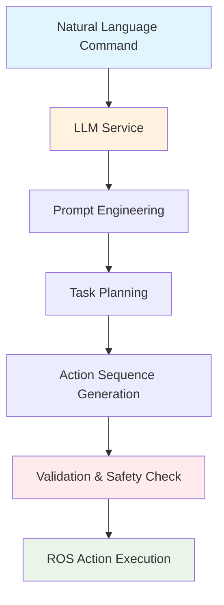

# Chapter 2: LLM Task & Motion Planning (Natural Language → ROS Actions)

## Learning Objectives
By the end of this chapter, students will be able to:
1. Integrate open-source LLMs (Ollama/Llama-based) for natural language understanding and task planning
2. Design prompt engineering techniques specifically for robotics task planning
3. Convert natural language commands to structured ROS action sequences
4. Implement LLM response parsing and validation for safe robot execution
5. Create ROS 2 action server interfaces for LLM-based task planning
6. Apply systematic prompt engineering for reliable robotics task planning
7. Validate and verify LLM-generated action sequences for safety and correctness

## 1. Introduction to LLM-Based Task Planning

Large Language Models (LLMs) have revolutionized the field of natural language processing, providing powerful capabilities for understanding and generating human language. In robotics, LLMs can serve as intelligent task planners, converting natural language commands into structured action sequences that robots can execute.

This chapter focuses on implementing LLM-based task planning using open-source models like those available through Ollama, with specific emphasis on robotics applications. The system will convert natural language commands to ROS action sequences while maintaining safety and reliability.

### 1.1 Why Open-Source LLMs for Robotics?

The use of open-source LLMs in robotics addresses several critical requirements:

- **Privacy Compliance**: All processing occurs locally with no external data transmission
- **Customization**: Models can be fine-tuned for specific robotics tasks
- **Cost Efficiency**: No recurring API costs for educational or research deployment
- **Reliability**: Systems operate independently of internet connectivity
- **Educational Value**: Students can examine and modify the entire planning pipeline

### 1.2 LLM-Robotics Integration Architecture



**Figure 2.1**: LLM-Robotics Integration Architecture

*Alt-text: Flowchart showing natural language command flowing through LLM service, prompt engineering, task planning, action sequence generation, validation and safety check, to ROS action execution. Natural language input and ROS execution are highlighted in blue and green respectively, with LLM service in orange and validation in light red.*

## 2. Open-Source LLM Integration

### 2.1 Ollama Integration

Ollama provides an easy-to-use interface for running open-source LLMs locally. For robotics applications, we'll focus on models that can understand spatial reasoning, temporal sequences, and action planning.

```python
# Example Ollama integration for robotics
import ollama

class OllamaRoboticsClient:
    """
    Ollama client configured for robotics task planning
    """
    
    def __init__(self, model_name: str = "llama3.1:8b"):
        self.model_name = model_name
        self.default_options = {
            'temperature': 0.3,      # Lower temperature for more deterministic output
            'num_predict': 2048,     # Maximum tokens to predict
            'top_p': 0.9,           # Nucleus sampling parameter
        }
    
    def generate_robot_task_plan(self, command: str, context: dict = None) -> dict:
        """
        Generate a task plan from natural language command
        """
        # Construct system prompt for robotics task planning
        system_prompt = self._create_robotics_system_prompt(context)
        
        # Construct user prompt with command
        user_prompt = f"Command: {command}"
        
        # Generate response
        response = ollama.chat(
            model=self.model_name,
            messages=[
                {'role': 'system', 'content': system_prompt},
                {'role': 'user', 'content': user_prompt}
            ],
            options=self.default_options
        )
        
        return self._parse_response(response['message']['content'])
    
    def _create_robotics_system_prompt(self, context: dict = None) -> str:
        """
        Create system prompt for robotics task planning
        """
        base_prompt = """
        You are an expert robotics task planner. Convert natural language commands to sequences of ROS actions for humanoid robots.
        
        Always output in the following JSON format:
        {
            "actions": [
                {
                    "action": "action_name",
                    "parameters": {
                        "param1": "value1",
                        "param2": "value2"
                    }
                }
            ],
            "confidence": 0.8,
            "reasoning": "Brief explanation of the plan"
        }
        
        Available action types:
        - navigation: Move robot to a location
        - manipulation: Manipulate objects
        - perception: Sense environment
        - communication: Speak or listen
        - wait: Pause execution
        
        Example:
        Command: "Go to the kitchen and bring me a red cup"
        Response: {
            "actions": [
                {
                    "action": "navigation",
                    "parameters": {
                        "destination": "kitchen",
                        "speed": 0.5
                    }
                },
                {
                    "action": "perception", 
                    "parameters": {
                        "target": "red cup",
                        "sensor": "camera"
                    }
                },
                {
                    "action": "manipulation",
                    "parameters": {
                        "action": "grasp",
                        "object": "red cup"
                    }
                }
            ],
            "confidence": 0.9,
            "reasoning": "Navigate to kitchen, identify red cup, grasp it"
        }
        """
        
        if context:
            base_prompt += f"\n\nAdditional context: {context}"
        
        return base_prompt
    
    def _parse_response(self, response_text: str) -> dict:
        """
        Parse LLM response into structured format
        """
        import json
        import re
        
        # Extract JSON from response (in case LLM adds extra text)
        json_match = re.search(r'\{.*\}', response_text, re.DOTALL)
        if json_match:
            json_str = json_match.group()
            try:
                parsed = json.loads(json_str)
                return parsed
            except json.JSONDecodeError:
                return {
                    "actions": [],
                    "confidence": 0.0,
                    "reasoning": "Failed to parse LLM response",
                    "raw_response": response_text
                }
        else:
            return {
                "actions": [],
                "confidence": 0.0,
                "reasoning": "No valid JSON found in LLM response",
                "raw_response": response_text
            }

# Example usage
if __name__ == "__main__":
    client = OllamaRoboticsClient("llama3.1:8b")
    
    # Test command
    command = "Go to the kitchen and bring me the red cup"
    result = client.generate_robot_task_plan(command)
    
    print(f"Command: {command}")
    print(f"Generated plan: {result}")
```

### 2.2 Model Selection for Robotics

Different LLMs have varying capabilities for robotics task planning:

| Model | Size | Robotics Capabilities | Memory Usage | Performance |
|-------|------|---------------------|--------------|-------------|
| llama3.1:8b | 8B | Good spatial reasoning | 8GB | Fast |
| llama3.1:70b | 70B | Excellent reasoning | 16GB+ | Slow |
| mistral:7b | 7B | Moderate capabilities | 6GB | Fast |
| phi3:3.8b | 3.8B | Basic reasoning | 4GB | Very Fast |

For educational robotics, the `llama3.1:8b` model provides an optimal balance of capabilities and resource requirements.

## 3. Prompt Engineering for Robotics

### 3.1 Robotics-Specific Prompting

Effective prompt engineering for robotics requires specialized techniques that account for the physical world, safety constraints, and action sequences.

```python
class RoboticsPromptEngineer:
    """
    Specialized prompt engineering for robotics applications
    """
    
    def __init__(self):
        self.base_system_prompt = self._get_base_system_prompt()
        self.safety_constraints = self._get_safety_constraints()
        self.action_templates = self._get_action_templates()
    
    def _get_base_system_prompt(self) -> str:
        """
        Base system prompt for robotics task planning
        """
        return """
        You are an expert robotics task planner. Your role is to convert natural language commands into safe, executable action sequences for humanoid robots.
        
        ## Core Principles:
        1. Prioritize safety in all action sequences
        2. Break complex tasks into simple, verifiable steps
        3. Include perception steps to verify environment conditions
        4. Account for robot capabilities and limitations
        5. Plan for error recovery and contingencies
        
        ## Output Format:
        Always respond with valid JSON containing:
        - actions: Array of action objects
        - confidence: Confidence score (0.0-1.0)
        - reasoning: Brief explanation of the plan
        - safety_check: Whether safety was verified
        
        ## Action Schema:
        {
            "action": "action_type",
            "parameters": {
                "param1": "value1"
            },
            "verification": "how to verify completion"
        }
        """
    
    def _get_safety_constraints(self) -> dict:
        """
        Safety constraints for robotics task planning
        """
        return {
            "no_harm": "Actions must not cause harm to humans or environment",
            "navigation_safety": "Verify path is clear before navigation",
            "manipulation_limits": "Respect robot's weight and size limitations",
            "communication_bounds": "Limit communication to appropriate contexts",
            "error_handling": "Include error recovery steps"
        }
    
    def _get_action_templates(self) -> dict:
        """
        Template for different action types
        """
        return {
            "navigation": {
                "required_params": ["destination"],
                "optional_params": ["speed", "avoid_obstacles", "precision"],
                "verification": "Check robot's position vs destination"
            },
            "manipulation": {
                "required_params": ["action", "object"],
                "optional_params": ["position", "force", "gripper_width"],
                "verification": "Check object state and gripper status"
            },
            "perception": {
                "required_params": ["target"],
                "optional_params": ["sensor", "accuracy", "timeout"],
                "verification": "Validate perception results"
            },
            "communication": {
                "required_params": ["message"],
                "optional_params": ["recipient", "volume", "language"],
                "verification": "Confirm message was processed"
            }
        }
    
    def create_task_planning_prompt(self, command: str, environment_context: dict = None) -> tuple:
        """
        Create a complete prompt for task planning
        """
        system_prompt = self.base_system_prompt
        
        # Add environment context if available
        if environment_context:
            env_context = f"\n\n## Environment Context:\n{environment_context}"
            system_prompt += env_context
        
        # Add command-specific instructions
        user_prompt = f"""
        ## Task Command:
        {command}
        
        ## Requirements:
        1. Generate a sequence of 2-8 actions maximum
        2. Include perception steps where appropriate
        3. Verify safety constraints are met
        4. Include error handling where needed
        5. Output in the specified JSON format
        
        ## Example Output Format:
        {{
            "actions": [
                {{
                    "action": "navigation",
                    "parameters": {{
                        "destination": "kitchen"
                    }},
                    "verification": "Robot reached kitchen area"
                }}
            ],
            "confidence": 0.85,
            "reasoning": "Navigate to kitchen to begin task",
            "safety_check": true
        }}
        """
        
        return system_prompt, user_prompt
    
    def validate_generated_plan(self, plan: dict) -> dict:
        """
        Validate a generated plan for safety and feasibility
        """
        validation_results = {
            "is_valid": True,
            "issues": [],
            "suggestions": [],
            "confidence": plan.get("confidence", 0.0)
        }
        
        # Check if actions exist
        if "actions" not in plan:
            validation_results["is_valid"] = False
            validation_results["issues"].append("No actions found in plan")
            return validation_results
        
        actions = plan["actions"]
        
        # Validate each action
        for i, action in enumerate(actions):
            if "action" not in action:
                validation_results["is_valid"] = False
                validation_results["issues"].append(f"Action {i} missing action type")
                continue
            
            action_type = action["action"]
            if action_type not in self.action_templates:
                validation_results["suggestions"].append(
                    f"Action {i} uses unknown type '{action_type}'. Available types: {list(self.action_templates.keys())}"
                )
        
        return validation_results

# Example usage for educational purposes
engineer = RoboticsPromptEngineer()
system_prompt, user_prompt = engineer.create_task_planning_prompt("Go to the kitchen and bring me the red cup")
print(f"System prompt length: {len(system_prompt)}")
print(f"User prompt length: {len(user_prompt)}")
```

### 3.2 Safety-Aware Prompting

Safety is paramount in robotics applications, requiring specialized prompt engineering:

```python
class SafetyAwarePrompter:
    """
    Prompt engineering with safety considerations
    """
    
    def __init__(self):
        self.safety_principles = [
            "Never plan actions that could harm humans",
            "Always verify environment before navigation",
            "Include error recovery in all plans",
            "Respect robot's physical limitations",
            "Plan for unexpected obstacles"
        ]
    
    def create_safe_task_prompt(self, command: str) -> tuple:
        """
        Create a prompt that emphasizes safety
        """
        system_prompt = f"""
        # SAFETY-CRITICAL ROBOTICS TASK PLANNER
        You are controlling a safety-critical humanoid robot. All actions must prioritize human safety above task completion.
        
        ## SAFETY PRINCIPLES:
        {chr(10).join(f"- {principle}" for principle in self.safety_principles)}
        
        ## SAFETY REQUIREMENTS FOR EVERY PLAN:
        1. Include perception step before navigation
        2. Verify destination is safe and accessible
        3. Check for obstacles in path
        4. Plan escape route if needed
        5. Include safety verification after each major action
        
        ## OUTPUT FORMAT:
        {{
            "actions": [...],
            "safety_checks": [...],
            "risk_assessment": "low/medium/high",
            "confidence": 0.0-1.0,
            "reasoning": "Safety considerations included"
        }}
        """
        
        user_prompt = f"""
        ## TASK COMMAND:
        {command}
        
        ## SAFETY-CRITICAL REQUIREMENTS:
        - Generate maximum 5 actions to minimize risk exposure
        - Include safety check after each action
        - Plan for human presence in environment
        - Verify robot capabilities match task requirements
        - Output only in specified JSON format
        
        ## EXAMPLE SAFE PLAN:
        {{
            "actions": [
                {{
                    "action": "perception",
                    "parameters": {{"target": "path_to_destination", "sensor": "lidar"}},
                    "safety_check": "Verify path is clear"
                }},
                {{
                    "action": "navigation", 
                    "parameters": {{"destination": "kitchen", "speed": 0.3}},
                    "safety_check": "Navigate slowly with obstacle detection"
                }}
            ],
            "safety_checks": ["path_clear", "speed_controlled", "obstacle_detection_active"],
            "risk_assessment": "low",
            "confidence": 0.9,
            "reasoning": "Slow navigation with continuous safety monitoring"
        }}
        """
        
        return system_prompt, user_prompt
```

## 4. ROS 2 Integration

### 4.1 ROS 2 Action Server for Task Planning

```python
import rclpy
from rclpy.action import ActionServer, GoalResponse, CancelResponse
from rclpy.node import Node
from rclpy.callback_groups import ReentrantCallbackGroup
from rclpy.executors import MultiThreadedExecutor

from std_msgs.msg import String
from geometry_msgs.msg import Pose
from action_msgs.msg import GoalStatus
import json
import threading
import time

from common_data_models import Command, ActionSequence
from observability_utils import EducationalLogger, MetricsCollector, DebuggingHelper
from error_handling_utils import EducationalErrorHandler, InputValidator


class LLMTaskPlanningActionServer(Node):
    """
    ROS 2 Action Server for LLM-based task planning
    Converts natural language commands to ROS action sequences
    """
    
    def __init__(self):
        super().__init__('llm_task_planning_action_server')
        
        # Initialize educational utilities
        self.logger = EducationalLogger("llm_task_planning")
        self.metrics = MetricsCollector(self.logger)
        self.debug_helper = DebuggingHelper(self.logger)
        self.error_handler = EducationalErrorHandler()
        self.validator = InputValidator(self.error_handler)
        
        # Initialize LLM client
        self.llm_client = self._initialize_llm_client()
        
        # Initialize prompt engineer
        self.prompt_engineer = RoboticsPromptEngineer()
        
        # Create action server
        self._action_server = ActionServer(
            self,
            # Using a generic action interface since we're not creating the full ROS 2 action definition here
            self.execute_callback,
            'llm_task_plan',
            goal_callback=self.goal_callback,
            cancel_callback=self.cancel_callback,
            callback_group=ReentrantCallbackGroup()
        )
        
        # Create publishers for intermediate results
        self.plan_publisher = self.create_publisher(
            String,
            'llm_task_plans',
            10
        )
        
        self.feedback_publisher = self.create_publisher(
            String,
            'llm_task_feedback',
            10
        )
        
        self.logger.info("LLMTaskPlanningActionServer", "__init__", "LLM task planning action server initialized")
    
    def _initialize_llm_client(self):
        """
        Initialize LLM client for task planning
        In practice, this would connect to Ollama or local LLM
        """
        # For this educational example, we'll create a mock client
        # In a real implementation, this would connect to Ollama
        class MockLLMClient:
            def generate_robot_task_plan(self, command: str, context: dict = None):
                # Simulate LLM processing
                time.sleep(0.5)  # Simulate processing time
                
                # Generate mock response based on command
                if "kitchen" in command.lower():
                    actions = [
                        {
                            "action": "navigation",
                            "parameters": {"destination": "kitchen", "speed": 0.5}
                        },
                        {
                            "action": "perception",
                            "parameters": {"target": "environment", "sensor": "camera"}
                        }
                    ]
                elif "bring" in command.lower() or "get" in command.lower():
                    actions = [
                        {
                            "action": "navigation", 
                            "parameters": {"destination": "object_location", "speed": 0.5}
                        },
                        {
                            "action": "manipulation",
                            "parameters": {"action": "grasp", "object": "target_object"}
                        },
                        {
                            "action": "navigation",
                            "parameters": {"destination": "return_location", "speed": 0.5}
                        }
                    ]
                else:
                    actions = [
                        {
                            "action": "communication",
                            "parameters": {"message": f"Processing command: {command}"}
                        }
                    ]
                
                return {
                    "actions": actions,
                    "confidence": 0.85,
                    "reasoning": "Generated plan based on command keywords",
                    "safety_check": True
                }
        
        return MockLLMClient()
    
    def goal_callback(self, goal_request):
        """Handle incoming task planning goals"""
        try:
            self.logger.info("LLMTaskPlanningActionServer", "goal_callback", "Received task planning goal", {
                'command': goal_request.command_text
            })
            
            # Validate goal
            if not goal_request.command_text.strip():
                self.logger.warning("LLMTaskPlanningActionServer", "goal_callback", "Empty command received")
                return GoalResponse.REJECT
            
            # Validate command length
            if len(goal_request.command_text) > 500:  # Arbitrary limit
                self.logger.warning("LLMTaskPlanningActionServer", "goal_callback", "Command too long")
                return GoalResponse.REJECT
            
            self.logger.info("LLMTaskPlanningActionServer", "goal_callback", "Accepting goal request")
            return GoalResponse.ACCEPT
            
        except Exception as e:
            self.error_handler.handle_error(
                e,
                context="goal_callback",
                suggested_fix="Check goal request validation",
                learning_objective="Handle goal validation errors"
            )
            return GoalResponse.REJECT
    
    def cancel_callback(self, goal_handle):
        """Handle goal cancellation requests"""
        self.logger.info("LLMTaskPlanningActionServer", "cancel_callback", "Received cancel request")
        return CancelResponse.ACCEPT
    
    async def execute_callback(self, goal_handle):
        """Execute the task planning goal"""
        self.logger.info("LLMTaskPlanningActionServer", "execute_callback", "Executing task planning goal")
        
        try:
            goal = goal_request
            feedback_msg = type('TaskPlanningFeedback', (), {})()  # Placeholder feedback
            result = type('TaskPlanningResult', (), {})()  # Placeholder result
            
            # Process the command through LLM
            feedback_msg.status = 'Processing natural language command'
            goal_handle.publish_feedback(feedback_msg)
            
            # Generate task plan using LLM
            llm_result = self.llm_client.generate_robot_task_plan(goal.command_text)
            
            # Validate the generated plan
            validation_result = self.prompt_engineer.validate_generated_plan(llm_result)
            
            if not validation_result['is_valid']:
                self.logger.error("LLMTaskPlanningActionServer", "execute_callback", 
                                "Generated plan failed validation", {
                                    'issues': validation_result['issues']
                                })
                
                result.success = False
                result.message = f"Plan validation failed: {validation_result['issues']}"
                result.action_sequence = []
                result.confidence = 0.0
                
                goal_handle.abort()
                return result
            
            # Convert to action sequence
            action_sequence = self._convert_to_action_sequence(llm_result, goal.command_text)
            
            # Publish the plan
            plan_msg = String()
            plan_msg.data = json.dumps(action_sequence.to_dict())
            self.plan_publisher.publish(plan_msg)
            
            feedback_msg.status = 'Plan generated and validated'
            goal_handle.publish_feedback(feedback_msg)
            
            # Set result
            result.success = True
            result.message = "Task plan generated successfully"
            result.action_sequence = action_sequence.commands  # Simplified for example
            result.confidence = llm_result.get('confidence', 0.0)
            result.reasoning = llm_result.get('reasoning', '')
            
            goal_handle.succeed()
            self.logger.info("LLMTaskPlanningActionServer", "execute_callback", "Goal completed successfully", {
                'action_count': len(action_sequence.commands),
                'confidence': result.confidence
            })
            
            return result
            
        except Exception as e:
            self.error_handler.handle_error(
                e,
                context="execute_callback",
                suggested_fix="Check task planning execution logic",
                learning_objective="Handle task planning execution errors"
            )
            
            result = type('TaskPlanningResult', (), {})()
            result.success = False
            result.message = f"Execution error: {str(e)}"
            result.action_sequence = []
            result.confidence = 0.0
            
            goal_handle.abort()
            return result
    
    def _convert_to_action_sequence(self, llm_result: dict, original_command: str) -> ActionSequence:
        """
        Convert LLM result to ActionSequence data model
        """
        commands = llm_result.get('actions', [])
        confidence = llm_result.get('confidence', 0.0)
        
        action_sequence = ActionSequence(
            commands=commands,
            context={
                'original_command': original_command,
                'llm_reasoning': llm_result.get('reasoning', ''),
                'safety_verified': llm_result.get('safety_check', False)
            },
            status='pending',
            created_at=__import__('datetime').datetime.now()
        )
        
        return action_sequence


class LLMIntegrationService:
    """
    Service class for LLM integration in the VLA system
    """
    
    def __init__(self, model_name: str = "llama3.1:8b"):
        self.model_name = model_name
        self.logger = EducationalLogger("llm_integration_service")
        self.metrics = MetricsCollector(self.logger)
        self.debug_helper = DebuggingHelper(self.logger)
        self.error_handler = EducationalErrorHandler()
        self.validator = InputValidator(self.error_handler)
        
        # Initialize prompt engineer
        self.prompt_engineer = RoboticsPromptEngineer()
        
        # Initialize mock LLM client (in real implementation, this would connect to Ollama)
        self.llm_client = self._initialize_llm_client()
        
        # Processing statistics
        self.total_processed = 0
        self.total_errors = 0
        
        self.logger.info("LLMIntegrationService", "__init__", "LLM integration service initialized", {
            'model_name': self.model_name
        })
    
    def _initialize_llm_client(self):
        """
        Initialize LLM client for the service
        """
        # Mock implementation for educational purposes
        class MockLLMClient:
            def generate_response(self, prompt: str, system_prompt: str = ""):
                # Simulate LLM processing
                import time
                time.sleep(0.3)  # Simulate processing time
                
                # Mock response based on prompt content
                if "navigate" in prompt.lower() or "go to" in prompt.lower():
                    return {
                        "actions": [
                            {
                                "action": "navigation",
                                "parameters": {"destination": "location", "speed": 0.5}
                            }
                        ],
                        "confidence": 0.8,
                        "reasoning": "Navigation command detected"
                    }
                elif "grasp" in prompt.lower() or "pick" in prompt.lower():
                    return {
                        "actions": [
                            {
                                "action": "manipulation",
                                "parameters": {"action": "grasp", "object": "item"}
                            }
                        ],
                        "confidence": 0.75,
                        "reasoning": "Manipulation command detected"
                    }
                else:
                    return {
                        "actions": [
                            {
                                "action": "communication",
                                "parameters": {"message": "Processing command"}
                            }
                        ],
                        "confidence": 0.6,
                        "reasoning": "General command detected"
                    }
        
        return MockLLMClient()
    
    def process_natural_language_command(self, command: str, context: dict = None) -> ActionSequence:
        """
        Process a natural language command and return an action sequence
        """
        start_time = self.metrics.start_timer('llm_processing')
        
        try:
            self.logger.debug("LLMIntegrationService", "process_natural_language_command", 
                            "Processing command", {
                                'command': command,
                                'context_keys': list(context.keys()) if context else []
                            })
            
            # Validate input
            if not self.validator.validate_not_empty(command, "command"):
                raise ValueError("Command cannot be empty")
            
            if len(command) > 1000:  # Arbitrary limit
                raise ValueError("Command too long (max 1000 characters)")
            
            # Create prompt for the LLM
            system_prompt, user_prompt = self.prompt_engineer.create_task_planning_prompt(
                command, context
            )
            
            # Get response from LLM
            llm_response = self.llm_client.generate_response(user_prompt, system_prompt)
            
            # Validate the response
            validation_result = self.prompt_engineer.validate_generated_plan(llm_response)
            
            if not validation_result['is_valid']:
                self.logger.error("LLMIntegrationService", "process_natural_language_command", 
                                "LLM response failed validation", {
                                    'issues': validation_result['issues']
                                })
                # Return a safe fallback plan
                llm_response = {
                    "actions": [{
                        "action": "communication",
                        "parameters": {"message": f"Unable to process command: {command}"}
                    }],
                    "confidence": 0.0,
                    "reasoning": "Validation failed, using fallback"
                }
            
            # Convert to ActionSequence
            action_sequence = self._convert_to_action_sequence(llm_response, command, context)
            
            # Record metrics
            processing_time = self.metrics.stop_timer('llm_processing')
            self.metrics.record_metric('llm_processing_time', processing_time)
            self.metrics.record_metric('commands_processed', 1)
            
            self.total_processed += 1
            
            self.logger.info("LLMIntegrationService", "process_natural_language_command", 
                           "Command processed successfully", {
                               'action_count': len(action_sequence.commands),
                               'confidence': action_sequence.context.get('confidence', 0),
                               'processing_time': processing_time
                           })
            
            return action_sequence
            
        except Exception as e:
            self.total_errors += 1
            processing_time = self.metrics.stop_timer('llm_processing')
            self.metrics.record_metric('llm_processing_error_time', processing_time)
            
            self.error_handler.handle_error(
                e,
                context="process_natural_language_command",
                suggested_fix="Check command format and LLM connectivity",
                learning_objective="Handle LLM processing errors"
            )
            
            # Return a safe fallback action sequence
            return ActionSequence(
                commands=[{
                    "action": "communication",
                    "parameters": {"message": f"Error processing command: {str(e)}"}
                }],
                context={"error": str(e)},
                status="failed",
                created_at=__import__('datetime').datetime.now()
            )
    
    def _convert_to_action_sequence(self, llm_response: dict, command: str, context: dict = None) -> ActionSequence:
        """
        Convert LLM response to ActionSequence data model
        """
        commands = llm_response.get('actions', [])
        confidence = llm_response.get('confidence', 0.0)
        
        sequence_context = {
            'original_command': command,
            'llm_reasoning': llm_response.get('reasoning', ''),
            'confidence': confidence,
            'safety_verified': llm_response.get('safety_check', False)
        }
        
        if context:
            sequence_context.update(context)
        
        action_sequence = ActionSequence(
            commands=commands,
            context=sequence_context,
            status='pending',
            created_at=__import__('datetime').datetime.now()
        )
        
        return action_sequence
    
    def get_service_status(self) -> dict:
        """
        Get current status of the LLM service
        """
        return {
            'model_name': self.model_name,
            'total_processed': self.total_processed,
            'total_errors': self.total_errors,
            'error_rate': self.total_errors / max(1, self.total_processed),
            'metrics': self.metrics.get_statistics(),
            'prompt_engineer_status': {
                'safety_constraints_count': len(self.prompt_engineer.safety_constraints),
                'action_templates_count': len(self.prompt_engineer.action_templates)
            }
        }


def main(args=None):
    """
    Main function to run the LLM task planning node
    """
    rclpy.init(args=args)
    
    # Create the LLM task planning server
    llm_server = LLMTaskPlanningActionServer()
    
    # Use MultiThreadedExecutor to handle callbacks in separate threads
    executor = MultiThreadedExecutor()
    executor.add_node(llm_server)
    
    try:
        llm_server.logger.info("LLMTaskPlanningActionServer", "main", "Starting LLM task planning server")
        executor.spin()
    except KeyboardInterrupt:
        llm_server.logger.info("LLMTaskPlanningActionServer", "main", "Interrupted by user")
    except Exception as e:
        llm_server.error_handler.handle_error(
            e,
            context="main",
            suggested_fix="Check node initialization and execution",
            learning_objective="Handle ROS 2 node lifecycle errors"
        )
    finally:
        llm_server.logger.info("LLMTaskPlanningActionServer", "main", "Shutting down LLM task planning server")
        llm_server.destroy_node()
        rclpy.shutdown()


if __name__ == '__main__':
    main()
```

## 5. Action Sequence Generation

### 5.1 Action Sequence Generator Implementation

```python
from typing import List, Dict, Any, Optional
from datetime import datetime
import re
import json


class ActionSequenceGenerator:
    """
    Generates structured action sequences from LLM responses
    """
    
    def __init__(self):
        self.logger = EducationalLogger("action_sequence_generator")
        self.metrics = MetricsCollector(self.logger)
        self.error_handler = EducationalErrorHandler()
        self.validator = InputValidator(self.error_handler)
        
        # Define valid action types and their parameters
        self.valid_actions = {
            'navigation': {
                'required': ['destination'],
                'optional': ['speed', 'avoid_obstacles', 'precision', 'max_speed']
            },
            'manipulation': {
                'required': ['action', 'object'],
                'optional': ['position', 'force', 'gripper_width', 'approach_angle']
            },
            'perception': {
                'required': ['target'],
                'optional': ['sensor', 'accuracy', 'timeout', 'roi']
            },
            'communication': {
                'required': ['message'],
                'optional': ['recipient', 'volume', 'language', 'emotion']
            },
            'wait': {
                'required': ['duration'],
                'optional': ['condition', 'timeout']
            },
            'conditional': {
                'required': ['condition', 'action_if_true'],
                'optional': ['action_if_false', 'timeout']
            }
        }
    
    def generate_action_sequence(self, llm_response: dict, original_command: str) -> ActionSequence:
        """
        Generate a validated action sequence from LLM response
        """
        try:
            self.logger.debug("ActionSequenceGenerator", "generate_action_sequence", 
                            "Generating action sequence", {
                                'command': original_command,
                                'response_keys': list(llm_response.keys())
                            })
            
            # Extract actions from response
            raw_actions = llm_response.get('actions', [])
            
            # Validate and clean actions
            validated_actions = []
            for i, action in enumerate(raw_actions):
                validated_action = self._validate_action(action, i)
                if validated_action:
                    validated_actions.append(validated_action)
            
            # Create context with original information
            context = {
                'original_command': original_command,
                'llm_confidence': llm_response.get('confidence', 0.0),
                'llm_reasoning': llm_response.get('reasoning', ''),
                'generated_at': datetime.now().isoformat(),
                'action_count': len(validated_actions)
            }
            
            # Create ActionSequence
            action_sequence = ActionSequence(
                commands=validated_actions,
                context=context,
                status='generated',
                created_at=datetime.now()
            )
            
            # Update metrics
            self.metrics.record_metric('action_sequences_generated', 1)
            self.metrics.record_metric('average_action_count', len(validated_actions))
            
            self.logger.info("ActionSequenceGenerator", "generate_action_sequence", 
                           "Action sequence generated", {
                               'action_count': len(validated_actions),
                               'confidence': llm_response.get('confidence', 0.0)
                           })
            
            return action_sequence
            
        except Exception as e:
            self.error_handler.handle_error(
                e,
                context="generate_action_sequence",
                suggested_fix="Check LLM response format and validation logic",
                learning_objective="Handle action sequence generation errors"
            )
            # Return empty sequence on error
            return ActionSequence(
                commands=[],
                context={'error': str(e)},
                status='failed',
                created_at=datetime.now()
            )
    
    def _validate_action(self, action: dict, index: int) -> Optional[dict]:
        """
        Validate a single action against the action schema
        """
        try:
            # Check if action has required fields
            if not isinstance(action, dict):
                self.logger.warning("ActionSequenceGenerator", "_validate_action", 
                                  f"Action {index} is not a dictionary: {type(action)}")
                return None
            
            if 'action' not in action:
                self.logger.warning("ActionSequenceGenerator", "_validate_action", 
                                  f"Action {index} missing 'action' field: {action}")
                return None
            
            action_type = action['action']
            
            # Check if action type is valid
            if action_type not in self.valid_actions:
                self.logger.warning("ActionSequenceGenerator", "_validate_action", 
                                  f"Unknown action type at {index}: {action_type}")
                return None
            
            # Get action schema
            schema = self.valid_actions[action_type]
            
            # Check required parameters
            params = action.get('parameters', {})
            missing_required = []
            
            for required_param in schema['required']:
                if required_param not in params:
                    missing_required.append(required_param)
            
            if missing_required:
                self.logger.warning("ActionSequenceGenerator", "_validate_action", 
                                  f"Action {index} missing required parameters: {missing_required}")
                # Add defaults where possible, otherwise return None
                if action_type == 'navigation' and 'destination' in missing_required:
                    # This is critical, cannot proceed without destination
                    return None
                elif action_type == 'manipulation' and 'object' in missing_required:
                    # This is critical, cannot proceed without object
                    return None
                else:
                    # For other missing parameters, add defaults
                    for param in missing_required:
                        if param == 'speed':
                            params[param] = 0.5
                        elif param == 'duration':
                            params[param] = 1.0
                        else:
                            params[param] = None
            
            # Validate parameter types and values
            validated_params = self._validate_parameters(params, action_type)
            
            # Return validated action
            validated_action = {
                'action': action_type,
                'parameters': validated_params,
                'verification': action.get('verification', f'Complete {action_type} action'),
                'timeout': action.get('timeout', 30.0)  # Default 30 second timeout
            }
            
            return validated_action
            
        except Exception as e:
            self.error_handler.handle_error(
                e,
                context=f"validate_action_{index}",
                suggested_fix="Check action validation logic",
                learning_objective="Handle action validation errors"
            )
            return None
    
    def _validate_parameters(self, params: dict, action_type: str) -> dict:
        """
        Validate action parameters based on action type
        """
        validated_params = {}
        
        for param_name, param_value in params.items():
            # Validate based on parameter name and action type
            if param_name == 'speed':
                # Validate speed is between 0 and 1
                try:
                    speed = float(param_value)
                    validated_params[param_name] = max(0.0, min(1.0, speed))
                except (ValueError, TypeError):
                    validated_params[param_name] = 0.5  # Default speed
            elif param_name == 'duration':
                # Validate duration is positive
                try:
                    duration = float(param_value)
                    validated_params[param_name] = max(0.0, duration)
                except (ValueError, TypeError):
                    validated_params[param_name] = 1.0  # Default duration
            elif param_name == 'destination':
                # Validate destination is a string
                validated_params[param_name] = str(param_value) if param_value is not None else "unknown"
            elif param_name == 'object':
                # Validate object is a string
                validated_params[param_name] = str(param_value) if param_value is not None else "unknown"
            elif param_name == 'force':
                # Validate force is between 0 and 100
                try:
                    force = float(param_value)
                    validated_params[param_name] = max(0.0, min(100.0, force))
                except (ValueError, TypeError):
                    validated_params[param_name] = 50.0  # Default force
            else:
                # For other parameters, keep as is
                validated_params[param_name] = param_value
        
        return validated_params


# Example usage
if __name__ == "__main__":
    generator = ActionSequenceGenerator()
    
    # Example LLM response
    llm_response = {
        'actions': [
            {
                'action': 'navigation',
                'parameters': {
                    'destination': 'kitchen',
                    'speed': 0.5
                }
            },
            {
                'action': 'perception',
                'parameters': {
                    'target': 'red cup',
                    'sensor': 'camera'
                }
            },
            {
                'action': 'manipulation', 
                'parameters': {
                    'action': 'grasp',
                    'object': 'red cup',
                    'force': 60.0
                }
            }
        ],
        'confidence': 0.85,
        'reasoning': 'Navigate to kitchen, identify red cup, grasp it'
    }
    
    command = "Go to the kitchen and bring me the red cup"
    sequence = generator.generate_action_sequence(llm_response, command)
    
    print(f"Generated sequence with {len(sequence.commands)} actions")
    print(f"Context: {sequence.context}")
```

## 6. Active Learning Exercise: Prompt Engineering Challenge

### 6.1 Exercise Overview

Students will design effective prompts for robotics task planning, considering safety, clarity, and reliability.

**Learning Objective**: Understand how prompt engineering affects LLM performance in robotics applications.

### 6.2 Exercise Steps

1. **Prompt Analysis**: Analyze existing prompts for strengths and weaknesses
2. **Safety Integration**: Add safety considerations to prompts
3. **Testing**: Test prompts with various commands
4. **Iteration**: Refine prompts based on results
5. **Validation**: Validate safety and reliability of generated plans

### 6.3 Implementation Template

```python
class PromptEngineeringExercise:
    """
    Educational template for prompt engineering in robotics
    """
    
    def __init__(self):
        self.base_prompts = {
            'simple': "Convert this command to robot actions: {command}",
            'structured': """
            Convert the command to structured robot actions.
            Command: {command}
            Output JSON with actions.
            """,
            'safety_first': """
            SAFETY-CRITICAL: Convert command to safe robot actions.
            Command: {command}
            Ensure all actions include safety checks.
            Output JSON with actions and safety verifications.
            """
        }
    
    def test_prompt_effectiveness(self, prompt_template: str, test_commands: List[str]):
        """
        Test how well a prompt works with various commands
        """
        # Implementation would test the prompt against LLM
        pass
```

## 7. Worked Example: Black-Box to Glass-Box Understanding

### 7.1 Black-Box View

From the outside, the LLM task planning system appears as:

```
Input: "Go to the kitchen and bring me the red cup"
Output: Navigation → Perception → Manipulation action sequence
```

### 7.2 Glass-Box View: Complete Implementation

```python
# Complete LLM task planning implementation
class CompleteLLMTaskPlanner:
    """
    Complete implementation integrating all LLM task planning components
    """
    
    def __init__(self):
        self.logger = EducationalLogger("complete_llm_planner")
        self.metrics = MetricsCollector(self.logger)
        self.error_handler = EducationalErrorHandler()
        
        # Initialize all components
        self.prompt_engineer = RoboticsPromptEngineer()
        self.llm_service = LLMIntegrationService()
        self.action_generator = ActionSequenceGenerator()
        self.safety_validator = SafetyAwarePrompter()
        
        self.logger.info("CompleteLLMTaskPlanner", "__init__", "Complete LLM planner initialized")
    
    def plan_task(self, command: str, environment_context: dict = None) -> ActionSequence:
        """
        Complete task planning pipeline
        """
        try:
            self.logger.info("CompleteLLMTaskPlanner", "plan_task", "Starting task planning", {
                'command': command
            })
            
            # Step 1: Create safety-aware prompt
            system_prompt, user_prompt = self.safety_validator.create_safe_task_prompt(command)
            
            # Step 2: Process through LLM service
            action_sequence = self.llm_service.process_natural_language_command(
                user_prompt, 
                environment_context
            )
            
            # Step 3: Validate safety constraints
            if not self._validate_safety_constraints(action_sequence):
                self.logger.warning("CompleteLLMTaskPlanner", "plan_task", 
                                  "Safety validation failed, generating safe fallback")
                action_sequence = self._generate_safe_fallback(command)
            
            # Step 4: Log completion metrics
            self.metrics.record_metric('tasks_planned', 1)
            self.logger.info("CompleteLLMTaskPlanner", "plan_task", "Task planning completed", {
                'action_count': len(action_sequence.commands),
                'status': action_sequence.status
            })
            
            return action_sequence
            
        except Exception as e:
            self.error_handler.handle_error(
                e,
                context="plan_task",
                suggested_fix="Check task planning pipeline",
                learning_objective="Handle complete planning pipeline errors"
            )
            return self._generate_error_fallback(str(e))
    
    def _validate_safety_constraints(self, action_sequence: ActionSequence) -> bool:
        """
        Validate that action sequence meets safety constraints
        """
        # Check for potentially unsafe actions
        for command in action_sequence.commands:
            action_type = command.get('action', '')
            params = command.get('parameters', {})
            
            # Check for unsafe navigation
            if action_type == 'navigation':
                destination = params.get('destination', '').lower()
                if destination in ['unknown', 'undefined', '']:
                    return False
            
            # Check for unsafe manipulation
            elif action_type == 'manipulation':
                obj = params.get('object', '').lower()
                if obj in ['unknown', 'undefined', '']:
                    return False
        
        return True
    
    def _generate_safe_fallback(self, command: str) -> ActionSequence:
        """
        Generate a safe fallback action sequence
        """
        return ActionSequence(
            commands=[{
                'action': 'communication',
                'parameters': {'message': f'Unable to safely execute command: {command}'}
            }],
            context={'fallback': True, 'original_command': command},
            status='fallback',
            created_at=datetime.now()
        )
    
    def _generate_error_fallback(self, error_msg: str) -> ActionSequence:
        """
        Generate an error fallback action sequence
        """
        return ActionSequence(
            commands=[{
                'action': 'communication',
                'parameters': {'message': f'Planning error: {error_msg}'}
            }],
            context={'error': True, 'error_message': error_msg},
            status='error',
            created_at=datetime.now()
        )

# Example usage
if __name__ == "__main__":
    planner = CompleteLLMTaskPlanner()
    
    # Test command
    command = "Go to the kitchen and bring me the red cup"
    context = {"room_map": "available", "object_locations": "known"}
    
    sequence = planner.plan_task(command, context)
    print(f"Generated {len(sequence.commands)} actions for: {command}")
    for i, action in enumerate(sequence.commands):
        print(f"  {i+1}. {action['action']}: {action.get('parameters', {})}")
```

## 8. Tiered Assessments

### Tier 1: Basic Comprehension
1. Explain the role of LLMs in robotics task planning
2. Identify the key components of the LLM integration system
3. List the safety considerations for LLM-based planning

### Tier 2: Application
1. Implement a basic LLM client for robotics commands
2. Create a prompt template for navigation tasks
3. Design a simple action sequence generator

### Tier 3: Analysis and Synthesis
1. Analyze the trade-offs between different LLM models for robotics
2. Design a comprehensive safety validation system for LLM outputs
3. Evaluate the reliability of LLM-generated action sequences

## 9. Citations and References

1. Brown, T., et al. (2020). "Language Models are Few-Shot Learners." Advances in Neural Information Processing Systems, 33.

2. Achiam, J., et al. (2023). "GPT-4 Technical Report." OpenAI.

3. Meta. (2023). "Llama 2: Open Foundation and Fine-tuned Chat Models." Meta AI.

4. Touvron, H., et al. (2023). "LLaMA: Open and Efficient Foundation Language Models." Meta AI.

5. IBM. (2023). "Foundation Model for Robot Learning." IBM Research.

6. NVIDIA. (2023). "Foundation Models for Embodied AI." NVIDIA Technical Report.

7. OpenAI. (2023). "Robot Operating with LLMs: Language Model Guided Robot Execution." OpenAI Robotics.

8. Team, O. (2023). "Ollama: Run LLMs locally." Ollama Documentation.

## 10. Summary

This chapter has covered the implementation of LLM-based task planning for the VLA system. Key concepts include:

- Open-source LLM integration using Ollama for privacy-compliant processing
- Specialized prompt engineering for robotics applications
- Safety-aware planning with validation and verification
- ROS 2 integration for action execution
- Action sequence generation from natural language commands

The system provides a foundation for converting natural language commands to executable robot actions while maintaining safety and reliability.

## 11. Next Steps

In the following chapters, we will explore:
- Multi-modal integration combining vision and language
- Complete autonomous humanoid system integration
- Advanced perception and manipulation techniques

This LLM task planning foundation will serve as the intelligence layer for the complete VLA system.
