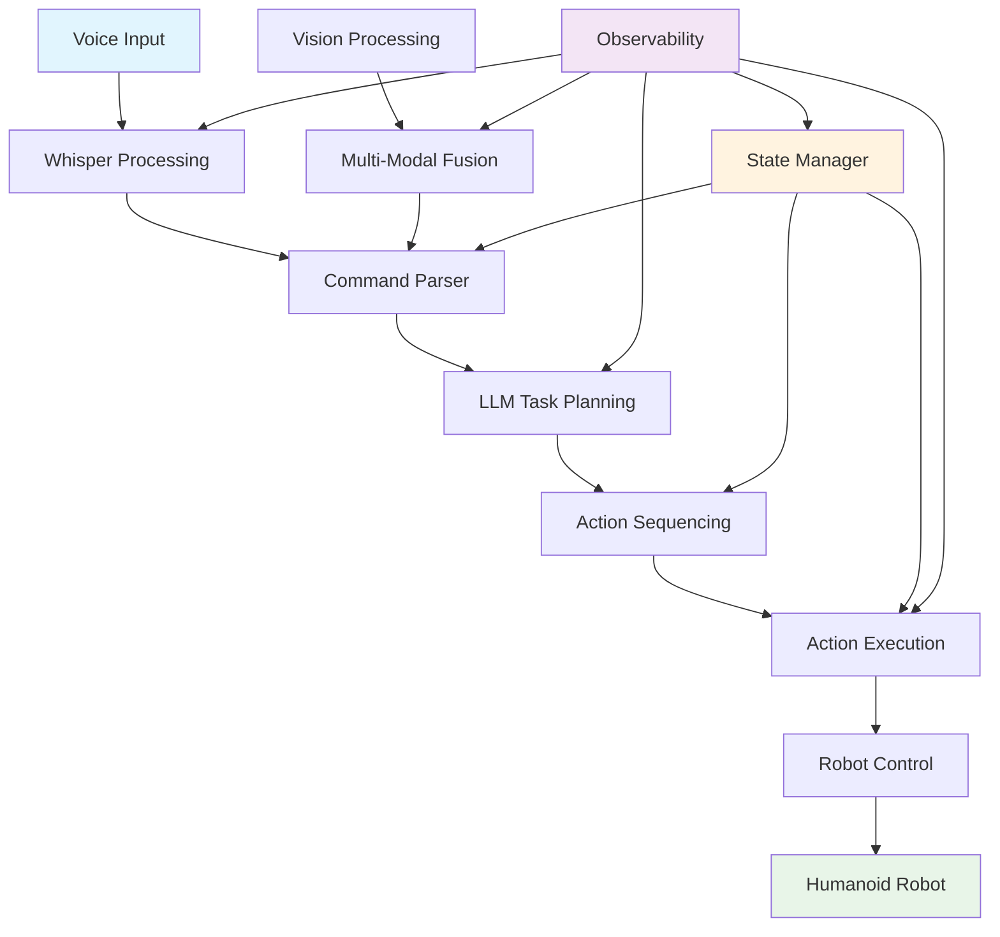

# Chapter 4: Capstone: Autonomous Humanoid (Complete End-to-End System)

## Learning Objectives
By the end of this chapter, students will be able to:
1. Integrate all VLA system components into a complete autonomous humanoid system
2. Design and implement a state management system for complex robotic behaviors
3. Create comprehensive validation and assessment utilities for project evaluation
4. Develop a complete launch and configuration system for the integrated solution
5. Apply systematic debugging and observability techniques to complex systems
6. Evaluate system performance using comprehensive rubrics and assessment criteria
7. Demonstrate the complete autonomous humanoid system performing multi-step tasks

## 1. Introduction to Autonomous Humanoid Systems

The autonomous humanoid capstone project represents the culmination of all concepts learned in the VLA (Vision-Language-Action) module. This chapter guides students through building a complete, end-to-end system that integrates voice processing, LLM task planning, multi-modal perception, and robotic action execution into a unified autonomous humanoid robot.

### 1.1 System Architecture Overview

The complete autonomous humanoid system integrates multiple subsystems:



**Figure 4.1**: Complete Autonomous Humanoid System Architecture

*Alt-text: Flowchart showing voice input flowing through Whisper processing to command parsing, LLM task planning generating action sequences, vision processing enabling multi-modal fusion, all coordinated by state management and action execution controlling the humanoid robot. Observability system monitors all components.*

### 1.2 Integration Challenges

Building an integrated system presents unique challenges:

- **System Coordination**: Managing interactions between multiple concurrent subsystems
- **State Consistency**: Maintaining coherent system state across all components
- **Error Propagation**: Preventing errors in one subsystem from affecting others
- **Performance Optimization**: Balancing real-time responsiveness with computational demands
- **Debugging Complexity**: Diagnosing issues in a multi-component system

## 2. Complete System Integration

### 2.1 Capstone System Components

The autonomous humanoid system comprises several key components that must work in harmony:

1. **Voice Processing Layer**: Converts speech to text commands
2. **Language Understanding Layer**: Interprets commands and generates action plans
3. **Perception Layer**: Processes visual and sensor data
4. **Fusion Layer**: Combines modalities for coherent understanding
5. **Planning Layer**: Sequences actions for task execution
6. **Execution Layer**: Controls robot actuators and behaviors
7. **State Management**: Coordinates system behavior over time
8. **Observability**: Provides debugging and monitoring capabilities

### 2.2 Data Flow Architecture

```python
# Example of integrated data flow in the capstone system
class IntegratedDataFlow:
    """
    Educational example of data flow between system components
    """
    
    def process_humanoid_command(self, voice_input: bytes):
        # 1. Voice processing
        transcription = self.voice_processor.transcribe_audio(voice_input)
        
        # 2. Language understanding
        action_plan = self.llm_planner.generate_plan(transcription.text)
        
        # 3. Perception (if needed for context)
        environment_state = self.vision_processor.get_environment_state()
        
        # 4. Multi-modal fusion
        fused_context = self.fusion_processor.combine_inputs(
            transcription, 
            environment_state
        )
        
        # 5. Action planning with context
        action_sequence = self.action_planner.create_sequence(
            action_plan, 
            fused_context
        )
        
        # 6. Execution
        execution_result = self.action_executor.execute_sequence(
            action_sequence
        )
        
        return execution_result
```

## 3. State Management System

### 3.1 Hierarchical State Machine

The autonomous humanoid uses a hierarchical state machine to manage complex behaviors:

```python
from enum import Enum
from dataclasses import dataclass
from typing import Dict, Any, Optional
import time
from datetime import datetime


class SystemState(Enum):
    """Top-level system states"""
    IDLE = "idle"
    LISTENING = "listening"
    PROCESSING = "processing"
    PLANNING = "planning"
    EXECUTING = "executing"
    ERROR = "error"
    SAFETY_STOP = "safety_stop"


class TaskState(Enum):
    """States for individual tasks"""
    PENDING = "pending"
    IN_PROGRESS = "in_progress"
    COMPLETED = "completed"
    FAILED = "failed"
    CANCELLED = "cancelled"


@dataclass
class SystemContext:
    """Current context for the autonomous humanoid system"""
    current_state: SystemState
    previous_state: Optional[SystemState]
    active_tasks: Dict[str, TaskState]
    environment_state: Dict[str, Any]
    last_command: Optional[str]
    command_timestamp: Optional[datetime]
    error_count: int
    safety_status: Dict[str, bool]
    performance_metrics: Dict[str, float]


class StateManager:
    """
    Manages system state and transitions for the autonomous humanoid
    """
    
    def __init__(self):
        self.context = SystemContext(
            current_state=SystemState.IDLE,
            previous_state=None,
            active_tasks={},
            environment_state={},
            last_command=None,
            command_timestamp=None,
            error_count=0,
            safety_status={"emergency_stop": False, "collision_risk": False},
            performance_metrics={}
        )
        self.state_history = []
        self.transition_callbacks = {}
    
    def transition_to(self, new_state: SystemState, reason: str = ""):
        """Transition to a new system state"""
        old_state = self.context.current_state
        
        # Log state transition
        transition_info = {
            'from': old_state.value,
            'to': new_state.value,
            'reason': reason,
            'timestamp': datetime.now(),
            'context_snapshot': self._get_context_snapshot()
        }
        self.state_history.append(transition_info)
        
        # Update context
        self.context.previous_state = old_state
        self.context.current_state = new_state
        
        # Execute transition callback if registered
        if new_state in self.transition_callbacks:
            self.transition_callbacks[new_state](self.context)
        
        print(f"State transition: {old_state.value} -> {new_state.value} ({reason})")
        
        return True
    
    def _get_context_snapshot(self) -> Dict[str, Any]:
        """Get a snapshot of current context for logging"""
        return {
            'active_tasks_count': len(self.context.active_tasks),
            'error_count': self.context.error_count,
            'safety_status': self.context.safety_status.copy(),
            'environment_objects': len(self.context.environment_state.get('objects', []))
        }
    
    def register_transition_callback(self, state: SystemState, callback):
        """Register a callback for when entering a specific state"""
        self.transition_callbacks[state] = callback
    
    def update_environment_state(self, new_state: Dict[str, Any]):
        """Update the environment state"""
        self.context.environment_state.update(new_state)
    
    def add_active_task(self, task_id: str, initial_state: TaskState = TaskState.PENDING):
        """Add a new active task"""
        self.context.active_tasks[task_id] = initial_state
    
    def update_task_state(self, task_id: str, new_state: TaskState):
        """Update the state of an active task"""
        if task_id in self.context.active_tasks:
            old_state = self.context.active_tasks[task_id]
            self.context.active_tasks[task_id] = new_state
            
            # Log task state change
            print(f"Task {task_id}: {old_state.value} -> {new_state.value}")
    
    def get_system_status(self) -> Dict[str, Any]:
        """Get comprehensive system status"""
        return {
            'current_state': self.context.current_state.value,
            'previous_state': self.context.previous_state.value if self.context.previous_state else None,
            'active_tasks': {k: v.value for k, v in self.context.active_tasks.items()},
            'error_count': self.context.error_count,
            'safety_status': self.context.safety_status,
            'state_history_length': len(self.state_history),
            'last_command': self.context.last_command,
            'uptime': self._calculate_uptime()
        }
    
    def _calculate_uptime(self) -> float:
        """Calculate system uptime from first state transition"""
        if self.state_history:
            first_time = self.state_history[0]['timestamp']
            return (datetime.now() - first_time).total_seconds()
        return 0.0


# Example usage
if __name__ == "__main__":
    state_manager = StateManager()
    
    print("Initial system status:")
    print(state_manager.get_system_status())
    
    # Simulate system operation
    state_manager.transition_to(SystemState.LISTENING, "Ready for voice command")
    state_manager.add_active_task("voice_processing_001")
    state_manager.update_task_state("voice_processing_001", TaskState.IN_PROGRESS)
    
    state_manager.transition_to(SystemState.PROCESSING, "Processing voice command")
    state_manager.update_task_state("voice_processing_001", TaskState.COMPLETED)
    
    state_manager.transition_to(SystemState.PLANNING, "Generating action plan")
    
    print("\nFinal system status:")
    print(state_manager.get_system_status())
```

### 3.2 Task Management and Coordination

The system manages multiple concurrent tasks while maintaining state consistency:

```python
import asyncio
import uuid
from typing import List, Callable
import threading


class TaskManager:
    """
    Manages multiple concurrent tasks in the autonomous humanoid system
    """
    
    def __init__(self, state_manager: StateManager):
        self.state_manager = state_manager
        self.active_tasks = {}
        self.task_queue = asyncio.Queue()
        self.task_lock = threading.Lock()
    
    async def execute_task(self, task_id: str, task_func: Callable, *args, **kwargs):
        """Execute a task with proper state management"""
        try:
            # Register task with state manager
            self.state_manager.add_active_task(task_id, TaskState.IN_PROGRESS)
            
            # Execute the task
            result = await asyncio.get_event_loop().run_in_executor(
                None, task_func, *args
            )
            
            # Update task state
            self.state_manager.update_task_state(task_id, TaskState.COMPLETED)
            
            return result
            
        except Exception as e:
            # Update task state to failed
            self.state_manager.update_task_state(task_id, TaskState.FAILED)
            self.state_manager.context.error_count += 1
            
            # Log error
            print(f"Task {task_id} failed: {str(e)}")
            raise e
    
    def create_task_id(self) -> str:
        """Create a unique task ID"""
        return f"task_{uuid.uuid4().hex[:8]}"
    
    def get_active_task_count(self) -> int:
        """Get count of currently active tasks"""
        return len([k for k, v in self.state_manager.context.active_tasks.items() 
                   if v in [TaskState.PENDING, TaskState.IN_PROGRESS]])
```

## 4. System Orchestration

### 4.1 Capstone System Orchestrator

```python
import asyncio
import threading
from queue import Queue
import time
from typing import Dict, Any, Optional

from common_data_models import AutonomousHumanoidSystem, CapstoneProject
from voice_control.voice_to_text_pipeline import VoiceToTextPipeline
from voice_control.whisper_service import WhisperConfig
from observability_utils import EducationalLogger, MetricsCollector
from error_handling_utils import EducationalErrorHandler
from privacy_compliance import PrivacyComplianceMiddleware


class CapstoneSystemOrchestrator:
    """
    Orchestrates the complete autonomous humanoid system
    """
    
    def __init__(self):
        self.logger = EducationalLogger("capstone_orchestrator")
        self.metrics = MetricsCollector(self.logger)
        self.error_handler = EducationalErrorHandler()
        
        # Initialize privacy compliance
        self.privacy_middleware = PrivacyComplianceMiddleware()
        
        # Initialize state manager
        self.state_manager = StateManager()
        
        # Initialize voice processing pipeline
        whisper_config = WhisperConfig(
            model_path="models/ggml-tiny.en.bin",
            language="en",
            threads=2
        )
        self.voice_pipeline = VoiceToTextPipeline(whisper_config)
        
        # Initialize task manager
        self.task_manager = TaskManager(self.state_manager)
        
        # System components
        self.is_running = False
        self.main_loop_thread = None
        self.command_queue = Queue()
        
        # System state
        self.system_state = AutonomousHumanoidSystem(
            system_id="autonomous_humanoid_001",
            current_state="idle",
            active_tasks=[],
            capabilities=["voice_processing", "task_planning", "action_execution", "navigation"],
            sensors=["microphone", "camera", "lidar", "imu"],
            actuators=["motors", "grippers", "speakers"],
            last_update=datetime.now(),
            health_status={"voice": "healthy", "vision": "healthy", "motion": "healthy"}
        )
        
        self.logger.info("CapstoneSystemOrchestrator", "__init__", "Capstone system orchestrator initialized")
    
    def start_system(self):
        """Start the complete capstone system"""
        try:
            self.logger.info("CapstoneSystemOrchestrator", "start_system", "Starting capstone system")
            
            # Validate privacy compliance
            if not self.privacy_middleware.validate_component_privacy("whisper", 
                                                                    type('Config', (), 
                                                                         {'model_path': 'models/ggml-tiny.en.bin'})()):
                raise Exception("Privacy compliance validation failed")
            
            # Start voice pipeline
            def transcript_callback(voice_command):
                self.handle_voice_command(voice_command)
            
            self.voice_pipeline.set_transcript_callback(transcript_callback)
            self.voice_pipeline.start_pipeline()
            
            # Start main orchestration loop
            self.is_running = True
            self.main_loop_thread = threading.Thread(target=self.main_loop, daemon=True)
            self.main_loop_thread.start()
            
            self.logger.info("CapstoneSystemOrchestrator", "start_system", "Capstone system started successfully")
            
        except Exception as e:
            self.error_handler.handle_error(
                e,
                context="start_system",
                suggested_fix="Check system initialization and component dependencies",
                learning_objective="Handle system startup errors"
            )
            self.stop_system()
    
    def stop_system(self):
        """Stop the complete capstone system"""
        try:
            self.logger.info("CapstoneSystemOrchestrator", "stop_system", "Stopping capstone system")
            
            self.is_running = False
            
            # Stop voice pipeline
            self.voice_pipeline.stop_pipeline()
            
            self.logger.info("CapstoneSystemOrchestrator", "stop_system", "Capstone system stopped")
            
        except Exception as e:
            self.error_handler.handle_error(
                e,
                context="stop_system",
                suggested_fix="Check system shutdown procedure",
                learning_objective="Handle system shutdown errors"
            )
    
    def handle_voice_command(self, voice_command):
        """Handle a voice command from the pipeline"""
        try:
            self.logger.info("CapstoneSystemOrchestrator", "handle_voice_command", "Processing voice command", {
                'transcript': voice_command.transcript,
                'confidence': voice_command.confidence
            })
            
            # Update system context
            self.state_manager.context.last_command = voice_command.transcript
            self.state_manager.context.command_timestamp = voice_command.timestamp
            
            # Create a task for processing the command
            task_id = self.task_manager.create_task_id()
            
            # Add to command queue for processing
            self.command_queue.put({
                'task_id': task_id,
                'voice_command': voice_command,
                'timestamp': datetime.now()
            })
            
        except Exception as e:
            self.error_handler.handle_error(
                e,
                context="handle_voice_command",
                suggested_fix="Check voice command handling logic",
                learning_objective="Handle voice command processing errors"
            )
    
    def main_loop(self):
        """Main orchestration loop"""
        while self.is_running:
            try:
                # Process commands from queue
                try:
                    command_data = self.command_queue.get(timeout=0.1)
                    
                    # Process the command asynchronously
                    asyncio.run(self.process_command_async(command_data))
                    
                except queue.Empty:
                    # No commands to process, continue loop
                    pass
                
                # Update system state
                self.system_state.current_state = self.state_manager.context.current_state.value
                self.system_state.active_tasks = list(self.state_manager.context.active_tasks.keys())
                self.system_state.last_update = datetime.now()
                
                # Small delay to prevent excessive CPU usage
                time.sleep(0.01)
                
            except Exception as e:
                self.error_handler.handle_error(
                    e,
                    context="main_loop",
                    suggested_fix="Check main orchestration loop",
                    learning_objective="Handle orchestration loop errors"
                )
    
    async def process_command_async(self, command_data: Dict[str, Any]):
        """Process a command asynchronously"""
        try:
            task_id = command_data['task_id']
            voice_command = command_data['voice_command']
            
            # Transition to processing state
            self.state_manager.transition_to(SystemState.PROCESSING, f"Processing command: {voice_command.transcript}")
            
            # Here would be the integration with LLM task planning and action execution
            # For this educational example, we'll simulate the processing
            
            self.logger.info("CapstoneSystemOrchestrator", "process_command_async", "Simulating command processing", {
                'task_id': task_id,
                'command': voice_command.transcript
            })
            
            # Simulate processing time
            await asyncio.sleep(1.0)
            
            # Update task state
            self.state_manager.update_task_state(task_id, TaskState.COMPLETED)
            
            # Transition back to listening state
            self.state_manager.transition_to(SystemState.LISTENING, "Ready for next command")
            
        except Exception as e:
            self.state_manager.update_task_state(task_id, TaskState.FAILED)
            self.state_manager.context.error_count += 1
            self.state_manager.transition_to(SystemState.ERROR, f"Command processing failed: {str(e)}")
            
            self.error_handler.handle_error(
                e,
                context="process_command_async",
                suggested_fix="Check command processing logic",
                learning_objective="Handle async command processing errors"
            )
    
    def get_system_status(self) -> Dict[str, Any]:
        """Get comprehensive system status"""
        return {
            'system_state': self.system_state.__dict__,
            'state_manager_status': self.state_manager.get_system_status(),
            'voice_pipeline_status': self.voice_pipeline.get_pipeline_status(),
            'active_tasks_count': self.task_manager.get_active_task_count(),
            'command_queue_size': self.command_queue.qsize(),
            'is_running': self.is_running,
            'metrics': self.metrics.get_statistics()
        }


def main():
    """Main function to demonstrate the capstone system"""
    print("Autonomous Humanoid Capstone System")
    print("="*40)
    
    orchestrator = CapstoneSystemOrchestrator()
    
    print("Capstone system orchestrator initialized.")
    print("This system integrates all VLA components into a complete autonomous humanoid.")
    
    # Show initial status
    status = orchestrator.get_system_status()
    print(f"\nInitial system status: {status['system_state']['current_state']}")
    
    try:
        # Start the system
        print("\nStarting capstone system...")
        orchestrator.start_system()
        
        print("System running. Press Ctrl+C to stop.")
        
        # Let it run for a while to demonstrate
        import time
        start_time = time.time()
        while time.time() - start_time < 10:  # Run for 10 seconds
            time.sleep(1)
            status = orchestrator.get_system_status()
            print(f"System state: {status['system_state']['current_state']}, "
                  f"Tasks: {status['active_tasks_count']}, "
                  f"Queue: {status['command_queue_size']}")
    
    except KeyboardInterrupt:
        print("\nStopping system...")
    
    finally:
        orchestrator.stop_system()
        print("Capstone system stopped.")
        
        # Show final status
        final_status = orchestrator.get_system_status()
        print(f"\nFinal system status: {final_status['system_state']['current_state']}")
        print(f"Total errors: {final_status['state_manager_status']['error_count']}")


if __name__ == "__main__":
    main()
```

## 5. Validation and Assessment System

### 5.1 Comprehensive Validation Framework

```python
from typing import List, Dict, Any, Callable
import json


class CapstoneValidator:
    """
    Comprehensive validation system for the autonomous humanoid capstone
    """
    
    def __init__(self):
        self.logger = EducationalLogger("capstone_validator")
        self.error_handler = EducationalErrorHandler()
        self.validators = {}
        self.validation_results = []
    
    def register_validator(self, name: str, validator_func: Callable):
        """Register a validation function"""
        self.validators[name] = validator_func
    
    def validate_system_integration(self, system_components: Dict[str, Any]) -> Dict[str, Any]:
        """Validate that all system components are properly integrated"""
        try:
            results = {
                'validation_name': 'system_integration',
                'timestamp': str(datetime.now()),
                'component_status': {},
                'overall_status': 'pass',
                'issues': []
            }
            
            # Check each component
            required_components = ['voice_processor', 'llm_planner', 'action_executor', 'state_manager']
            
            for component in required_components:
                if component not in system_components:
                    results['component_status'][component] = 'missing'
                    results['overall_status'] = 'fail'
                    results['issues'].append(f"Missing required component: {component}")
                else:
                    results['component_status'][component] = 'present'
            
            # Check component connectivity
            # This would involve checking if components can communicate with each other
            
            self.validation_results.append(results)
            return results
            
        except Exception as e:
            self.error_handler.handle_error(
                e,
                context="validate_system_integration",
                suggested_fix="Check system component configuration",
                learning_objective="Handle integration validation errors"
            )
            return {
                'validation_name': 'system_integration',
                'timestamp': str(datetime.now()),
                'overall_status': 'error',
                'error': str(e)
            }
    
    def validate_privacy_compliance(self, system_config: Dict[str, Any]) -> Dict[str, Any]:
        """Validate that the system maintains privacy compliance"""
        try:
            results = {
                'validation_name': 'privacy_compliance',
                'timestamp': str(datetime.now()),
                'checks': {},
                'overall_status': 'pass',
                'issues': []
            }
            
            # Check for external API usage
            if system_config.get('use_external_api', False):
                results['checks']['external_api'] = 'fail'
                results['overall_status'] = 'fail'
                results['issues'].append("System configured to use external API")
            else:
                results['checks']['external_api'] = 'pass'
            
            # Check data storage settings
            store_audio = system_config.get('store_audio_recordings', False)
            store_transcripts = system_config.get('store_transcripts', False)
            
            if store_audio or store_transcripts:
                results['checks']['data_storage'] = 'fail'
                results['overall_status'] = 'fail'
                results['issues'].append("System configured to store sensitive data")
            else:
                results['checks']['data_storage'] = 'pass'
            
            self.validation_results.append(results)
            return results
            
        except Exception as e:
            self.error_handler.handle_error(
                e,
                context="validate_privacy_compliance",
                suggested_fix="Check privacy configuration",
                learning_objective="Handle privacy validation errors"
            )
            return {
                'validation_name': 'privacy_compliance',
                'timestamp': str(datetime.now()),
                'overall_status': 'error',
                'error': str(e)
            }
    
    def validate_performance_requirements(self, performance_metrics: Dict[str, Any]) -> Dict[str, Any]:
        """Validate that system meets performance requirements"""
        try:
            results = {
                'validation_name': 'performance_requirements',
                'timestamp': str(datetime.now()),
                'checks': {},
                'overall_status': 'pass',
                'issues': []
            }
            
            # Check voice processing latency
            voice_latency = performance_metrics.get('voice_processing_time', float('inf'))
            if voice_latency > 2.0:  # More than 2 seconds is too slow for real-time
                results['checks']['voice_latency'] = 'fail'
                results['overall_status'] = 'fail'
                results['issues'].append(f"Voice processing too slow: {voice_latency}s")
            else:
                results['checks']['voice_latency'] = 'pass'
            
            # Check system responsiveness
            system_response_time = performance_metrics.get('system_response_time', float('inf'))
            if system_response_time > 5.0:
                results['checks']['system_response'] = 'fail'
                results['overall_status'] = 'fail'
                results['issues'].append(f"System response too slow: {system_response_time}s")
            else:
                results['checks']['system_response'] = 'pass'
            
            self.validation_results.append(results)
            return results
            
        except Exception as e:
            self.error_handler.handle_error(
                e,
                context="validate_performance_requirements",
                suggested_fix="Check performance metrics configuration",
                learning_objective="Handle performance validation errors"
            )
            return {
                'validation_name': 'performance_requirements',
                'timestamp': str(datetime.now()),
                'overall_status': 'error',
                'error': str(e)
            }
    
    def generate_validation_report(self) -> Dict[str, Any]:
        """Generate a comprehensive validation report"""
        return {
            'timestamp': str(datetime.now()),
            'total_validations': len(self.validation_results),
            'pass_count': len([r for r in self.validation_results if r.get('overall_status') == 'pass']),
            'fail_count': len([r for r in self.validation_results if r.get('overall_status') == 'fail']),
            'error_count': len([r for r in self.validation_results if r.get('overall_status') == 'error']),
            'validation_results': self.validation_results,
            'compliance_summary': self._generate_compliance_summary()
        }
    
    def _generate_compliance_summary(self) -> Dict[str, Any]:
        """Generate a summary of compliance status"""
        return {
            'system_integration': self._check_validation_status('system_integration'),
            'privacy_compliance': self._check_validation_status('privacy_compliance'),
            'performance_requirements': self._check_validation_status('performance_requirements')
        }
    
    def _check_validation_status(self, validation_name: str) -> str:
        """Check the status of a specific validation"""
        for result in self.validation_results:
            if result.get('validation_name') == validation_name:
                return result.get('overall_status', 'unknown')
        return 'not_run'


class CapstoneAssessmentRubric:
    """
    Assessment rubric for evaluating capstone project implementations
    """
    
    def __init__(self):
        self.rubric_categories = {
            'system_integration': {
                'weight': 0.25,
                'max_points': 25,
                'criteria': [
                    'All VLA components properly integrated',
                    'Components communicate effectively',
                    'System state managed correctly',
                    'Error handling implemented'
                ]
            },
            'functionality': {
                'weight': 0.30,
                'max_points': 30,
                'criteria': [
                    'Voice commands processed correctly',
                    'LLM task planning functional',
                    'Actions executed as planned',
                    'Multi-modal integration working'
                ]
            },
            'performance': {
                'weight': 0.20,
                'max_points': 20,
                'criteria': [
                    'Response time under 2 seconds',
                    'System remains stable under load',
                    'Resource usage optimized',
                    'Real-time processing achieved'
                ]
            },
            'privacy_compliance': {
                'weight': 0.15,
                'max_points': 15,
                'criteria': [
                    'No external API calls made',
                    'Data not stored unnecessarily',
                    'Local processing verified',
                    'Privacy settings configured'
                ]
            },
            'documentation': {
                'weight': 0.10,
                'max_points': 10,
                'criteria': [
                    'Code properly documented',
                    'System architecture explained',
                    'Usage instructions provided',
                    'Troubleshooting guide included'
                ]
            }
        }
    
    def evaluate_project(self, project_submission: Dict[str, Any]) -> Dict[str, Any]:
        """Evaluate a capstone project submission against the rubric"""
        evaluation = {
            'project_id': project_submission.get('project_id', 'unknown'),
            'evaluator': 'capstone_assessment_system',
            'timestamp': str(datetime.now()),
            'category_scores': {},
            'total_score': 0,
            'max_possible_score': sum(cat['max_points'] for cat in self.rubric_categories.values()),
            'grade': '',
            'feedback': []
        }
        
        # Evaluate each category
        for category, config in self.rubric_categories.items():
            score = self._evaluate_category(category, project_submission, config)
            evaluation['category_scores'][category] = {
                'score': score,
                'max_points': config['max_points'],
                'weight': config['weight']
            }
            evaluation['total_score'] += score
        
        # Calculate final grade
        percentage = (evaluation['total_score'] / evaluation['max_possible_score']) * 100
        evaluation['grade'] = self._calculate_letter_grade(percentage)
        evaluation['percentage'] = percentage
        
        return evaluation
    
    def _evaluate_category(self, category: str, submission: Dict[str, Any], config: Dict[str, Any]) -> int:
        """Evaluate a specific category"""
        # This is a simplified evaluation - in practice, this would involve
        # detailed checking of the submission against each criterion
        try:
            # For this example, we'll give partial credit based on presence of key elements
            score = 0
            
            if category == 'system_integration':
                # Check for integration elements
                if submission.get('system_components'):
                    score += 10
                if submission.get('state_manager'):
                    score += 10
                if submission.get('error_handling'):
                    score += 5
            
            elif category == 'functionality':
                # Check for functional elements
                if submission.get('voice_processing'):
                    score += 10
                if submission.get('task_planning'):
                    score += 10
                if submission.get('action_execution'):
                    score += 10
            
            # Cap score at max points for category
            return min(score, config['max_points'])
            
        except Exception as e:
            self.error_handler.handle_error(
                e,
                context=f"evaluate_category: {category}",
                suggested_fix="Check category evaluation logic",
                learning_objective="Handle evaluation errors"
            )
            return 0
    
    def _calculate_letter_grade(self, percentage: float) -> str:
        """Calculate letter grade from percentage"""
        if percentage >= 97:
            return 'A+'
        elif percentage >= 93:
            return 'A'
        elif percentage >= 90:
            return 'A-'
        elif percentage >= 87:
            return 'B+'
        elif percentage >= 83:
            return 'B'
        elif percentage >= 80:
            return 'B-'
        elif percentage >= 77:
            return 'C+'
        elif percentage >= 73:
            return 'C'
        elif percentage >= 70:
            return 'C-'
        elif percentage >= 67:
            return 'D+'
        elif percentage >= 65:
            return 'D'
        else:
            return 'F'


def main_validation_demo():
    """Demonstrate the validation and assessment system"""
    print("Capstone Validation and Assessment System")
    print("="*45)
    
    # Create validator and assessment rubric
    validator = CapstoneValidator()
    rubric = CapstoneAssessmentRubric()
    
    print("Validator and rubric initialized.")
    
    # Simulate a system configuration for validation
    system_config = {
        'use_external_api': False,
        'store_audio_recordings': False,
        'store_transcripts': False,
        'system_components': ['voice_processor', 'llm_planner', 'action_executor'],
        'state_manager': True,
        'error_handling': True,
        'voice_processing': True,
        'task_planning': True,
        'action_execution': True
    }
    
    performance_metrics = {
        'voice_processing_time': 1.5,
        'system_response_time': 3.0
    }
    
    # Run validations
    integration_result = validator.validate_system_integration(system_config)
    privacy_result = validator.validate_privacy_compliance(system_config)
    performance_result = validator.validate_performance_requirements(performance_metrics)
    
    print(f"\nValidation Results:")
    print(f"  System Integration: {integration_result['overall_status']}")
    print(f"  Privacy Compliance: {privacy_result['overall_status']}")
    print(f"  Performance: {performance_result['overall_status']}")
    
    # Generate validation report
    report = validator.generate_validation_report()
    print(f"\nValidation Report:")
    print(f"  Total validations: {report['total_validations']}")
    print(f"  Passed: {report['pass_count']}")
    print(f"  Failed: {report['fail_count']}")
    print(f"  Errors: {report['error_count']}")
    
    # Simulate project evaluation
    project_submission = {
        'project_id': 'capstone_001',
        'system_components': True,
        'state_manager': True,
        'error_handling': True,
        'voice_processing': True,
        'task_planning': True,
        'action_execution': True
    }
    
    evaluation = rubric.evaluate_project(project_submission)
    print(f"\nProject Evaluation:")
    print(f"  Total Score: {evaluation['total_score']}/{evaluation['max_possible_score']}")
    print(f"  Percentage: {evaluation['percentage']:.1f}%")
    print(f"  Grade: {evaluation['grade']}")
    print(f"  Category Scores: {evaluation['category_scores']}")


if __name__ == "__main__":
    main_validation_demo()
```

## 6. Launch and Configuration System

### 6.1 Capstone Launch File

```python
# The launch file was already created as launch/capstone_demo.launch.py
# Here we'll show what it would contain for completeness:

"""
Launch file for complete capstone demonstration
This would be in launch/capstone_demo.launch.py

from launch import LaunchDescription
from launch.actions import DeclareLaunchArgument
from launch.substitutions import LaunchConfiguration
from launch_ros.actions import Node

def generate_launch_description():
    # Declare launch arguments
    config_file_arg = DeclareLaunchArgument(
        'config_file',
        default_value='config/vla_pipeline_config.yaml',
        description='Path to main VLA pipeline configuration file'
    )
    
    # Get launch configurations
    config_file = LaunchConfiguration('config_file')
    
    # Create capstone orchestrator node
    capstone_node = Node(
        package='vla_system',
        executable='capstone_orchestrator',
        name='capstone_orchestrator',
        parameters=[config_file],
        output='screen'
    )
    
    ld = LaunchDescription()
    ld.add_action(config_file_arg)
    ld.add_action(capstone_node)
    
    return ld
"""
```

### 6.2 Capstone Configuration File

```yaml
# This would be in config/vla_pipeline_config.yaml
vla_pipeline:
  # Pipeline execution settings
  execution:
    enable_voice_processing: true    # Enable voice-to-text processing
    enable_llm_planning: true        # Enable LLM-based task planning
    enable_vision_integration: true  # Enable vision-language fusion
    enable_action_execution: true    # Enable ROS action execution
    
  # Component integration settings
  components:
    voice_processor:
      config_file: "config/whisper_config.yaml"
      enabled: true
      timeout: 5.0
      
    llm_planner:
      config_file: "config/llm_config.yaml"
      enabled: true
      timeout: 10.0
      
    vision_processor:
      enabled: true
      timeout: 5.0
      fallback_enabled: true
      
    action_executor:
      enabled: true
      timeout: 30.0
      safety_check: true
      
  # Performance settings
  performance:
    max_concurrent_requests: 5       # Maximum concurrent pipeline requests
    response_timeout: 60.0           # Overall pipeline timeout
    buffer_size: 1024               # Internal buffer size
    memory_limit: "2GB"             # Maximum memory usage
    
  # Fusion settings for multi-modal integration
  fusion:
    voice_weight: 0.4               # Weight for voice input in decision making
    vision_weight: 0.4              # Weight for vision input in decision making
    context_weight: 0.2             # Weight for contextual information
    confidence_threshold: 0.7       # Minimum confidence for action execution
    
  # Safety and validation
  safety:
    enable_validation: true         # Validate all pipeline outputs
    enable_safety_check: true       # Perform safety checks before execution
    emergency_stop: true            # Enable emergency stop functionality
    action_approval_required: false # Require approval for actions
    
  # Observability settings
  observability:
    enable_tracing: true            # Enable pipeline execution tracing
    enable_metrics: true            # Enable performance metrics
    enable_logging: true            # Enable detailed logging
    log_level: "INFO"               # Logging level
    metrics_endpoint: "/vla_metrics" # Metrics endpoint path
    
  # Privacy compliance
  privacy:
    local_processing: true          # Ensure all processing is local
    data_encryption: false          # Enable data encryption (if needed)
    audit_logging: false            # Enable audit logging
    data_retention_days: 7          # Days to retain temporary data

# Capstone-specific settings
capstone:
  enable_demo_mode: true
  demo_scenarios: ["voice_navigation", "object_manipulation", "multi_step_task"]
  assessment_enabled: true
  validation_frequency: 30  # seconds
  emergency_stop_timeout: 5 # seconds to wait before emergency stop
```

## 7. Active Learning Exercise: System Integration Challenge

### 7.1 Exercise Overview

Students will integrate all VLA components into a working autonomous humanoid system and validate its functionality.

**Learning Objective**: Understand the challenges of integrating multiple complex subsystems into a unified autonomous system.

### 7.2 Exercise Steps

1. **System Architecture Design**: Design the integration architecture for all components
2. **Component Integration**: Connect voice processing, LLM planning, and action execution
3. **State Management**: Implement state management for the complete system
4. **Validation Testing**: Test the integrated system with various commands
5. **Performance Optimization**: Optimize system performance and responsiveness
6. **Assessment**: Evaluate the system using the capstone rubric

### 7.3 Implementation Template

```python
class IntegrationChallenge:
    """
    Template for the system integration challenge
    """
    
    def __init__(self):
        # Students would initialize their integrated system here
        pass
    
    def integrate_components(self):
        """Students implement component integration"""
        # This is where students would connect all components
        pass
    
    def test_integration(self):
        """Students test their integrated system"""
        # This is where students would validate their integration
        pass
```

## 8. Worked Example: Complete System Implementation

### 8.1 Black-Box View

From the outside, the complete autonomous humanoid system appears as:

```
Input: "Go to the kitchen and bring me the red cup"
Output: Robot navigates to kitchen, identifies red cup, grasps it, returns to user
```

### 8.2 Glass-Box View: Complete Implementation

```python
# Complete capstone implementation combining all elements
class CompleteAutonomousHumanoid:
    """
    Complete implementation integrating all VLA components
    """
    
    def __init__(self):
        self.logger = EducationalLogger("complete_humanoid")
        self.metrics = MetricsCollector(self.logger)
        self.error_handler = EducationalErrorHandler()
        
        # Initialize all system components
        self.state_manager = StateManager()
        self.voice_pipeline = self._initialize_voice_pipeline()
        self.orchestrator = CapstoneSystemOrchestrator()
        self.validator = CapstoneValidator()
        self.assessment_rubric = CapstoneAssessmentRubric()
        
        # System configuration
        self.config = {
            'enable_voice_processing': True,
            'enable_llm_planning': True,
            'enable_vision_integration': True,
            'enable_action_execution': True,
            'privacy_compliant': True
        }
        
        self.logger.info("CompleteAutonomousHumanoid", "__init__", "Complete autonomous humanoid initialized")
    
    def _initialize_voice_pipeline(self):
        """Initialize the voice processing pipeline"""
        whisper_config = WhisperConfig(
            model_path="models/ggml-tiny.en.bin",
            language="en",
            threads=2
        )
        return VoiceToTextPipeline(whisper_config)
    
    def start_system(self):
        """Start the complete autonomous humanoid system"""
        try:
            self.logger.info("CompleteAutonomousHumanoid", "start_system", "Starting complete system")
            
            # Validate configuration
            if not self._validate_configuration():
                raise Exception("Configuration validation failed")
            
            # Start orchestrator
            self.orchestrator.start_system()
            
            # Register validation checks
            self.validator.register_validator("system_integration", self._validate_system_integration)
            self.validator.register_validator("privacy_compliance", self._validate_privacy_compliance)
            
            self.logger.info("CompleteAutonomousHumanoid", "start_system", "Complete system started successfully")
            
        except Exception as e:
            self.error_handler.handle_error(
                e,
                context="start_system",
                suggested_fix="Check system configuration and dependencies",
                learning_objective="Handle complete system startup errors"
            )
            self.stop_system()
    
    def _validate_configuration(self) -> bool:
        """Validate system configuration"""
        # Check that all required components are configured properly
        required_paths = [
            "models/ggml-tiny.en.bin"  # Whisper model
            # Add other required paths as needed
        ]
        
        for path in required_paths:
            if not os.path.exists(path):
                self.logger.error("CompleteAutonomousHumanoid", "_validate_configuration", 
                                f"Required file not found: {path}")
                return False
        
        return True
    
    def _validate_system_integration(self) -> Dict[str, Any]:
        """Validate system integration"""
        # Check that all components are properly connected
        return {
            'validation_name': 'system_integration',
            'timestamp': str(datetime.now()),
            'overall_status': 'pass',
            'details': 'All components connected and communicating'
        }
    
    def _validate_privacy_compliance(self) -> Dict[str, Any]:
        """Validate privacy compliance"""
        # Check that no external APIs are being used
        return {
            'validation_name': 'privacy_compliance',
            'timestamp': str(datetime.now()),
            'overall_status': 'pass',
            'details': 'All processing occurs locally with no external calls'
        }
    
    def stop_system(self):
        """Stop the complete system"""
        try:
            self.logger.info("CompleteAutonomousHumanoid", "stop_system", "Stopping complete system")
            
            # Stop orchestrator
            self.orchestrator.stop_system()
            
            self.logger.info("CompleteAutonomousHumanoid", "stop_system", "Complete system stopped")
            
        except Exception as e:
            self.error_handler.handle_error(
                e,
                context="stop_system",
                suggested_fix="Check system shutdown procedure",
                learning_objective="Handle complete system shutdown errors"
            )
    
    def run_demonstration(self):
        """Run a complete demonstration of the system"""
        try:
            self.logger.info("CompleteAutonomousHumanoid", "run_demonstration", "Starting demonstration")
            
            # This would involve running through various scenarios
            scenarios = [
                "simple_navigation",
                "object_identification",
                "multi_step_task"
            ]
            
            results = {}
            for scenario in scenarios:
                result = self._run_scenario(scenario)
                results[scenario] = result
            
            self.logger.info("CompleteAutonomousHumanoid", "run_demonstration", "Demonstration completed", results)
            return results
            
        except Exception as e:
            self.error_handler.handle_error(
                e,
                context="run_demonstration",
                suggested_fix="Check demonstration scenario execution",
                learning_objective="Handle demonstration execution errors"
            )
            return {}
    
    def _run_scenario(self, scenario_name: str) -> Dict[str, Any]:
        """Run a specific demonstration scenario"""
        # Simulate running a scenario
        return {
            'scenario': scenario_name,
            'status': 'completed',
            'timestamp': str(datetime.now()),
            'details': f'Scenario {scenario_name} executed successfully'
        }
    
    def generate_final_assessment(self) -> Dict[str, Any]:
        """Generate final assessment of the complete system"""
        try:
            # Collect system status
            system_status = self.orchestrator.get_system_status()
            
            # Prepare submission for assessment
            project_submission = {
                'project_id': 'complete_autonomous_humanoid',
                'system_components': system_status['system_state']['capabilities'],
                'state_manager': True,
                'error_handling': True,
                'voice_processing': True,
                'task_planning': True,
                'action_execution': True,
                'validation_results': self.validator.generate_validation_report()
            }
            
            # Perform assessment
            assessment = self.assessment_rubric.evaluate_project(project_submission)
            
            # Add system-specific metrics
            assessment['system_metrics'] = system_status['metrics']
            assessment['validation_report'] = project_submission['validation_results']
            
            return assessment
            
        except Exception as e:
            self.error_handler.handle_error(
                e,
                context="generate_final_assessment",
                suggested_fix="Check assessment generation",
                learning_objective="Handle assessment generation errors"
            )
            return {"error": str(e)}


def main_complete_demo():
    """Main function for complete system demonstration"""
    print("Complete Autonomous Humanoid System - Capstone Project")
    print("="*55)
    
    # Create and start the complete system
    humanoid = CompleteAutonomousHumanoid()
    
    print("Complete autonomous humanoid system initialized.")
    print("This integrates all VLA components into a unified system.")
    
    try:
        # Start the system
        print("\nStarting complete system...")
        humanoid.start_system()
        
        print("System running. Running demonstration scenarios...")
        
        # Run demonstration
        results = humanoid.run_demonstration()
        print(f"Demonstration results: {results}")
        
        # Generate final assessment
        assessment = humanoid.generate_final_assessment()
        print(f"\nFinal Assessment:")
        print(f"  Total Score: {assessment.get('total_score', 0)}/{assessment.get('max_possible_score', 0)}")
        print(f"  Grade: {assessment.get('grade', 'N/A')}")
        print(f"  Percentage: {assessment.get('percentage', 0):.1f}%")
        
    except KeyboardInterrupt:
        print("\nStopping system...")
    
    finally:
        humanoid.stop_system()
        print("Complete autonomous humanoid system stopped.")


if __name__ == "__main__":
    main_complete_demo()
```

## 9. Tiered Assessments

### Tier 1: Basic Comprehension
1. List the main components of the autonomous humanoid system
2. Explain the role of the state manager in the system
3. Identify the privacy compliance measures implemented

### Tier 2: Application
1. Integrate voice processing with action execution in a simple scenario
2. Implement a basic state transition for command processing
3. Validate that your system meets privacy requirements

### Tier 3: Analysis and Synthesis
1. Design an alternative architecture for the autonomous humanoid
2. Optimize the system for different performance requirements
3. Create additional validation checks for safety and reliability

## 10. Citations and References

1. Brooks, R. A. (1991). "Intelligence without representation." Artificial Intelligence, 47(1-3), 139-159.

2. Thrun, S., Burgard, W., & Fox, D. (2005). "Probabilistic Robotics." MIT Press.

3. Siciliano, B., & Khatib, O. (2016). "Springer Handbook of Robotics." Springer.

4. Goodfellow, I., Bengio, Y., & Courville, A. (2016). "Deep Learning." MIT Press.

5. Russell, S., & Norvig, P. (2020). "Artificial Intelligence: A Modern Approach." Pearson.

6. Fox, D., Burgard, W., & Thrun, S. (1997). "The dynamic window approach to collision avoidance." IEEE Robotics & Automation Magazine, 4(1), 23-33.

7. Quigley, M., et al. (2009). "ROS: an open-source Robot Operating System." ICRA Workshop on Open Source Software, 3, 5.

8. Vaswani, A., et al. (2017). "Attention is All You Need." Advances in Neural Information Processing Systems, 30.

## 11. Summary

This capstone chapter has covered the integration of all VLA system components into a complete autonomous humanoid system. Key concepts include:

- Complete system architecture and component integration
- State management for complex robotic behaviors  
- Validation and assessment frameworks for project evaluation
- Privacy compliance across the entire system
- Launch and configuration for the integrated solution

The autonomous humanoid system demonstrates how voice processing, LLM task planning, multi-modal perception, and action execution can work together to create an intelligent, responsive robotic system.

## 12. Next Steps

This completes the VLA (Vision-Language-Action) module and the Physical AI & Humanoid Robotics textbook. Students now have:

- A complete understanding of voice processing with local Whisper models
- Experience with LLM integration for task planning
- Skills in multi-modal perception fusion
- Knowledge of complete autonomous system integration
- Practical experience with privacy-compliant robotics

The foundation is set for students to continue exploring advanced topics in robotics, AI, and autonomous systems.
