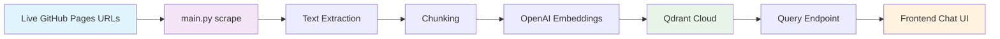

# Architecture – Integrated RAG Chatbot

## System Design

## Single-File System Design

The entire ingestion pipeline is contained in a single file (`backend/main.py`) to simplify deployment and maintenance. The file contains all necessary functions for:

1. Scraping live book pages from URLs
2. Extracting text content from HTML
3. Chunking text into manageable pieces
4. Generating embeddings using OpenAI
5. Creating and populating Qdrant collection
6. Query endpoint for RAG functionality

## Metadata Stored

Each chunk stored in Qdrant contains the following metadata:
- `page_url`: Original URL of the source page
- `page_title`: Title of the source page
- `chunk_index`: Sequential index of the chunk within the page
- `content`: The actual text content of the chunk